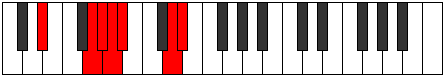

# Mode Mocrimic

## Links

- [Documentation](index.md)
- [Scales Index](Scales.md)
- [Modes Index](Modes.md)
- [Chords Index](Chords.md)

## Parent Scale

[Daptimic](ScaleDaptimic.md)

## Number

[2289](https://ianring.com/musictheory/scales/2289)

## Perfection

- 4 Perfect notes
- 2 Perfect notes

## Perfection Profile

[true true true false false true]

## Permutations

| Tonic | Notes | Signature | Illustration | Audio |
|-------|-------|-----------|--------------|-------|
| [C](ModeCNaturalMocrimic.md) | C, D##, E#, **F#**, **G**, A##, C | C |  | [midi](ModeCNaturalMocrimic.mid) [ogg](ModeCNaturalMocrimic.ogg) |
| [C#](ModeCSharpMocrimic.md) | C#, D###, E##, **F##**, **G#**, A###, C# | C |  | [midi](ModeCSharpMocrimic.mid) [ogg](ModeCSharpMocrimic.ogg) |
| [Db](ModeDFlatMocrimic.md) | Db, E#, F#, **G**, **Ab**, B#, Db | C |  | [midi](ModeDFlatMocrimic.mid) [ogg](ModeDFlatMocrimic.ogg) |
| [D](ModeDNaturalMocrimic.md) | D, E##, F##, **G#**, **A**, B##, D | C |  | [midi](ModeDNaturalMocrimic.mid) [ogg](ModeDNaturalMocrimic.ogg) |
| [D#](ModeDSharpMocrimic.md) | D#, E###, F###, **G##**, **A#**, B###, D# | C |  | [midi](ModeDSharpMocrimic.mid) [ogg](ModeDSharpMocrimic.ogg) |
| [Eb](ModeEFlatMocrimic.md) | Eb, F##, G#, **A**, **Bb**, C##, Eb | C |  | [midi](ModeEFlatMocrimic.mid) [ogg](ModeEFlatMocrimic.ogg) |
| [E](ModeENaturalMocrimic.md) | E, F###, G##, **A#**, **B**, C###, E | C |  | [midi](ModeENaturalMocrimic.mid) [ogg](ModeENaturalMocrimic.ogg) |
| [F](ModeFNaturalMocrimic.md) | F, G##, A#, **B**, **C**, D##, F | C |  | [midi](ModeFNaturalMocrimic.mid) [ogg](ModeFNaturalMocrimic.ogg) |
| [F#](ModeFSharpMocrimic.md) | F#, G###, A##, **B#**, **C#**, D###, F# | C |  | [midi](ModeFSharpMocrimic.mid) [ogg](ModeFSharpMocrimic.ogg) |
| [Gb](ModeGFlatMocrimic.md) | Gb, A#, B, **C**, **Db**, E#, Gb | C |  | [midi](ModeGFlatMocrimic.mid) [ogg](ModeGFlatMocrimic.ogg) |
| [G](ModeGNaturalMocrimic.md) | G, A##, B#, **C#**, **D**, E##, G | C |  | [midi](ModeGNaturalMocrimic.mid) [ogg](ModeGNaturalMocrimic.ogg) |
| [G#](ModeGSharpMocrimic.md) | G#, A###, B##, **C##**, **D#**, E###, G# | C |  | [midi](ModeGSharpMocrimic.mid) [ogg](ModeGSharpMocrimic.ogg) |
| [Ab](ModeAFlatMocrimic.md) | Ab, B#, C#, **D**, **Eb**, F##, Ab | C |  | [midi](ModeAFlatMocrimic.mid) [ogg](ModeAFlatMocrimic.ogg) |
| [A](ModeANaturalMocrimic.md) | A, B##, C##, **D#**, **E**, F###, A | C |  | [midi](ModeANaturalMocrimic.mid) [ogg](ModeANaturalMocrimic.ogg) |
| [A#](ModeASharpMocrimic.md) | A#, B###, C###, **D##**, **E#**, Cbbb, A# | C |  | [midi](ModeASharpMocrimic.mid) [ogg](ModeASharpMocrimic.ogg) |
| [Bb](ModeBFlatMocrimic.md) | Bb, C##, D#, **E**, **F**, G##, Bb | C |  | [midi](ModeBFlatMocrimic.mid) [ogg](ModeBFlatMocrimic.ogg) |
| [B](ModeBNaturalMocrimic.md) | B, C###, D##, **E#**, **F#**, G###, B | C |  | [midi](ModeBNaturalMocrimic.mid) [ogg](ModeBNaturalMocrimic.ogg) |
