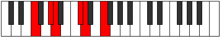
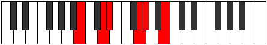

# Mode Mocritonic

## Links

- [Documentation](index.md)
- [Scales Index](Scales.md)
- [Modes Index](Modes.md)
- [Chords Index](Chords.md)

## Parent Scale

[Lycritonic](ScaleLycritonic.md)

## Number

[793](https://ianring.com/musictheory/scales/793)

## Perfection

- 2 Perfect notes
- 3 Perfect notes

## Perfection Profile

[false false false true true]

## Permutations

| Tonic | Notes | Signature | Illustration | Audio |
|-------|-------|-----------|--------------|-------|
| [C](ModeCNaturalMocritonic.md) | **C**, **D#**, **E**, G#, A, **C** | C |  | [midi](ModeCNaturalMocritonic.mid) [ogg](ModeCNaturalMocritonic.ogg) |
| [C#](ModeCSharpMocritonic.md) | **C#**, **E**, **F**, A, A#, **C#** | C |  | [midi](ModeCSharpMocritonic.mid) [ogg](ModeCSharpMocritonic.ogg) |
| [Db](ModeDFlatMocritonic.md) | **Db**, **E**, **F**, A, Bb, **Db** | C |  | [midi](ModeDFlatMocritonic.mid) [ogg](ModeDFlatMocritonic.ogg) |
| [D](ModeDNaturalMocritonic.md) | **D**, **F**, **F#**, A#, B, **D** | C |  | [midi](ModeDNaturalMocritonic.mid) [ogg](ModeDNaturalMocritonic.ogg) |
| [D#](ModeDSharpMocritonic.md) | **D#**, **F#**, **G**, B, C, **D#** | C |  | [midi](ModeDSharpMocritonic.mid) [ogg](ModeDSharpMocritonic.ogg) |
| [Eb](ModeEFlatMocritonic.md) | **Eb**, **Gb**, **G**, B, C, **Eb** | C |  | [midi](ModeEFlatMocritonic.mid) [ogg](ModeEFlatMocritonic.ogg) |
| [E](ModeENaturalMocritonic.md) | **E**, **G**, **G#**, C, C#, **E** | C |  | [midi](ModeENaturalMocritonic.mid) [ogg](ModeENaturalMocritonic.ogg) |
| [F](ModeFNaturalMocritonic.md) | **F**, **G#**, **A**, C#, D, **F** | C |  | [midi](ModeFNaturalMocritonic.mid) [ogg](ModeFNaturalMocritonic.ogg) |
| [F#](ModeFSharpMocritonic.md) | **F#**, **A**, **A#**, D, D#, **F#** | C |  | [midi](ModeFSharpMocritonic.mid) [ogg](ModeFSharpMocritonic.ogg) |
| [Gb](ModeGFlatMocritonic.md) | **Gb**, **A**, **Bb**, D, Eb, **Gb** | C |  | [midi](ModeGFlatMocritonic.mid) [ogg](ModeGFlatMocritonic.ogg) |
| [G](ModeGNaturalMocritonic.md) | **G**, **A#**, **B**, D#, E, **G** | C |  | [midi](ModeGNaturalMocritonic.mid) [ogg](ModeGNaturalMocritonic.ogg) |
| [G#](ModeGSharpMocritonic.md) | **G#**, **B**, **C**, E, F, **G#** | C |  | [midi](ModeGSharpMocritonic.mid) [ogg](ModeGSharpMocritonic.ogg) |
| [Ab](ModeAFlatMocritonic.md) | **Ab**, **B**, **C**, E, F, **Ab** | C |  | [midi](ModeAFlatMocritonic.mid) [ogg](ModeAFlatMocritonic.ogg) |
| [A](ModeANaturalMocritonic.md) | **A**, **C**, **C#**, F, F#, **A** | C |  | [midi](ModeANaturalMocritonic.mid) [ogg](ModeANaturalMocritonic.ogg) |
| [A#](ModeASharpMocritonic.md) | **A#**, **C#**, **D**, F#, G, **A#** | C |  | [midi](ModeASharpMocritonic.mid) [ogg](ModeASharpMocritonic.ogg) |
| [Bb](ModeBFlatMocritonic.md) | **Bb**, **Db**, **D**, Gb, G, **Bb** | C |  | [midi](ModeBFlatMocritonic.mid) [ogg](ModeBFlatMocritonic.ogg) |
| [B](ModeBNaturalMocritonic.md) | **B**, **D**, **D#**, G, G#, **B** | C |  | [midi](ModeBNaturalMocritonic.mid) [ogg](ModeBNaturalMocritonic.ogg) |
