# Mode Mocryllic

## Links

- [Documentation](index.md)
- [Scales Index](Scales.md)
- [Modes Index](Modes.md)
- [Chords Index](Chords.md)

## Parent Scale

[Stogyllic](ScaleStogyllic.md)

## Number

[2909](https://ianring.com/musictheory/scales/2909)

## Interval Pattern

2, 1, 1, 2, 2, 1, 2, 1

## Chord Pattern

i⁰, iii⁰, IV, v⁰, vi⁰, vii⁰

## Perfection

- 5 Perfect notes
- 3 Perfect notes

## Perfection Profile

[false true false true false true true true]

## Permutations

| Tonic | Notes | Signature | Illustration | Audio |
|-------|-------|-----------|--------------|-------|
| [C](ModeCNaturalMocryllic.md) | **C**, D, **D#**, E, **F#**, G#, A, B, **C** | C | 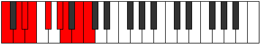 | [midi](https://github.com/edipermadi/music/blob/main/docs/ModeCNaturalMocryllic.mid?raw=true) |
| [C#](ModeCSharpMocryllic.md) | **C#**, D#, **E**, F, **G**, A, A#, C, **C#** | C | 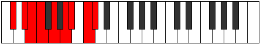 | [midi](https://github.com/edipermadi/music/blob/main/docs/ModeCSharpMocryllic.mid?raw=true) |
| [Db](ModeDFlatMocryllic.md) | **Db**, Eb, **E**, F, **G**, A, Bb, C, **Db** | C |  | [midi](https://github.com/edipermadi/music/blob/main/docs/ModeDFlatMocryllic.mid?raw=true) |
| [D](ModeDNaturalMocryllic.md) | **D**, E, **F**, F#, **G#**, A#, B, C#, **D** | C | 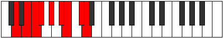 | [midi](https://github.com/edipermadi/music/blob/main/docs/ModeDNaturalMocryllic.mid?raw=true) |
| [D#](ModeDSharpMocryllic.md) | **D#**, F, **F#**, G, **A**, B, C, D, **D#** | C | 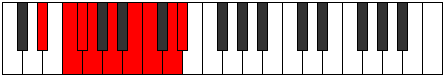 | [midi](https://github.com/edipermadi/music/blob/main/docs/ModeDSharpMocryllic.mid?raw=true) |
| [Eb](ModeEFlatMocryllic.md) | **Eb**, F, **Gb**, G, **A**, B, C, D, **Eb** | C |  | [midi](https://github.com/edipermadi/music/blob/main/docs/ModeEFlatMocryllic.mid?raw=true) |
| [E](ModeENaturalMocryllic.md) | **E**, F#, **G**, G#, **A#**, C, C#, D#, **E** | C | 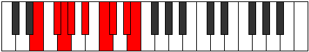 | [midi](https://github.com/edipermadi/music/blob/main/docs/ModeENaturalMocryllic.mid?raw=true) |
| [F](ModeFNaturalMocryllic.md) | **F**, G, **G#**, A, **B**, C#, D, E, **F** | C | 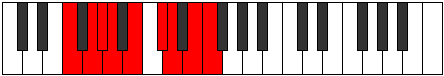 | [midi](https://github.com/edipermadi/music/blob/main/docs/ModeFNaturalMocryllic.mid?raw=true) |
| [F#](ModeFSharpMocryllic.md) | **F#**, G#, **A**, A#, **C**, D, D#, F, **F#** | C | 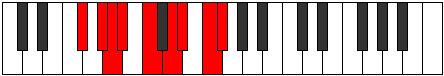 | [midi](https://github.com/edipermadi/music/blob/main/docs/ModeFSharpMocryllic.mid?raw=true) |
| [Gb](ModeGFlatMocryllic.md) | **Gb**, Ab, **A**, Bb, **C**, D, Eb, F, **Gb** | C |  | [midi](https://github.com/edipermadi/music/blob/main/docs/ModeGFlatMocryllic.mid?raw=true) |
| [G](ModeGNaturalMocryllic.md) | **G**, A, **A#**, B, **C#**, D#, E, F#, **G** | C | 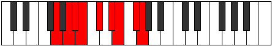 | [midi](https://github.com/edipermadi/music/blob/main/docs/ModeGNaturalMocryllic.mid?raw=true) |
| [G#](ModeGSharpMocryllic.md) | **G#**, A#, **B**, C, **D**, E, F, G, **G#** | C | 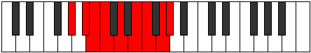 | [midi](https://github.com/edipermadi/music/blob/main/docs/ModeGSharpMocryllic.mid?raw=true) |
| [Ab](ModeAFlatMocryllic.md) | **Ab**, Bb, **B**, C, **D**, E, F, G, **Ab** | C |  | [midi](https://github.com/edipermadi/music/blob/main/docs/ModeAFlatMocryllic.mid?raw=true) |
| [A](ModeANaturalMocryllic.md) | **A**, B, **C**, C#, **D#**, F, F#, G#, **A** | C | 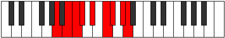 | [midi](https://github.com/edipermadi/music/blob/main/docs/ModeANaturalMocryllic.mid?raw=true) |
| [A#](ModeASharpMocryllic.md) | **A#**, C, **C#**, D, **E**, F#, G, A, **A#** | C | 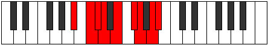 | [midi](https://github.com/edipermadi/music/blob/main/docs/ModeASharpMocryllic.mid?raw=true) |
| [Bb](ModeBFlatMocryllic.md) | **Bb**, C, **Db**, D, **E**, Gb, G, A, **Bb** | C |  | [midi](https://github.com/edipermadi/music/blob/main/docs/ModeBFlatMocryllic.mid?raw=true) |
| [B](ModeBNaturalMocryllic.md) | **B**, C#, **D**, D#, **F**, G, G#, A#, **B** | C | 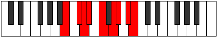 | [midi](https://github.com/edipermadi/music/blob/main/docs/ModeBNaturalMocryllic.mid?raw=true) |
