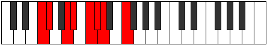

# Mode Modian

## Links

- [Documentation](index.md)
- [Scales Index](Scales.md)
- [Modes Index](Modes.md)
- [Chords Index](Chords.md)

## Parent Scale

[Katathian](ScaleKatathian.md)

## Number

[947](https://ianring.com/musictheory/scales/947)

## Perfection

- 4 Perfect notes
- 3 Perfect notes

## Perfection Profile

[true true false true false false true]

## Permutations

| Tonic | Notes | Signature | Illustration | Audio |
|-------|-------|-----------|--------------|-------|
| [C](ModeCNaturalModian.md) | C, Db, **E**, F, **G**, **Ab**, Bbb, C | C |  | [midi](ModeCNaturalModian.mid) [ogg](ModeCNaturalModian.ogg) |
| [C#](ModeCSharpModian.md) | C#, D, **E#**, F#, **G#**, **A**, Bb, C# | C |  | [midi](ModeCSharpModian.mid) [ogg](ModeCSharpModian.ogg) |
| [Db](ModeDFlatModian.md) | Db, Ebb, **F**, Gb, **Ab**, **Bbb**, Cbb, Db | C |  | [midi](ModeDFlatModian.mid) [ogg](ModeDFlatModian.ogg) |
| [D](ModeDNaturalModian.md) | D, Eb, **F#**, G, **A**, **Bb**, Cb, D | C |  | [midi](ModeDNaturalModian.mid) [ogg](ModeDNaturalModian.ogg) |
| [D#](ModeDSharpModian.md) | D#, E, **F##**, G#, **A#**, **B**, C, D# | C |  | [midi](ModeDSharpModian.mid) [ogg](ModeDSharpModian.ogg) |
| [Eb](ModeEFlatModian.md) | Eb, Fb, **G**, Ab, **Bb**, **Cb**, Dbb, Eb | C |  | [midi](ModeEFlatModian.mid) [ogg](ModeEFlatModian.ogg) |
| [E](ModeENaturalModian.md) | E, F, **G#**, A, **B**, **C**, Db, E | C |  | [midi](ModeENaturalModian.mid) [ogg](ModeENaturalModian.ogg) |
| [F](ModeFNaturalModian.md) | F, Gb, **A**, Bb, **C**, **Db**, Ebb, F | C |  | [midi](ModeFNaturalModian.mid) [ogg](ModeFNaturalModian.ogg) |
| [F#](ModeFSharpModian.md) | F#, G, **A#**, B, **C#**, **D**, Eb, F# | C |  | [midi](ModeFSharpModian.mid) [ogg](ModeFSharpModian.ogg) |
| [Gb](ModeGFlatModian.md) | Gb, Abb, **Bb**, Cb, **Db**, **Ebb**, Fbb, Gb | C |  | [midi](ModeGFlatModian.mid) [ogg](ModeGFlatModian.ogg) |
| [G](ModeGNaturalModian.md) | G, Ab, **B**, C, **D**, **Eb**, Fb, G | C |  | [midi](ModeGNaturalModian.mid) [ogg](ModeGNaturalModian.ogg) |
| [G#](ModeGSharpModian.md) | G#, A, **B#**, C#, **D#**, **E**, F, G# | C |  | [midi](ModeGSharpModian.mid) [ogg](ModeGSharpModian.ogg) |
| [Ab](ModeAFlatModian.md) | Ab, Bbb, **C**, Db, **Eb**, **Fb**, Gbb, Ab | C |  | [midi](ModeAFlatModian.mid) [ogg](ModeAFlatModian.ogg) |
| [A](ModeANaturalModian.md) | A, Bb, **C#**, D, **E**, **F**, Gb, A | C |  | [midi](ModeANaturalModian.mid) [ogg](ModeANaturalModian.ogg) |
| [A#](ModeASharpModian.md) | A#, B, **C##**, D#, **E#**, **F#**, G, A# | C |  | [midi](ModeASharpModian.mid) [ogg](ModeASharpModian.ogg) |
| [Bb](ModeBFlatModian.md) | Bb, Cb, **D**, Eb, **F**, **Gb**, Abb, Bb | C |  | [midi](ModeBFlatModian.mid) [ogg](ModeBFlatModian.ogg) |
| [B](ModeBNaturalModian.md) | B, C, **D#**, E, **F#**, **G**, Ab, B | C |  | [midi](ModeBNaturalModian.mid) [ogg](ModeBNaturalModian.ogg) |
