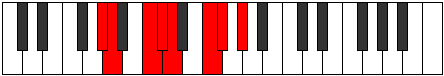

# Mode Mogian

## Links

- [Documentation](index.md)
- [Scales Index](Scales.md)
- [Modes Index](Modes.md)
- [Chords Index](Chords.md)

## Parent Scale

[Loptian](ScaleLoptian.md)

## Number

[1651](https://ianring.com/musictheory/scales/1651)

## Interval Pattern

1, 3, 1, 1, 3, 1, 2

## Chord Pattern

II⁺, IV, V, vi, vii

## Perfection

- 4 Perfect notes
- 3 Perfect notes

## Perfection Profile

[false false false true true true true]

## Permutations

| Tonic | Notes | Signature | Illustration | Audio |
|-------|-------|-----------|--------------|-------|
| [C](ModeCNaturalMogian.md) | **C**, **Db**, **E**, F, Gb, A, Bb, **C** | C |  | [midi](https://github.com/edipermadi/music/blob/main/docs/ModeCNaturalMogian.mid?raw=true) |
| [C#](ModeCSharpMogian.md) | **C#**, **D**, **E#**, F#, G, A#, B, **C#** | C |  | [midi](https://github.com/edipermadi/music/blob/main/docs/ModeCSharpMogian.mid?raw=true) |
| [Db](ModeDFlatMogian.md) | **Db**, **Ebb**, **F**, Gb, Abb, Bb, Cb, **Db** | C |  | [midi](https://github.com/edipermadi/music/blob/main/docs/ModeDFlatMogian.mid?raw=true) |
| [D](ModeDNaturalMogian.md) | **D**, **Eb**, **F#**, G, Ab, B, C, **D** | C |  | [midi](https://github.com/edipermadi/music/blob/main/docs/ModeDNaturalMogian.mid?raw=true) |
| [D#](ModeDSharpMogian.md) | **D#**, **E**, **F##**, G#, A, B#, C#, **D#** | C |  | [midi](https://github.com/edipermadi/music/blob/main/docs/ModeDSharpMogian.mid?raw=true) |
| [Eb](ModeEFlatMogian.md) | **Eb**, **Fb**, **G**, Ab, Bbb, C, Db, **Eb** | C |  | [midi](https://github.com/edipermadi/music/blob/main/docs/ModeEFlatMogian.mid?raw=true) |
| [E](ModeENaturalMogian.md) | **E**, **F**, **G#**, A, Bb, C#, D, **E** | C |  | [midi](https://github.com/edipermadi/music/blob/main/docs/ModeENaturalMogian.mid?raw=true) |
| [F](ModeFNaturalMogian.md) | **F**, **Gb**, **A**, Bb, Cb, D, Eb, **F** | C |  | [midi](https://github.com/edipermadi/music/blob/main/docs/ModeFNaturalMogian.mid?raw=true) |
| [F#](ModeFSharpMogian.md) | **F#**, **G**, **A#**, B, C, D#, E, **F#** | C |  | [midi](https://github.com/edipermadi/music/blob/main/docs/ModeFSharpMogian.mid?raw=true) |
| [Gb](ModeGFlatMogian.md) | **Gb**, **Abb**, **Bb**, Cb, Dbb, Eb, Fb, **Gb** | C |  | [midi](https://github.com/edipermadi/music/blob/main/docs/ModeGFlatMogian.mid?raw=true) |
| [G](ModeGNaturalMogian.md) | **G**, **Ab**, **B**, C, Db, E, F, **G** | C |  | [midi](https://github.com/edipermadi/music/blob/main/docs/ModeGNaturalMogian.mid?raw=true) |
| [G#](ModeGSharpMogian.md) | **G#**, **A**, **B#**, C#, D, E#, F#, **G#** | C |  | [midi](https://github.com/edipermadi/music/blob/main/docs/ModeGSharpMogian.mid?raw=true) |
| [Ab](ModeAFlatMogian.md) | **Ab**, **Bbb**, **C**, Db, Ebb, F, Gb, **Ab** | C |  | [midi](https://github.com/edipermadi/music/blob/main/docs/ModeAFlatMogian.mid?raw=true) |
| [A](ModeANaturalMogian.md) | **A**, **Bb**, **C#**, D, Eb, F#, G, **A** | C |  | [midi](https://github.com/edipermadi/music/blob/main/docs/ModeANaturalMogian.mid?raw=true) |
| [A#](ModeASharpMogian.md) | **A#**, **B**, **C##**, D#, E, F##, G#, **A#** | C |  | [midi](https://github.com/edipermadi/music/blob/main/docs/ModeASharpMogian.mid?raw=true) |
| [Bb](ModeBFlatMogian.md) | **Bb**, **Cb**, **D**, Eb, Fb, G, Ab, **Bb** | C |  | [midi](https://github.com/edipermadi/music/blob/main/docs/ModeBFlatMogian.mid?raw=true) |
| [B](ModeBNaturalMogian.md) | **B**, **C**, **D#**, E, F, G#, A, **B** | C |  | [midi](https://github.com/edipermadi/music/blob/main/docs/ModeBNaturalMogian.mid?raw=true) |
