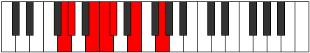

# Mode Mogimic

## Links

- [Documentation](index.md)
- [Scales Index](Scales.md)
- [Modes Index](Modes.md)
- [Chords Index](Chords.md)

## Parent Scale

[Ionodimic](ScaleIonodimic.md)

## Number

[627](https://ianring.com/musictheory/scales/627)

## Perfection

- 3 Perfect notes
- 3 Perfect notes

## Perfection Profile

[false false false true true true]

## Permutations

| Tonic | Notes | Signature | Illustration | Audio |
|-------|-------|-----------|--------------|-------|
| [C](ModeCNaturalMogimic.md) | **C**, **Db**, **E**, F, Gb, A, **C** | C |  | [midi](ModeCNaturalMogimic.mid) [ogg](ModeCNaturalMogimic.ogg) |
| [C#](ModeCSharpMogimic.md) | **C#**, **D**, **E#**, F#, G, A#, **C#** | C |  | [midi](ModeCSharpMogimic.mid) [ogg](ModeCSharpMogimic.ogg) |
| [Db](ModeDFlatMogimic.md) | **Db**, **Ebb**, **F**, Gb, Abb, Bb, **Db** | C |  | [midi](ModeDFlatMogimic.mid) [ogg](ModeDFlatMogimic.ogg) |
| [D](ModeDNaturalMogimic.md) | **D**, **Eb**, **F#**, G, Ab, B, **D** | C |  | [midi](ModeDNaturalMogimic.mid) [ogg](ModeDNaturalMogimic.ogg) |
| [D#](ModeDSharpMogimic.md) | **D#**, **E**, **F##**, G#, A, B#, **D#** | C |  | [midi](ModeDSharpMogimic.mid) [ogg](ModeDSharpMogimic.ogg) |
| [Eb](ModeEFlatMogimic.md) | **Eb**, **Fb**, **G**, Ab, Bbb, C, **Eb** | C |  | [midi](ModeEFlatMogimic.mid) [ogg](ModeEFlatMogimic.ogg) |
| [E](ModeENaturalMogimic.md) | **E**, **F**, **G#**, A, Bb, C#, **E** | C |  | [midi](ModeENaturalMogimic.mid) [ogg](ModeENaturalMogimic.ogg) |
| [F](ModeFNaturalMogimic.md) | **F**, **Gb**, **A**, Bb, Cb, D, **F** | C |  | [midi](ModeFNaturalMogimic.mid) [ogg](ModeFNaturalMogimic.ogg) |
| [F#](ModeFSharpMogimic.md) | **F#**, **G**, **A#**, B, C, D#, **F#** | C |  | [midi](ModeFSharpMogimic.mid) [ogg](ModeFSharpMogimic.ogg) |
| [Gb](ModeGFlatMogimic.md) | **Gb**, **Abb**, **Bb**, Cb, Dbb, Eb, **Gb** | C |  | [midi](ModeGFlatMogimic.mid) [ogg](ModeGFlatMogimic.ogg) |
| [G](ModeGNaturalMogimic.md) | **G**, **Ab**, **B**, C, Db, E, **G** | C |  | [midi](ModeGNaturalMogimic.mid) [ogg](ModeGNaturalMogimic.ogg) |
| [G#](ModeGSharpMogimic.md) | **G#**, **A**, **B#**, C#, D, E#, **G#** | C |  | [midi](ModeGSharpMogimic.mid) [ogg](ModeGSharpMogimic.ogg) |
| [Ab](ModeAFlatMogimic.md) | **Ab**, **Bbb**, **C**, Db, Ebb, F, **Ab** | C |  | [midi](ModeAFlatMogimic.mid) [ogg](ModeAFlatMogimic.ogg) |
| [A](ModeANaturalMogimic.md) | **A**, **Bb**, **C#**, D, Eb, F#, **A** | C |  | [midi](ModeANaturalMogimic.mid) [ogg](ModeANaturalMogimic.ogg) |
| [A#](ModeASharpMogimic.md) | **A#**, **B**, **C##**, D#, E, F##, **A#** | C |  | [midi](ModeASharpMogimic.mid) [ogg](ModeASharpMogimic.ogg) |
| [Bb](ModeBFlatMogimic.md) | **Bb**, **Cb**, **D**, Eb, Fb, G, **Bb** | C |  | [midi](ModeBFlatMogimic.mid) [ogg](ModeBFlatMogimic.ogg) |
| [B](ModeBNaturalMogimic.md) | **B**, **C**, **D#**, E, F, G#, **B** | C |  | [midi](ModeBNaturalMogimic.mid) [ogg](ModeBNaturalMogimic.ogg) |
