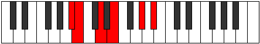

# Mode Mogitonic

## Links

- [Documentation](index.md)
- [Scales Index](Scales.md)
- [Modes Index](Modes.md)
- [Chords Index](Chords.md)

## Parent Scale

[Ionoditonic](ScaleIonoditonic.md)

## Number

[1107](https://ianring.com/musictheory/scales/1107)

## Perfection

- 1 Perfect notes
- 4 Perfect notes

## Perfection Profile

[false false false true false]

## Permutations

| Tonic | Notes | Signature | Illustration | Audio |
|-------|-------|-----------|--------------|-------|
| [C](ModeCNaturalMogitonic.md) | **C**, **C#**, **E**, F#, **A#**, **C** | C |  | [midi](https://github.com/edipermadi/music/blob/main/docs/ModeCNaturalMogitonic.mid?raw=true) |
| [C#](ModeCSharpMogitonic.md) | **C#**, **D**, **F**, G, **B**, **C#** | C |  | [midi](https://github.com/edipermadi/music/blob/main/docs/ModeCSharpMogitonic.mid?raw=true) |
| [Db](ModeDFlatMogitonic.md) | **Db**, **D**, **F**, G, **B**, **Db** | C |  | [midi](https://github.com/edipermadi/music/blob/main/docs/ModeDFlatMogitonic.mid?raw=true) |
| [D](ModeDNaturalMogitonic.md) | **D**, **D#**, **F#**, G#, **C**, **D** | C |  | [midi](https://github.com/edipermadi/music/blob/main/docs/ModeDNaturalMogitonic.mid?raw=true) |
| [D#](ModeDSharpMogitonic.md) | **D#**, **E**, **G**, A, **C#**, **D#** | C |  | [midi](https://github.com/edipermadi/music/blob/main/docs/ModeDSharpMogitonic.mid?raw=true) |
| [Eb](ModeEFlatMogitonic.md) | **Eb**, **E**, **G**, A, **Db**, **Eb** | C |  | [midi](https://github.com/edipermadi/music/blob/main/docs/ModeEFlatMogitonic.mid?raw=true) |
| [E](ModeENaturalMogitonic.md) | **E**, **F**, **G#**, A#, **D**, **E** | C |  | [midi](https://github.com/edipermadi/music/blob/main/docs/ModeENaturalMogitonic.mid?raw=true) |
| [F](ModeFNaturalMogitonic.md) | **F**, **F#**, **A**, B, **D#**, **F** | C |  | [midi](https://github.com/edipermadi/music/blob/main/docs/ModeFNaturalMogitonic.mid?raw=true) |
| [F#](ModeFSharpMogitonic.md) | **F#**, **G**, **A#**, C, **E**, **F#** | C |  | [midi](https://github.com/edipermadi/music/blob/main/docs/ModeFSharpMogitonic.mid?raw=true) |
| [Gb](ModeGFlatMogitonic.md) | **Gb**, **G**, **Bb**, C, **E**, **Gb** | C |  | [midi](https://github.com/edipermadi/music/blob/main/docs/ModeGFlatMogitonic.mid?raw=true) |
| [G](ModeGNaturalMogitonic.md) | **G**, **G#**, **B**, C#, **F**, **G** | C |  | [midi](https://github.com/edipermadi/music/blob/main/docs/ModeGNaturalMogitonic.mid?raw=true) |
| [G#](ModeGSharpMogitonic.md) | **G#**, **A**, **C**, D, **F#**, **G#** | C |  | [midi](https://github.com/edipermadi/music/blob/main/docs/ModeGSharpMogitonic.mid?raw=true) |
| [Ab](ModeAFlatMogitonic.md) | **Ab**, **A**, **C**, D, **Gb**, **Ab** | C |  | [midi](https://github.com/edipermadi/music/blob/main/docs/ModeAFlatMogitonic.mid?raw=true) |
| [A](ModeANaturalMogitonic.md) | **A**, **A#**, **C#**, D#, **G**, **A** | C |  | [midi](https://github.com/edipermadi/music/blob/main/docs/ModeANaturalMogitonic.mid?raw=true) |
| [A#](ModeASharpMogitonic.md) | **A#**, **B**, **D**, E, **G#**, **A#** | C |  | [midi](https://github.com/edipermadi/music/blob/main/docs/ModeASharpMogitonic.mid?raw=true) |
| [Bb](ModeBFlatMogitonic.md) | **Bb**, **B**, **D**, E, **Ab**, **Bb** | C |  | [midi](https://github.com/edipermadi/music/blob/main/docs/ModeBFlatMogitonic.mid?raw=true) |
| [B](ModeBNaturalMogitonic.md) | **B**, **C**, **D#**, F, **A**, **B** | C |  | [midi](https://github.com/edipermadi/music/blob/main/docs/ModeBNaturalMogitonic.mid?raw=true) |
