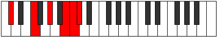
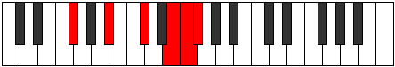

# Mode Molitonic

## Links

- [Documentation](README.md)
- [Scales Index](Scales.md)
- [Modes Index](Modes.md)
- [Chords Index](Chords.md)

## Parent Scale

[Molitonic](ScaleMolitonic.md)

## Number

[3217](https://ianring.com/musictheory/scales/3217)

## Interval Pattern

4, 3, 3, 1, 1

## Chord Pattern

## Perfection

- 2 Perfect notes
- 3 Perfect notes

## Perfection Profile

[true true false false false]

## Permutations

| Tonic | Notes | Signature | Illustration | Audio |
|-------|-------|-----------|--------------|-------|
| [C](ModeCNaturalMolitonic.md) | C, E, **G**, **A#**, **B**, C | C |  | [midi](https://github.com/edipermadi/music/blob/main/docs/ModeCNaturalMolitonic.mid?raw=true) |
| [C#](ModeCSharpMolitonic.md) | C#, F, **G#**, **B**, **C**, C# | C |  | [midi](https://github.com/edipermadi/music/blob/main/docs/ModeCSharpMolitonic.mid?raw=true) |
| [Db](ModeDFlatMolitonic.md) | Db, F, **Ab**, **B**, **C**, Db | C |  | [midi](https://github.com/edipermadi/music/blob/main/docs/ModeDFlatMolitonic.mid?raw=true) |
| [D](ModeDNaturalMolitonic.md) | D, F#, **A**, **C**, **C#**, D | C |  | [midi](https://github.com/edipermadi/music/blob/main/docs/ModeDNaturalMolitonic.mid?raw=true) |
| [D#](ModeDSharpMolitonic.md) | D#, G, **A#**, **C#**, **D**, D# | C |  | [midi](https://github.com/edipermadi/music/blob/main/docs/ModeDSharpMolitonic.mid?raw=true) |
| [Eb](ModeEFlatMolitonic.md) | Eb, G, **Bb**, **Db**, **D**, Eb | C |  | [midi](https://github.com/edipermadi/music/blob/main/docs/ModeEFlatMolitonic.mid?raw=true) |
| [E](ModeENaturalMolitonic.md) | E, G#, **B**, **D**, **D#**, E | C |  | [midi](https://github.com/edipermadi/music/blob/main/docs/ModeENaturalMolitonic.mid?raw=true) |
| [F](ModeFNaturalMolitonic.md) | F, A, **C**, **D#**, **E**, F | C |  | [midi](https://github.com/edipermadi/music/blob/main/docs/ModeFNaturalMolitonic.mid?raw=true) |
| [F#](ModeFSharpMolitonic.md) | F#, A#, **C#**, **E**, **F**, F# | C |  | [midi](https://github.com/edipermadi/music/blob/main/docs/ModeFSharpMolitonic.mid?raw=true) |
| [Gb](ModeGFlatMolitonic.md) | Gb, Bb, **Db**, **E**, **F**, Gb | C |  | [midi](https://github.com/edipermadi/music/blob/main/docs/ModeGFlatMolitonic.mid?raw=true) |
| [G](ModeGNaturalMolitonic.md) | G, B, **D**, **F**, **F#**, G | C |  | [midi](https://github.com/edipermadi/music/blob/main/docs/ModeGNaturalMolitonic.mid?raw=true) |
| [G#](ModeGSharpMolitonic.md) | G#, C, **D#**, **F#**, **G**, G# | C |  | [midi](https://github.com/edipermadi/music/blob/main/docs/ModeGSharpMolitonic.mid?raw=true) |
| [Ab](ModeAFlatMolitonic.md) | Ab, C, **Eb**, **Gb**, **G**, Ab | C |  | [midi](https://github.com/edipermadi/music/blob/main/docs/ModeAFlatMolitonic.mid?raw=true) |
| [A](ModeANaturalMolitonic.md) | A, C#, **E**, **G**, **G#**, A | C |  | [midi](https://github.com/edipermadi/music/blob/main/docs/ModeANaturalMolitonic.mid?raw=true) |
| [A#](ModeASharpMolitonic.md) | A#, D, **F**, **G#**, **A**, A# | C |  | [midi](https://github.com/edipermadi/music/blob/main/docs/ModeASharpMolitonic.mid?raw=true) |
| [Bb](ModeBFlatMolitonic.md) | Bb, D, **F**, **Ab**, **A**, Bb | C |  | [midi](https://github.com/edipermadi/music/blob/main/docs/ModeBFlatMolitonic.mid?raw=true) |
| [B](ModeBNaturalMolitonic.md) | B, D#, **F#**, **A**, **A#**, B | C |  | [midi](https://github.com/edipermadi/music/blob/main/docs/ModeBNaturalMolitonic.mid?raw=true) |
