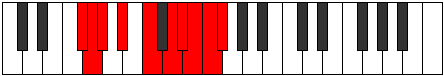
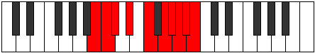

# Mode Monygic

## Links

- [Documentation](index.md)
- [Scales Index](Scales.md)
- [Modes Index](Modes.md)
- [Chords Index](Chords.md)

## Parent Scale

[Kyrygic](ScaleKyrygic.md)

## Number

[3927](https://ianring.com/musictheory/scales/3927)

## Perfection

- 6 Perfect notes
- 3 Perfect notes

## Perfection Profile

[false true true true true false true false true]

## Permutations

| Tonic | Notes | Signature | Illustration | Audio |
|-------|-------|-----------|--------------|-------|
| [C](ModeCNaturalMonygic.md) | **C**, C#, D, E, F#, **G#**, A, **A#**, B, **C** | C |  | [midi](ModeCNaturalMonygic.mid) [ogg](ModeCNaturalMonygic.ogg) |
| [C#](ModeCSharpMonygic.md) | **C#**, D, D#, F, G, **A**, A#, **B**, C, **C#** | C |  | [midi](ModeCSharpMonygic.mid) [ogg](ModeCSharpMonygic.ogg) |
| [Db](ModeDFlatMonygic.md) | **Db**, D, Eb, F, G, **A**, Bb, **B**, C, **Db** | C |  | [midi](ModeDFlatMonygic.mid) [ogg](ModeDFlatMonygic.ogg) |
| [D](ModeDNaturalMonygic.md) | **D**, D#, E, F#, G#, **A#**, B, **C**, C#, **D** | C |  | [midi](ModeDNaturalMonygic.mid) [ogg](ModeDNaturalMonygic.ogg) |
| [D#](ModeDSharpMonygic.md) | **D#**, E, F, G, A, **B**, C, **C#**, D, **D#** | C |  | [midi](ModeDSharpMonygic.mid) [ogg](ModeDSharpMonygic.ogg) |
| [Eb](ModeEFlatMonygic.md) | **Eb**, E, F, G, A, **B**, C, **Db**, D, **Eb** | C |  | [midi](ModeEFlatMonygic.mid) [ogg](ModeEFlatMonygic.ogg) |
| [E](ModeENaturalMonygic.md) | **E**, F, F#, G#, A#, **C**, C#, **D**, D#, **E** | C |  | [midi](ModeENaturalMonygic.mid) [ogg](ModeENaturalMonygic.ogg) |
| [F](ModeFNaturalMonygic.md) | **F**, F#, G, A, B, **C#**, D, **D#**, E, **F** | C |  | [midi](ModeFNaturalMonygic.mid) [ogg](ModeFNaturalMonygic.ogg) |
| [F#](ModeFSharpMonygic.md) | **F#**, G, G#, A#, C, **D**, D#, **E**, F, **F#** | C |  | [midi](ModeFSharpMonygic.mid) [ogg](ModeFSharpMonygic.ogg) |
| [Gb](ModeGFlatMonygic.md) | **Gb**, G, Ab, Bb, C, **D**, Eb, **E**, F, **Gb** | C |  | [midi](ModeGFlatMonygic.mid) [ogg](ModeGFlatMonygic.ogg) |
| [G](ModeGNaturalMonygic.md) | **G**, G#, A, B, C#, **D#**, E, **F**, F#, **G** | C |  | [midi](ModeGNaturalMonygic.mid) [ogg](ModeGNaturalMonygic.ogg) |
| [G#](ModeGSharpMonygic.md) | **G#**, A, A#, C, D, **E**, F, **F#**, G, **G#** | C |  | [midi](ModeGSharpMonygic.mid) [ogg](ModeGSharpMonygic.ogg) |
| [Ab](ModeAFlatMonygic.md) | **Ab**, A, Bb, C, D, **E**, F, **Gb**, G, **Ab** | C |  | [midi](ModeAFlatMonygic.mid) [ogg](ModeAFlatMonygic.ogg) |
| [A](ModeANaturalMonygic.md) | **A**, A#, B, C#, D#, **F**, F#, **G**, G#, **A** | C |  | [midi](ModeANaturalMonygic.mid) [ogg](ModeANaturalMonygic.ogg) |
| [A#](ModeASharpMonygic.md) | **A#**, B, C, D, E, **F#**, G, **G#**, A, **A#** | C |  | [midi](ModeASharpMonygic.mid) [ogg](ModeASharpMonygic.ogg) |
| [Bb](ModeBFlatMonygic.md) | **Bb**, B, C, D, E, **Gb**, G, **Ab**, A, **Bb** | C |  | [midi](ModeBFlatMonygic.mid) [ogg](ModeBFlatMonygic.ogg) |
| [B](ModeBNaturalMonygic.md) | **B**, C, C#, D#, F, **G**, G#, **A**, A#, **B** | C |  | [midi](ModeBNaturalMonygic.mid) [ogg](ModeBNaturalMonygic.ogg) |
