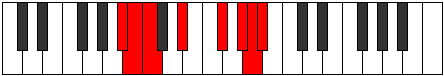

# Mode Moptian

## Links

- [Documentation](index.md)
- [Scales Index](Scales.md)
- [Modes Index](Modes.md)
- [Chords Index](Chords.md)

## Parent Scale

[Bonian](ScaleBonian.md)

## Number

[3367](https://ianring.com/musictheory/scales/3367)

## Interval Pattern

1, 1, 3, 3, 2, 1, 1

## Chord Pattern

II, iii⁰, iv, iv⁰, v⁰, vi, VI, vii⁰

## Perfection

- 3 Perfect notes
- 4 Perfect notes

## Perfection Profile

[false true false true false true false]

## Permutations

| Tonic | Notes | Signature | Illustration | Audio |
|-------|-------|-----------|--------------|-------|
| [C](ModeCNaturalMoptian.md) | **C**, Db, **Ebb**, F, **G#**, A#, **B**, **C** | C |  | [midi](https://github.com/edipermadi/music/blob/main/docs/ModeCNaturalMoptian.mid?raw=true) |
| [C#](ModeCSharpMoptian.md) | **C#**, D, **Eb**, F#, **G##**, A##, **B#**, **C#** | C |  | [midi](https://github.com/edipermadi/music/blob/main/docs/ModeCSharpMoptian.mid?raw=true) |
| [Db](ModeDFlatMoptian.md) | **Db**, Ebb, **Fbb**, Gb, **A**, B, **C**, **Db** | C |  | [midi](https://github.com/edipermadi/music/blob/main/docs/ModeDFlatMoptian.mid?raw=true) |
| [D](ModeDNaturalMoptian.md) | **D**, Eb, **Fb**, G, **A#**, B#, **C#**, **D** | C |  | [midi](https://github.com/edipermadi/music/blob/main/docs/ModeDNaturalMoptian.mid?raw=true) |
| [D#](ModeDSharpMoptian.md) | **D#**, E, **F**, G#, **A##**, B##, **C##**, **D#** | C |  | [midi](https://github.com/edipermadi/music/blob/main/docs/ModeDSharpMoptian.mid?raw=true) |
| [Eb](ModeEFlatMoptian.md) | **Eb**, Fb, **Gbb**, Ab, **B**, C#, **D**, **Eb** | C |  | [midi](https://github.com/edipermadi/music/blob/main/docs/ModeEFlatMoptian.mid?raw=true) |
| [E](ModeENaturalMoptian.md) | **E**, F, **Gb**, A, **B#**, C##, **D#**, **E** | C |  | [midi](https://github.com/edipermadi/music/blob/main/docs/ModeENaturalMoptian.mid?raw=true) |
| [F](ModeFNaturalMoptian.md) | **F**, Gb, **Abb**, Bb, **C#**, D#, **E**, **F** | C |  | [midi](https://github.com/edipermadi/music/blob/main/docs/ModeFNaturalMoptian.mid?raw=true) |
| [F#](ModeFSharpMoptian.md) | **F#**, G, **Ab**, B, **C##**, D##, **E#**, **F#** | C |  | [midi](https://github.com/edipermadi/music/blob/main/docs/ModeFSharpMoptian.mid?raw=true) |
| [Gb](ModeGFlatMoptian.md) | **Gb**, Abb, **Bbbb**, Cb, **D**, E, **F**, **Gb** | C |  | [midi](https://github.com/edipermadi/music/blob/main/docs/ModeGFlatMoptian.mid?raw=true) |
| [G](ModeGNaturalMoptian.md) | **G**, Ab, **Bbb**, C, **D#**, E#, **F#**, **G** | C |  | [midi](https://github.com/edipermadi/music/blob/main/docs/ModeGNaturalMoptian.mid?raw=true) |
| [G#](ModeGSharpMoptian.md) | **G#**, A, **Bb**, C#, **D##**, E##, **F##**, **G#** | C |  | [midi](https://github.com/edipermadi/music/blob/main/docs/ModeGSharpMoptian.mid?raw=true) |
| [Ab](ModeAFlatMoptian.md) | **Ab**, Bbb, **Cbb**, Db, **E**, F#, **G**, **Ab** | C |  | [midi](https://github.com/edipermadi/music/blob/main/docs/ModeAFlatMoptian.mid?raw=true) |
| [A](ModeANaturalMoptian.md) | **A**, Bb, **Cb**, D, **E#**, F##, **G#**, **A** | C |  | [midi](https://github.com/edipermadi/music/blob/main/docs/ModeANaturalMoptian.mid?raw=true) |
| [A#](ModeASharpMoptian.md) | **A#**, B, **C**, D#, **E##**, F###, **G##**, **A#** | C |  | [midi](https://github.com/edipermadi/music/blob/main/docs/ModeASharpMoptian.mid?raw=true) |
| [Bb](ModeBFlatMoptian.md) | **Bb**, Cb, **Dbb**, Eb, **F#**, G#, **A**, **Bb** | C |  | [midi](https://github.com/edipermadi/music/blob/main/docs/ModeBFlatMoptian.mid?raw=true) |
| [B](ModeBNaturalMoptian.md) | **B**, C, **Db**, E, **F##**, G##, **A#**, **B** | C |  | [midi](https://github.com/edipermadi/music/blob/main/docs/ModeBNaturalMoptian.mid?raw=true) |
