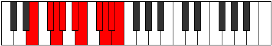
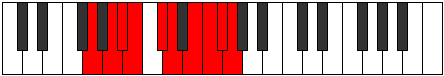

# Mode Moptygic

## Links

- [Documentation](index.md)
- [Scales Index](Scales.md)
- [Modes Index](Modes.md)
- [Chords Index](Chords.md)

## Parent Scale

[Aeolorygic](ScaleAeolorygic.md)

## Number

[3805](https://ianring.com/musictheory/scales/3805)

## Perfection

- 7 Perfect notes
- 2 Perfect notes

## Perfection Profile

[true true true true false true true false true]

## Permutations

| Tonic | Notes | Signature | Illustration | Audio |
|-------|-------|-----------|--------------|-------|
| [C](ModeCNaturalMoptygic.md) | C, D, D#, E, **F#**, G, A, **A#**, B, C | C |  | [midi](ModeCNaturalMoptygic.mid) [ogg](ModeCNaturalMoptygic.ogg) |
| [C#](ModeCSharpMoptygic.md) | C#, D#, E, F, **G**, G#, A#, **B**, C, C# | C |  | [midi](ModeCSharpMoptygic.mid) [ogg](ModeCSharpMoptygic.ogg) |
| [Db](ModeDFlatMoptygic.md) | Db, Eb, E, F, **G**, Ab, Bb, **B**, C, Db | C |  | [midi](ModeDFlatMoptygic.mid) [ogg](ModeDFlatMoptygic.ogg) |
| [D](ModeDNaturalMoptygic.md) | D, E, F, F#, **G#**, A, B, **C**, C#, D | C |  | [midi](ModeDNaturalMoptygic.mid) [ogg](ModeDNaturalMoptygic.ogg) |
| [D#](ModeDSharpMoptygic.md) | D#, F, F#, G, **A**, A#, C, **C#**, D, D# | C |  | [midi](ModeDSharpMoptygic.mid) [ogg](ModeDSharpMoptygic.ogg) |
| [Eb](ModeEFlatMoptygic.md) | Eb, F, Gb, G, **A**, Bb, C, **Db**, D, Eb | C |  | [midi](ModeEFlatMoptygic.mid) [ogg](ModeEFlatMoptygic.ogg) |
| [E](ModeENaturalMoptygic.md) | E, F#, G, G#, **A#**, B, C#, **D**, D#, E | C |  | [midi](ModeENaturalMoptygic.mid) [ogg](ModeENaturalMoptygic.ogg) |
| [F](ModeFNaturalMoptygic.md) | F, G, G#, A, **B**, C, D, **D#**, E, F | C |  | [midi](ModeFNaturalMoptygic.mid) [ogg](ModeFNaturalMoptygic.ogg) |
| [F#](ModeFSharpMoptygic.md) | F#, G#, A, A#, **C**, C#, D#, **E**, F, F# | C |  | [midi](ModeFSharpMoptygic.mid) [ogg](ModeFSharpMoptygic.ogg) |
| [Gb](ModeGFlatMoptygic.md) | Gb, Ab, A, Bb, **C**, Db, Eb, **E**, F, Gb | C |  | [midi](ModeGFlatMoptygic.mid) [ogg](ModeGFlatMoptygic.ogg) |
| [G](ModeGNaturalMoptygic.md) | G, A, A#, B, **C#**, D, E, **F**, F#, G | C |  | [midi](ModeGNaturalMoptygic.mid) [ogg](ModeGNaturalMoptygic.ogg) |
| [G#](ModeGSharpMoptygic.md) | G#, A#, B, C, **D**, D#, F, **F#**, G, G# | C |  | [midi](ModeGSharpMoptygic.mid) [ogg](ModeGSharpMoptygic.ogg) |
| [Ab](ModeAFlatMoptygic.md) | Ab, Bb, B, C, **D**, Eb, F, **Gb**, G, Ab | C |  | [midi](ModeAFlatMoptygic.mid) [ogg](ModeAFlatMoptygic.ogg) |
| [A](ModeANaturalMoptygic.md) | A, B, C, C#, **D#**, E, F#, **G**, G#, A | C |  | [midi](ModeANaturalMoptygic.mid) [ogg](ModeANaturalMoptygic.ogg) |
| [A#](ModeASharpMoptygic.md) | A#, C, C#, D, **E**, F, G, **G#**, A, A# | C |  | [midi](ModeASharpMoptygic.mid) [ogg](ModeASharpMoptygic.ogg) |
| [Bb](ModeBFlatMoptygic.md) | Bb, C, Db, D, **E**, F, G, **Ab**, A, Bb | C |  | [midi](ModeBFlatMoptygic.mid) [ogg](ModeBFlatMoptygic.ogg) |
| [B](ModeBNaturalMoptygic.md) | B, C#, D, D#, **F**, F#, G#, **A**, A#, B | C |  | [midi](ModeBNaturalMoptygic.mid) [ogg](ModeBNaturalMoptygic.ogg) |
