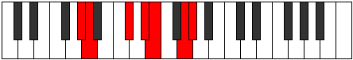

# Mode Morimic

## Links

- [Documentation](index.md)
- [Scales Index](Scales.md)
- [Modes Index](Modes.md)
- [Chords Index](Chords.md)

## Parent Scale

[Katythimic](ScaleKatythimic.md)

## Number

[2467](https://ianring.com/musictheory/scales/2467)

## Perfection

- 3 Perfect notes
- 3 Perfect notes

## Perfection Profile

[true true true false false false]

## Permutations

| Tonic | Notes | Signature | Illustration | Audio |
|-------|-------|-----------|--------------|-------|
| [C](ModeCNaturalMorimic.md) | C, Db, E#, **F##**, **G#**, **A##**, C | C |  | [midi](https://github.com/edipermadi/music/blob/main/docs/ModeCNaturalMorimic.mid?raw=true) |
| [C#](ModeCSharpMorimic.md) | C#, D, E##, **F###**, **G##**, **A###**, C# | C |  | [midi](https://github.com/edipermadi/music/blob/main/docs/ModeCSharpMorimic.mid?raw=true) |
| [Db](ModeDFlatMorimic.md) | Db, Ebb, F#, **G#**, **A**, **B#**, Db | C |  | [midi](https://github.com/edipermadi/music/blob/main/docs/ModeDFlatMorimic.mid?raw=true) |
| [D](ModeDNaturalMorimic.md) | D, Eb, F##, **G##**, **A#**, **B##**, D | C |  | [midi](https://github.com/edipermadi/music/blob/main/docs/ModeDNaturalMorimic.mid?raw=true) |
| [D#](ModeDSharpMorimic.md) | D#, E, F###, **G###**, **A##**, **B###**, D# | C |  | [midi](https://github.com/edipermadi/music/blob/main/docs/ModeDSharpMorimic.mid?raw=true) |
| [Eb](ModeEFlatMorimic.md) | Eb, Fb, G#, **A#**, **B**, **C##**, Eb | C |  | [midi](https://github.com/edipermadi/music/blob/main/docs/ModeEFlatMorimic.mid?raw=true) |
| [E](ModeENaturalMorimic.md) | E, F, G##, **A##**, **B#**, **C###**, E | C |  | [midi](https://github.com/edipermadi/music/blob/main/docs/ModeENaturalMorimic.mid?raw=true) |
| [F](ModeFNaturalMorimic.md) | F, Gb, A#, **B#**, **C#**, **D##**, F | C |  | [midi](https://github.com/edipermadi/music/blob/main/docs/ModeFNaturalMorimic.mid?raw=true) |
| [F#](ModeFSharpMorimic.md) | F#, G, A##, **B##**, **C##**, **D###**, F# | C |  | [midi](https://github.com/edipermadi/music/blob/main/docs/ModeFSharpMorimic.mid?raw=true) |
| [Gb](ModeGFlatMorimic.md) | Gb, Abb, B, **C#**, **D**, **E#**, Gb | C |  | [midi](https://github.com/edipermadi/music/blob/main/docs/ModeGFlatMorimic.mid?raw=true) |
| [G](ModeGNaturalMorimic.md) | G, Ab, B#, **C##**, **D#**, **E##**, G | C |  | [midi](https://github.com/edipermadi/music/blob/main/docs/ModeGNaturalMorimic.mid?raw=true) |
| [G#](ModeGSharpMorimic.md) | G#, A, B##, **C###**, **D##**, **E###**, G# | C |  | [midi](https://github.com/edipermadi/music/blob/main/docs/ModeGSharpMorimic.mid?raw=true) |
| [Ab](ModeAFlatMorimic.md) | Ab, Bbb, C#, **D#**, **E**, **F##**, Ab | C |  | [midi](https://github.com/edipermadi/music/blob/main/docs/ModeAFlatMorimic.mid?raw=true) |
| [A](ModeANaturalMorimic.md) | A, Bb, C##, **D##**, **E#**, **F###**, A | C |  | [midi](https://github.com/edipermadi/music/blob/main/docs/ModeANaturalMorimic.mid?raw=true) |
| [A#](ModeASharpMorimic.md) | A#, B, C###, **D###**, **E##**, **Cbbb**, A# | C |  | [midi](https://github.com/edipermadi/music/blob/main/docs/ModeASharpMorimic.mid?raw=true) |
| [Bb](ModeBFlatMorimic.md) | Bb, Cb, D#, **E#**, **F#**, **G##**, Bb | C |  | [midi](https://github.com/edipermadi/music/blob/main/docs/ModeBFlatMorimic.mid?raw=true) |
| [B](ModeBNaturalMorimic.md) | B, C, D##, **E##**, **F##**, **G###**, B | C |  | [midi](https://github.com/edipermadi/music/blob/main/docs/ModeBNaturalMorimic.mid?raw=true) |
