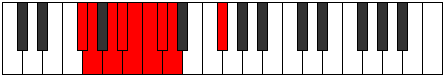

# Mode Moryllic

## Links

- [Documentation](index.md)
- [Scales Index](Scales.md)
- [Modes Index](Modes.md)
- [Chords Index](Chords.md)

## Parent Scale

[Dolyllic](ScaleDolyllic.md)

## Number

[507](https://ianring.com/musictheory/scales/507)

## Perfection

- 5 Perfect notes
- 3 Perfect notes

## Perfection Profile

[true true false false true true false true]

## Permutations

| Tonic | Notes | Signature | Illustration | Audio |
|-------|-------|-----------|--------------|-------|
| [C](ModeCNaturalMoryllic.md) | C, C#, **D#**, **E**, F, F#, **G**, G#, C | C |  | [midi](ModeCNaturalMoryllic.mid) [ogg](ModeCNaturalMoryllic.ogg) |
| [C#](ModeCSharpMoryllic.md) | C#, D, **E**, **F**, F#, G, **G#**, A, C# | C |  | [midi](ModeCSharpMoryllic.mid) [ogg](ModeCSharpMoryllic.ogg) |
| [Db](ModeDFlatMoryllic.md) | Db, D, **E**, **F**, Gb, G, **Ab**, A, Db | C |  | [midi](ModeDFlatMoryllic.mid) [ogg](ModeDFlatMoryllic.ogg) |
| [D](ModeDNaturalMoryllic.md) | D, D#, **F**, **F#**, G, G#, **A**, A#, D | C |  | [midi](ModeDNaturalMoryllic.mid) [ogg](ModeDNaturalMoryllic.ogg) |
| [D#](ModeDSharpMoryllic.md) | D#, E, **F#**, **G**, G#, A, **A#**, B, D# | C |  | [midi](ModeDSharpMoryllic.mid) [ogg](ModeDSharpMoryllic.ogg) |
| [Eb](ModeEFlatMoryllic.md) | Eb, E, **Gb**, **G**, Ab, A, **Bb**, B, Eb | C |  | [midi](ModeEFlatMoryllic.mid) [ogg](ModeEFlatMoryllic.ogg) |
| [E](ModeENaturalMoryllic.md) | E, F, **G**, **G#**, A, A#, **B**, C, E | C |  | [midi](ModeENaturalMoryllic.mid) [ogg](ModeENaturalMoryllic.ogg) |
| [F](ModeFNaturalMoryllic.md) | F, F#, **G#**, **A**, A#, B, **C**, C#, F | C |  | [midi](ModeFNaturalMoryllic.mid) [ogg](ModeFNaturalMoryllic.ogg) |
| [F#](ModeFSharpMoryllic.md) | F#, G, **A**, **A#**, B, C, **C#**, D, F# | C |  | [midi](ModeFSharpMoryllic.mid) [ogg](ModeFSharpMoryllic.ogg) |
| [Gb](ModeGFlatMoryllic.md) | Gb, G, **A**, **Bb**, B, C, **Db**, D, Gb | C |  | [midi](ModeGFlatMoryllic.mid) [ogg](ModeGFlatMoryllic.ogg) |
| [G](ModeGNaturalMoryllic.md) | G, G#, **A#**, **B**, C, C#, **D**, D#, G | C |  | [midi](ModeGNaturalMoryllic.mid) [ogg](ModeGNaturalMoryllic.ogg) |
| [G#](ModeGSharpMoryllic.md) | G#, A, **B**, **C**, C#, D, **D#**, E, G# | C |  | [midi](ModeGSharpMoryllic.mid) [ogg](ModeGSharpMoryllic.ogg) |
| [Ab](ModeAFlatMoryllic.md) | Ab, A, **B**, **C**, Db, D, **Eb**, E, Ab | C |  | [midi](ModeAFlatMoryllic.mid) [ogg](ModeAFlatMoryllic.ogg) |
| [A](ModeANaturalMoryllic.md) | A, A#, **C**, **C#**, D, D#, **E**, F, A | C |  | [midi](ModeANaturalMoryllic.mid) [ogg](ModeANaturalMoryllic.ogg) |
| [A#](ModeASharpMoryllic.md) | A#, B, **C#**, **D**, D#, E, **F**, F#, A# | C |  | [midi](ModeASharpMoryllic.mid) [ogg](ModeASharpMoryllic.ogg) |
| [Bb](ModeBFlatMoryllic.md) | Bb, B, **Db**, **D**, Eb, E, **F**, Gb, Bb | C |  | [midi](ModeBFlatMoryllic.mid) [ogg](ModeBFlatMoryllic.ogg) |
| [B](ModeBNaturalMoryllic.md) | B, C, **D**, **D#**, E, F, **F#**, G, B | C |  | [midi](ModeBNaturalMoryllic.mid) [ogg](ModeBNaturalMoryllic.ogg) |
