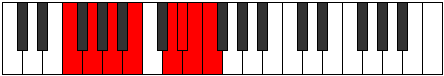

# Mode Mothian

## Links

- [Documentation](index.md)
- [Scales Index](Scales.md)
- [Modes Index](Modes.md)
- [Chords Index](Chords.md)

## Parent Scale

[Pagian](ScalePagian.md)

## Number

[3669](https://ianring.com/musictheory/scales/3669)

## Perfection

- 4 Perfect notes
- 3 Perfect notes

## Perfection Profile

[false true true false true false true]

## Permutations

| Tonic | Notes | Signature | Illustration | Audio |
|-------|-------|-----------|--------------|-------|
| [C](ModeCNaturalMothian.md) | **C**, D, E, **F#**, G##, **A#**, B, **C** | C |  | [midi](ModeCNaturalMothian.mid) [ogg](ModeCNaturalMothian.ogg) |
| [C#](ModeCSharpMothian.md) | **C#**, D#, E#, **F##**, G###, **A##**, B#, **C#** | C |  | [midi](ModeCSharpMothian.mid) [ogg](ModeCSharpMothian.ogg) |
| [Db](ModeDFlatMothian.md) | **Db**, Eb, F, **G**, A#, **B**, C, **Db** | C |  | [midi](ModeDFlatMothian.mid) [ogg](ModeDFlatMothian.ogg) |
| [D](ModeDNaturalMothian.md) | **D**, E, F#, **G#**, A##, **B#**, C#, **D** | C |  | [midi](ModeDNaturalMothian.mid) [ogg](ModeDNaturalMothian.ogg) |
| [D#](ModeDSharpMothian.md) | **D#**, E#, F##, **G##**, A###, **B##**, C##, **D#** | C |  | [midi](ModeDSharpMothian.mid) [ogg](ModeDSharpMothian.ogg) |
| [Eb](ModeEFlatMothian.md) | **Eb**, F, G, **A**, B#, **C#**, D, **Eb** | C |  | [midi](ModeEFlatMothian.mid) [ogg](ModeEFlatMothian.ogg) |
| [E](ModeENaturalMothian.md) | **E**, F#, G#, **A#**, B##, **C##**, D#, **E** | C |  | [midi](ModeENaturalMothian.mid) [ogg](ModeENaturalMothian.ogg) |
| [F](ModeFNaturalMothian.md) | **F**, G, A, **B**, C##, **D#**, E, **F** | C |  | [midi](ModeFNaturalMothian.mid) [ogg](ModeFNaturalMothian.ogg) |
| [F#](ModeFSharpMothian.md) | **F#**, G#, A#, **B#**, C###, **D##**, E#, **F#** | C |  | [midi](ModeFSharpMothian.mid) [ogg](ModeFSharpMothian.ogg) |
| [Gb](ModeGFlatMothian.md) | **Gb**, Ab, Bb, **C**, D#, **E**, F, **Gb** | C |  | [midi](ModeGFlatMothian.mid) [ogg](ModeGFlatMothian.ogg) |
| [G](ModeGNaturalMothian.md) | **G**, A, B, **C#**, D##, **E#**, F#, **G** | C |  | [midi](ModeGNaturalMothian.mid) [ogg](ModeGNaturalMothian.ogg) |
| [G#](ModeGSharpMothian.md) | **G#**, A#, B#, **C##**, D###, **E##**, F##, **G#** | C |  | [midi](ModeGSharpMothian.mid) [ogg](ModeGSharpMothian.ogg) |
| [Ab](ModeAFlatMothian.md) | **Ab**, Bb, C, **D**, E#, **F#**, G, **Ab** | C |  | [midi](ModeAFlatMothian.mid) [ogg](ModeAFlatMothian.ogg) |
| [A](ModeANaturalMothian.md) | **A**, B, C#, **D#**, E##, **F##**, G#, **A** | C |  | [midi](ModeANaturalMothian.mid) [ogg](ModeANaturalMothian.ogg) |
| [A#](ModeASharpMothian.md) | **A#**, B#, C##, **D##**, E###, **F###**, G##, **A#** | C |  | [midi](ModeASharpMothian.mid) [ogg](ModeASharpMothian.ogg) |
| [Bb](ModeBFlatMothian.md) | **Bb**, C, D, **E**, F##, **G#**, A, **Bb** | C |  | [midi](ModeBFlatMothian.mid) [ogg](ModeBFlatMothian.ogg) |
| [B](ModeBNaturalMothian.md) | **B**, C#, D#, **E#**, F###, **G##**, A#, **B** | C |  | [midi](ModeBNaturalMothian.mid) [ogg](ModeBNaturalMothian.ogg) |
