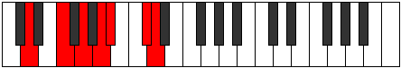

# Mode Mothimic

## Links

- [Documentation](index.md)
- [Scales Index](Scales.md)
- [Modes Index](Modes.md)
- [Chords Index](Chords.md)

## Parent Scale

[Mothimic](ScaleMothimic.md)

## Number

[2473](https://ianring.com/musictheory/scales/2473)

## Perfection

- 3 Perfect notes
- 3 Perfect notes

## Perfection Profile

[true false true false true false]

## Permutations

| Tonic | Notes | Signature | Illustration | Audio |
|-------|-------|-----------|--------------|-------|
| [C](ModeCNaturalMothimic.md) | C, **D#**, E#, **F##**, G#, **A##**, C | C |  | [midi](ModeCNaturalMothimic.mid) [ogg](ModeCNaturalMothimic.ogg) |
| [C#](ModeCSharpMothimic.md) | C#, **D##**, E##, **F###**, G##, **A###**, C# | C |  | [midi](ModeCSharpMothimic.mid) [ogg](ModeCSharpMothimic.ogg) |
| [Db](ModeDFlatMothimic.md) | Db, **E**, F#, **G#**, A, **B#**, Db | C |  | [midi](ModeDFlatMothimic.mid) [ogg](ModeDFlatMothimic.ogg) |
| [D](ModeDNaturalMothimic.md) | D, **E#**, F##, **G##**, A#, **B##**, D | C |  | [midi](ModeDNaturalMothimic.mid) [ogg](ModeDNaturalMothimic.ogg) |
| [D#](ModeDSharpMothimic.md) | D#, **E##**, F###, **G###**, A##, **B###**, D# | C |  | [midi](ModeDSharpMothimic.mid) [ogg](ModeDSharpMothimic.ogg) |
| [Eb](ModeEFlatMothimic.md) | Eb, **F#**, G#, **A#**, B, **C##**, Eb | C |  | [midi](ModeEFlatMothimic.mid) [ogg](ModeEFlatMothimic.ogg) |
| [E](ModeENaturalMothimic.md) | E, **F##**, G##, **A##**, B#, **C###**, E | C |  | [midi](ModeENaturalMothimic.mid) [ogg](ModeENaturalMothimic.ogg) |
| [F](ModeFNaturalMothimic.md) | F, **G#**, A#, **B#**, C#, **D##**, F | C |  | [midi](ModeFNaturalMothimic.mid) [ogg](ModeFNaturalMothimic.ogg) |
| [F#](ModeFSharpMothimic.md) | F#, **G##**, A##, **B##**, C##, **D###**, F# | C |  | [midi](ModeFSharpMothimic.mid) [ogg](ModeFSharpMothimic.ogg) |
| [Gb](ModeGFlatMothimic.md) | Gb, **A**, B, **C#**, D, **E#**, Gb | C |  | [midi](ModeGFlatMothimic.mid) [ogg](ModeGFlatMothimic.ogg) |
| [G](ModeGNaturalMothimic.md) | G, **A#**, B#, **C##**, D#, **E##**, G | C |  | [midi](ModeGNaturalMothimic.mid) [ogg](ModeGNaturalMothimic.ogg) |
| [G#](ModeGSharpMothimic.md) | G#, **A##**, B##, **C###**, D##, **E###**, G# | C |  | [midi](ModeGSharpMothimic.mid) [ogg](ModeGSharpMothimic.ogg) |
| [Ab](ModeAFlatMothimic.md) | Ab, **B**, C#, **D#**, E, **F##**, Ab | C |  | [midi](ModeAFlatMothimic.mid) [ogg](ModeAFlatMothimic.ogg) |
| [A](ModeANaturalMothimic.md) | A, **B#**, C##, **D##**, E#, **F###**, A | C |  | [midi](ModeANaturalMothimic.mid) [ogg](ModeANaturalMothimic.ogg) |
| [A#](ModeASharpMothimic.md) | A#, **B##**, C###, **D###**, E##, **Cbbb**, A# | C |  | [midi](ModeASharpMothimic.mid) [ogg](ModeASharpMothimic.ogg) |
| [Bb](ModeBFlatMothimic.md) | Bb, **C#**, D#, **E#**, F#, **G##**, Bb | C |  | [midi](ModeBFlatMothimic.mid) [ogg](ModeBFlatMothimic.ogg) |
| [B](ModeBNaturalMothimic.md) | B, **C##**, D##, **E##**, F##, **G###**, B | C |  | [midi](ModeBNaturalMothimic.mid) [ogg](ModeBNaturalMothimic.ogg) |
