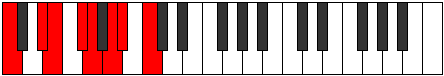

# Mode Mycrian

## Links

- [Documentation](index.md)
- [Scales Index](Scales.md)
- [Modes Index](Modes.md)
- [Chords Index](Chords.md)

## Parent Scale

[Mycrian](ScaleMycrian.md)

## Number

[1753](https://ianring.com/musictheory/scales/1753)

## Perfection

- 3 Perfect notes
- 4 Perfect notes

## Perfection Profile

[true true false false false true false]

## Permutations

| Tonic | Notes | Signature | Illustration | Audio |
|-------|-------|-----------|--------------|-------|
| [C](ModeCNaturalMycrian.md) | C, D#, **E**, **F#**, **G**, A, **Bb**, C | C |  | [midi](ModeCNaturalMycrian.mid) [ogg](ModeCNaturalMycrian.ogg) |
| [C#](ModeCSharpMycrian.md) | C#, D##, **E#**, **F##**, **G#**, A#, **B**, C# | C |  | [midi](ModeCSharpMycrian.mid) [ogg](ModeCSharpMycrian.ogg) |
| [Db](ModeDFlatMycrian.md) | Db, E, **F**, **G**, **Ab**, Bb, **Cb**, Db | C |  | [midi](ModeDFlatMycrian.mid) [ogg](ModeDFlatMycrian.ogg) |
| [D](ModeDNaturalMycrian.md) | D, E#, **F#**, **G#**, **A**, B, **C**, D | C |  | [midi](ModeDNaturalMycrian.mid) [ogg](ModeDNaturalMycrian.ogg) |
| [D#](ModeDSharpMycrian.md) | D#, E##, **F##**, **G##**, **A#**, B#, **C#**, D# | C |  | [midi](ModeDSharpMycrian.mid) [ogg](ModeDSharpMycrian.ogg) |
| [Eb](ModeEFlatMycrian.md) | Eb, F#, **G**, **A**, **Bb**, C, **Db**, Eb | C |  | [midi](ModeEFlatMycrian.mid) [ogg](ModeEFlatMycrian.ogg) |
| [E](ModeENaturalMycrian.md) | E, F##, **G#**, **A#**, **B**, C#, **D**, E | C |  | [midi](ModeENaturalMycrian.mid) [ogg](ModeENaturalMycrian.ogg) |
| [F](ModeFNaturalMycrian.md) | F, G#, **A**, **B**, **C**, D, **Eb**, F | C |  | [midi](ModeFNaturalMycrian.mid) [ogg](ModeFNaturalMycrian.ogg) |
| [F#](ModeFSharpMycrian.md) | F#, G##, **A#**, **B#**, **C#**, D#, **E**, F# | C |  | [midi](ModeFSharpMycrian.mid) [ogg](ModeFSharpMycrian.ogg) |
| [Gb](ModeGFlatMycrian.md) | Gb, A, **Bb**, **C**, **Db**, Eb, **Fb**, Gb | C |  | [midi](ModeGFlatMycrian.mid) [ogg](ModeGFlatMycrian.ogg) |
| [G](ModeGNaturalMycrian.md) | G, A#, **B**, **C#**, **D**, E, **F**, G | C |  | [midi](ModeGNaturalMycrian.mid) [ogg](ModeGNaturalMycrian.ogg) |
| [G#](ModeGSharpMycrian.md) | G#, A##, **B#**, **C##**, **D#**, E#, **F#**, G# | C |  | [midi](ModeGSharpMycrian.mid) [ogg](ModeGSharpMycrian.ogg) |
| [Ab](ModeAFlatMycrian.md) | Ab, B, **C**, **D**, **Eb**, F, **Gb**, Ab | C |  | [midi](ModeAFlatMycrian.mid) [ogg](ModeAFlatMycrian.ogg) |
| [A](ModeANaturalMycrian.md) | A, B#, **C#**, **D#**, **E**, F#, **G**, A | C |  | [midi](ModeANaturalMycrian.mid) [ogg](ModeANaturalMycrian.ogg) |
| [A#](ModeASharpMycrian.md) | A#, B##, **C##**, **D##**, **E#**, F##, **G#**, A# | C |  | [midi](ModeASharpMycrian.mid) [ogg](ModeASharpMycrian.ogg) |
| [Bb](ModeBFlatMycrian.md) | Bb, C#, **D**, **E**, **F**, G, **Ab**, Bb | C |  | [midi](ModeBFlatMycrian.mid) [ogg](ModeBFlatMycrian.ogg) |
| [B](ModeBNaturalMycrian.md) | B, C##, **D#**, **E#**, **F#**, G#, **A**, B | C |  | [midi](ModeBNaturalMycrian.mid) [ogg](ModeBNaturalMycrian.ogg) |
