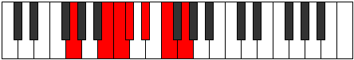

# Mode Mycrimic

## Links

- [Documentation](index.md)
- [Scales Index](Scales.md)
- [Modes Index](Modes.md)
- [Chords Index](Chords.md)

## Parent Scale

[Mycrimic](ScaleMycrimic.md)

## Number

[1393](https://ianring.com/musictheory/scales/1393)

## Perfection

- 2 Perfect notes
- 4 Perfect notes

## Perfection Profile

[false false true false false true]

## Permutations

| Tonic | Notes | Signature | Illustration | Audio |
|-------|-------|-----------|--------------|-------|
| [C](ModeCNaturalMycrimic.md) | **C**, **D##**, E#, **F#**, **G#**, A#, **C** | C |  | [midi](ModeCNaturalMycrimic.mid) [ogg](ModeCNaturalMycrimic.ogg) |
| [C#](ModeCSharpMycrimic.md) | **C#**, **D###**, E##, **F##**, **G##**, A##, **C#** | C |  | [midi](ModeCSharpMycrimic.mid) [ogg](ModeCSharpMycrimic.ogg) |
| [Db](ModeDFlatMycrimic.md) | **Db**, **E#**, F#, **G**, **A**, B, **Db** | C |  | [midi](ModeDFlatMycrimic.mid) [ogg](ModeDFlatMycrimic.ogg) |
| [D](ModeDNaturalMycrimic.md) | **D**, **E##**, F##, **G#**, **A#**, B#, **D** | C |  | [midi](ModeDNaturalMycrimic.mid) [ogg](ModeDNaturalMycrimic.ogg) |
| [D#](ModeDSharpMycrimic.md) | **D#**, **E###**, F###, **G##**, **A##**, B##, **D#** | C |  | [midi](ModeDSharpMycrimic.mid) [ogg](ModeDSharpMycrimic.ogg) |
| [Eb](ModeEFlatMycrimic.md) | **Eb**, **F##**, G#, **A**, **B**, C#, **Eb** | C |  | [midi](ModeEFlatMycrimic.mid) [ogg](ModeEFlatMycrimic.ogg) |
| [E](ModeENaturalMycrimic.md) | **E**, **F###**, G##, **A#**, **B#**, C##, **E** | C |  | [midi](ModeENaturalMycrimic.mid) [ogg](ModeENaturalMycrimic.ogg) |
| [F](ModeFNaturalMycrimic.md) | **F**, **G##**, A#, **B**, **C#**, D#, **F** | C |  | [midi](ModeFNaturalMycrimic.mid) [ogg](ModeFNaturalMycrimic.ogg) |
| [F#](ModeFSharpMycrimic.md) | **F#**, **G###**, A##, **B#**, **C##**, D##, **F#** | C |  | [midi](ModeFSharpMycrimic.mid) [ogg](ModeFSharpMycrimic.ogg) |
| [Gb](ModeGFlatMycrimic.md) | **Gb**, **A#**, B, **C**, **D**, E, **Gb** | C |  | [midi](ModeGFlatMycrimic.mid) [ogg](ModeGFlatMycrimic.ogg) |
| [G](ModeGNaturalMycrimic.md) | **G**, **A##**, B#, **C#**, **D#**, E#, **G** | C |  | [midi](ModeGNaturalMycrimic.mid) [ogg](ModeGNaturalMycrimic.ogg) |
| [G#](ModeGSharpMycrimic.md) | **G#**, **A###**, B##, **C##**, **D##**, E##, **G#** | C |  | [midi](ModeGSharpMycrimic.mid) [ogg](ModeGSharpMycrimic.ogg) |
| [Ab](ModeAFlatMycrimic.md) | **Ab**, **B#**, C#, **D**, **E**, F#, **Ab** | C |  | [midi](ModeAFlatMycrimic.mid) [ogg](ModeAFlatMycrimic.ogg) |
| [A](ModeANaturalMycrimic.md) | **A**, **B##**, C##, **D#**, **E#**, F##, **A** | C |  | [midi](ModeANaturalMycrimic.mid) [ogg](ModeANaturalMycrimic.ogg) |
| [A#](ModeASharpMycrimic.md) | **A#**, **B###**, C###, **D##**, **E##**, F###, **A#** | C |  | [midi](ModeASharpMycrimic.mid) [ogg](ModeASharpMycrimic.ogg) |
| [Bb](ModeBFlatMycrimic.md) | **Bb**, **C##**, D#, **E**, **F#**, G#, **Bb** | C |  | [midi](ModeBFlatMycrimic.mid) [ogg](ModeBFlatMycrimic.ogg) |
| [B](ModeBNaturalMycrimic.md) | **B**, **C###**, D##, **E#**, **F##**, G##, **B** | C |  | [midi](ModeBNaturalMycrimic.mid) [ogg](ModeBNaturalMycrimic.ogg) |
