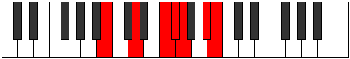

# Mode Mydimic

## Links

- [Documentation](index.md)
- [Scales Index](Scales.md)
- [Modes Index](Modes.md)
- [Chords Index](Chords.md)

## Parent Scale

[Mydimic](ScaleMydimic.md)

## Number

[2505](https://ianring.com/musictheory/scales/2505)

## Perfection

- 3 Perfect notes
- 3 Perfect notes

## Interval Pattern

3, 3, 1, 1, 3, 1

## Perfection Profile

[true false false false true true]

## Permutations

| Tonic | Notes | Signature | Illustration | Audio |
|-------|-------|-----------|--------------|-------|
| [C](ModeCNaturalMydimic.md) | C, **D#**, **E##**, **F##**, G#, A##, C | C |  | [midi](https://github.com/edipermadi/music/blob/main/docs/ModeCNaturalMydimic.mid?raw=true) |
| [C#](ModeCSharpMydimic.md) | C#, **D##**, **E###**, **F###**, G##, A###, C# | C |  | [midi](https://github.com/edipermadi/music/blob/main/docs/ModeCSharpMydimic.mid?raw=true) |
| [Db](ModeDFlatMydimic.md) | Db, **E**, **F##**, **G#**, A, B#, Db | C |  | [midi](https://github.com/edipermadi/music/blob/main/docs/ModeDFlatMydimic.mid?raw=true) |
| [D](ModeDNaturalMydimic.md) | D, **E#**, **F###**, **G##**, A#, B##, D | C |  | [midi](https://github.com/edipermadi/music/blob/main/docs/ModeDNaturalMydimic.mid?raw=true) |
| [D#](ModeDSharpMydimic.md) | D#, **E##**, **Cbbb**, **Cbb**, Dbbb, Ebb, D# | C |  | [midi](https://github.com/edipermadi/music/blob/main/docs/ModeDSharpMydimic.mid?raw=true) |
| [Eb](ModeEFlatMydimic.md) | Eb, **F#**, **G##**, **A#**, B, C##, Eb | C |  | [midi](https://github.com/edipermadi/music/blob/main/docs/ModeEFlatMydimic.mid?raw=true) |
| [E](ModeENaturalMydimic.md) | E, **F##**, **G###**, **A##**, B#, C###, E | C |  | [midi](https://github.com/edipermadi/music/blob/main/docs/ModeENaturalMydimic.mid?raw=true) |
| [F](ModeFNaturalMydimic.md) | F, **G#**, **A##**, **B#**, C#, D##, F | C |  | [midi](https://github.com/edipermadi/music/blob/main/docs/ModeFNaturalMydimic.mid?raw=true) |
| [F#](ModeFSharpMydimic.md) | F#, **G##**, **A###**, **B##**, C##, D###, F# | C |  | [midi](https://github.com/edipermadi/music/blob/main/docs/ModeFSharpMydimic.mid?raw=true) |
| [Gb](ModeGFlatMydimic.md) | Gb, **A**, **B#**, **C#**, D, E#, Gb | C |  | [midi](https://github.com/edipermadi/music/blob/main/docs/ModeGFlatMydimic.mid?raw=true) |
| [G](ModeGNaturalMydimic.md) | G, **A#**, **B##**, **C##**, D#, E##, G | C |  | [midi](https://github.com/edipermadi/music/blob/main/docs/ModeGNaturalMydimic.mid?raw=true) |
| [G#](ModeGSharpMydimic.md) | G#, **A##**, **B###**, **C###**, D##, E###, G# | C |  | [midi](https://github.com/edipermadi/music/blob/main/docs/ModeGSharpMydimic.mid?raw=true) |
| [Ab](ModeAFlatMydimic.md) | Ab, **B**, **C##**, **D#**, E, F##, Ab | C |  | [midi](https://github.com/edipermadi/music/blob/main/docs/ModeAFlatMydimic.mid?raw=true) |
| [A](ModeANaturalMydimic.md) | A, **B#**, **C###**, **D##**, E#, F###, A | C |  | [midi](https://github.com/edipermadi/music/blob/main/docs/ModeANaturalMydimic.mid?raw=true) |
| [A#](ModeASharpMydimic.md) | A#, **B##**, **D##**, **E#**, F#, G##, A# | C |  | [midi](https://github.com/edipermadi/music/blob/main/docs/ModeASharpMydimic.mid?raw=true) |
| [Bb](ModeBFlatMydimic.md) | Bb, **C#**, **D##**, **E#**, F#, G##, Bb | C |  | [midi](https://github.com/edipermadi/music/blob/main/docs/ModeBFlatMydimic.mid?raw=true) |
| [B](ModeBNaturalMydimic.md) | B, **C##**, **D###**, **E##**, F##, G###, B | C |  | [midi](https://github.com/edipermadi/music/blob/main/docs/ModeBNaturalMydimic.mid?raw=true) |
