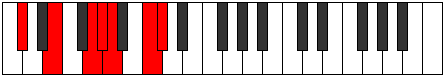
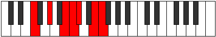

# Mode Mydimic

## Links

- [Documentation](index.md)
- [Scales Index](Scales.md)
- [Modes Index](Modes.md)
- [Chords Index](Chords.md)

## Parent Scale

[Mydimic](ScaleMydimic.md)

## Number

[2505](https://ianring.com/musictheory/scales/2505)

## Perfection

- 3 Perfect notes
- 3 Perfect notes

## Perfection Profile

[true false false false true true]

## Permutations

| Tonic | Notes | Signature | Illustration | Audio |
|-------|-------|-----------|--------------|-------|
| [C](ModeCNaturalMydimic.md) | C, **D#**, **E##**, **F##**, G#, A##, C | C |  | [midi](ModeCNaturalMydimic.mid) [ogg](ModeCNaturalMydimic.ogg) |
| [C#](ModeCSharpMydimic.md) | C#, **D##**, **E###**, **F###**, G##, A###, C# | C |  | [midi](ModeCSharpMydimic.mid) [ogg](ModeCSharpMydimic.ogg) |
| [Db](ModeDFlatMydimic.md) | Db, **E**, **F##**, **G#**, A, B#, Db | C |  | [midi](ModeDFlatMydimic.mid) [ogg](ModeDFlatMydimic.ogg) |
| [D](ModeDNaturalMydimic.md) | D, **E#**, **F###**, **G##**, A#, B##, D | C |  | [midi](ModeDNaturalMydimic.mid) [ogg](ModeDNaturalMydimic.ogg) |
| [D#](ModeDSharpMydimic.md) | D#, **E##**, **Cbbb**, **Cbb**, Dbbb, Ebb, D# | C |  | [midi](ModeDSharpMydimic.mid) [ogg](ModeDSharpMydimic.ogg) |
| [Eb](ModeEFlatMydimic.md) | Eb, **F#**, **G##**, **A#**, B, C##, Eb | C |  | [midi](ModeEFlatMydimic.mid) [ogg](ModeEFlatMydimic.ogg) |
| [E](ModeENaturalMydimic.md) | E, **F##**, **G###**, **A##**, B#, C###, E | C |  | [midi](ModeENaturalMydimic.mid) [ogg](ModeENaturalMydimic.ogg) |
| [F](ModeFNaturalMydimic.md) | F, **G#**, **A##**, **B#**, C#, D##, F | C |  | [midi](ModeFNaturalMydimic.mid) [ogg](ModeFNaturalMydimic.ogg) |
| [F#](ModeFSharpMydimic.md) | F#, **G##**, **A###**, **B##**, C##, D###, F# | C |  | [midi](ModeFSharpMydimic.mid) [ogg](ModeFSharpMydimic.ogg) |
| [Gb](ModeGFlatMydimic.md) | Gb, **A**, **B#**, **C#**, D, E#, Gb | C |  | [midi](ModeGFlatMydimic.mid) [ogg](ModeGFlatMydimic.ogg) |
| [G](ModeGNaturalMydimic.md) | G, **A#**, **B##**, **C##**, D#, E##, G | C |  | [midi](ModeGNaturalMydimic.mid) [ogg](ModeGNaturalMydimic.ogg) |
| [G#](ModeGSharpMydimic.md) | G#, **A##**, **B###**, **C###**, D##, E###, G# | C |  | [midi](ModeGSharpMydimic.mid) [ogg](ModeGSharpMydimic.ogg) |
| [Ab](ModeAFlatMydimic.md) | Ab, **B**, **C##**, **D#**, E, F##, Ab | C |  | [midi](ModeAFlatMydimic.mid) [ogg](ModeAFlatMydimic.ogg) |
| [A](ModeANaturalMydimic.md) | A, **B#**, **C###**, **D##**, E#, F###, A | C |  | [midi](ModeANaturalMydimic.mid) [ogg](ModeANaturalMydimic.ogg) |
| [A#](ModeASharpMydimic.md) | A#, **B##**, **D##**, **E#**, F#, G##, A# | C |  | [midi](ModeASharpMydimic.mid) [ogg](ModeASharpMydimic.ogg) |
| [Bb](ModeBFlatMydimic.md) | Bb, **C#**, **D##**, **E#**, F#, G##, Bb | C |  | [midi](ModeBFlatMydimic.mid) [ogg](ModeBFlatMydimic.ogg) |
| [B](ModeBNaturalMydimic.md) | B, **C##**, **D###**, **E##**, F##, G###, B | C |  | [midi](ModeBNaturalMydimic.mid) [ogg](ModeBNaturalMydimic.ogg) |
