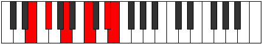
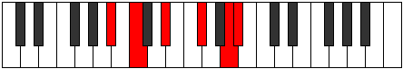

# Mode Myditonic

## Links

- [Documentation](index.md)
- [Scales Index](Scales.md)
- [Modes Index](Modes.md)
- [Chords Index](Chords.md)

## Parent Scale

[Thyritonic](ScaleThyritonic.md)

## Number

[2341](https://ianring.com/musictheory/scales/2341)

## Perfection

- 1 Perfect notes
- 4 Perfect notes

## Perfection Profile

[false false true false false]

## Permutations

| Tonic | Notes | Signature | Illustration | Audio |
|-------|-------|-----------|--------------|-------|
| [C](ModeCNaturalMyditonic.md) | **C**, **D**, F, **G#**, **B**, **C** | C |  | [midi](ModeCNaturalMyditonic.mid) [ogg](ModeCNaturalMyditonic.ogg) |
| [C#](ModeCSharpMyditonic.md) | **C#**, **D#**, F#, **A**, **C**, **C#** | C |  | [midi](ModeCSharpMyditonic.mid) [ogg](ModeCSharpMyditonic.ogg) |
| [Db](ModeDFlatMyditonic.md) | **Db**, **Eb**, Gb, **A**, **C**, **Db** | C |  | [midi](ModeDFlatMyditonic.mid) [ogg](ModeDFlatMyditonic.ogg) |
| [D](ModeDNaturalMyditonic.md) | **D**, **E**, G, **A#**, **C#**, **D** | C |  | [midi](ModeDNaturalMyditonic.mid) [ogg](ModeDNaturalMyditonic.ogg) |
| [D#](ModeDSharpMyditonic.md) | **D#**, **F**, G#, **B**, **D**, **D#** | C |  | [midi](ModeDSharpMyditonic.mid) [ogg](ModeDSharpMyditonic.ogg) |
| [Eb](ModeEFlatMyditonic.md) | **Eb**, **F**, Ab, **B**, **D**, **Eb** | C |  | [midi](ModeEFlatMyditonic.mid) [ogg](ModeEFlatMyditonic.ogg) |
| [E](ModeENaturalMyditonic.md) | **E**, **F#**, A, **C**, **D#**, **E** | C |  | [midi](ModeENaturalMyditonic.mid) [ogg](ModeENaturalMyditonic.ogg) |
| [F](ModeFNaturalMyditonic.md) | **F**, **G**, A#, **C#**, **E**, **F** | C |  | [midi](ModeFNaturalMyditonic.mid) [ogg](ModeFNaturalMyditonic.ogg) |
| [F#](ModeFSharpMyditonic.md) | **F#**, **G#**, B, **D**, **F**, **F#** | C |  | [midi](ModeFSharpMyditonic.mid) [ogg](ModeFSharpMyditonic.ogg) |
| [Gb](ModeGFlatMyditonic.md) | **Gb**, **Ab**, B, **D**, **F**, **Gb** | C |  | [midi](ModeGFlatMyditonic.mid) [ogg](ModeGFlatMyditonic.ogg) |
| [G](ModeGNaturalMyditonic.md) | **G**, **A**, C, **D#**, **F#**, **G** | C |  | [midi](ModeGNaturalMyditonic.mid) [ogg](ModeGNaturalMyditonic.ogg) |
| [G#](ModeGSharpMyditonic.md) | **G#**, **A#**, C#, **E**, **G**, **G#** | C |  | [midi](ModeGSharpMyditonic.mid) [ogg](ModeGSharpMyditonic.ogg) |
| [Ab](ModeAFlatMyditonic.md) | **Ab**, **Bb**, Db, **E**, **G**, **Ab** | C |  | [midi](ModeAFlatMyditonic.mid) [ogg](ModeAFlatMyditonic.ogg) |
| [A](ModeANaturalMyditonic.md) | **A**, **B**, D, **F**, **G#**, **A** | C |  | [midi](ModeANaturalMyditonic.mid) [ogg](ModeANaturalMyditonic.ogg) |
| [A#](ModeASharpMyditonic.md) | **A#**, **C**, D#, **F#**, **A**, **A#** | C |  | [midi](ModeASharpMyditonic.mid) [ogg](ModeASharpMyditonic.ogg) |
| [Bb](ModeBFlatMyditonic.md) | **Bb**, **C**, Eb, **Gb**, **A**, **Bb** | C |  | [midi](ModeBFlatMyditonic.mid) [ogg](ModeBFlatMyditonic.ogg) |
| [B](ModeBNaturalMyditonic.md) | **B**, **C#**, E, **G**, **A#**, **B** | C |  | [midi](ModeBNaturalMyditonic.mid) [ogg](ModeBNaturalMyditonic.ogg) |
