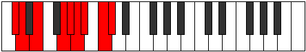

# Mode Mydyllic

## Links

- [Documentation](index.md)
- [Scales Index](Scales.md)
- [Modes Index](Modes.md)
- [Chords Index](Chords.md)

## Parent Scale

[Zagyllic](ScaleZagyllic.md)

## Number

[3019](https://ianring.com/musictheory/scales/3019)

## Perfection

- 5 Perfect notes
- 3 Perfect notes

## Perfection Profile

[true true false true false true false true]

## Permutations

| Tonic | Notes | Signature | Illustration | Audio |
|-------|-------|-----------|--------------|-------|
| [C](ModeCNaturalMydyllic.md) | C, C#, **D#**, F#, **G**, G#, **A**, B, C | C |  | [midi](ModeCNaturalMydyllic.mid) [ogg](ModeCNaturalMydyllic.ogg) |
| [C#](ModeCSharpMydyllic.md) | C#, D, **E**, G, **G#**, A, **A#**, C, C# | C |  | [midi](ModeCSharpMydyllic.mid) [ogg](ModeCSharpMydyllic.ogg) |
| [Db](ModeDFlatMydyllic.md) | Db, D, **E**, G, **Ab**, A, **Bb**, C, Db | C |  | [midi](ModeDFlatMydyllic.mid) [ogg](ModeDFlatMydyllic.ogg) |
| [D](ModeDNaturalMydyllic.md) | D, D#, **F**, G#, **A**, A#, **B**, C#, D | C |  | [midi](ModeDNaturalMydyllic.mid) [ogg](ModeDNaturalMydyllic.ogg) |
| [D#](ModeDSharpMydyllic.md) | D#, E, **F#**, A, **A#**, B, **C**, D, D# | C |  | [midi](ModeDSharpMydyllic.mid) [ogg](ModeDSharpMydyllic.ogg) |
| [Eb](ModeEFlatMydyllic.md) | Eb, E, **Gb**, A, **Bb**, B, **C**, D, Eb | C |  | [midi](ModeEFlatMydyllic.mid) [ogg](ModeEFlatMydyllic.ogg) |
| [E](ModeENaturalMydyllic.md) | E, F, **G**, A#, **B**, C, **C#**, D#, E | C |  | [midi](ModeENaturalMydyllic.mid) [ogg](ModeENaturalMydyllic.ogg) |
| [F](ModeFNaturalMydyllic.md) | F, F#, **G#**, B, **C**, C#, **D**, E, F | C |  | [midi](ModeFNaturalMydyllic.mid) [ogg](ModeFNaturalMydyllic.ogg) |
| [F#](ModeFSharpMydyllic.md) | F#, G, **A**, C, **C#**, D, **D#**, F, F# | C |  | [midi](ModeFSharpMydyllic.mid) [ogg](ModeFSharpMydyllic.ogg) |
| [Gb](ModeGFlatMydyllic.md) | Gb, G, **A**, C, **Db**, D, **Eb**, F, Gb | C |  | [midi](ModeGFlatMydyllic.mid) [ogg](ModeGFlatMydyllic.ogg) |
| [G](ModeGNaturalMydyllic.md) | G, G#, **A#**, C#, **D**, D#, **E**, F#, G | C |  | [midi](ModeGNaturalMydyllic.mid) [ogg](ModeGNaturalMydyllic.ogg) |
| [G#](ModeGSharpMydyllic.md) | G#, A, **B**, D, **D#**, E, **F**, G, G# | C |  | [midi](ModeGSharpMydyllic.mid) [ogg](ModeGSharpMydyllic.ogg) |
| [Ab](ModeAFlatMydyllic.md) | Ab, A, **B**, D, **Eb**, E, **F**, G, Ab | C |  | [midi](ModeAFlatMydyllic.mid) [ogg](ModeAFlatMydyllic.ogg) |
| [A](ModeANaturalMydyllic.md) | A, A#, **C**, D#, **E**, F, **F#**, G#, A | C |  | [midi](ModeANaturalMydyllic.mid) [ogg](ModeANaturalMydyllic.ogg) |
| [A#](ModeASharpMydyllic.md) | A#, B, **C#**, E, **F**, F#, **G**, A, A# | C |  | [midi](ModeASharpMydyllic.mid) [ogg](ModeASharpMydyllic.ogg) |
| [Bb](ModeBFlatMydyllic.md) | Bb, B, **Db**, E, **F**, Gb, **G**, A, Bb | C |  | [midi](ModeBFlatMydyllic.mid) [ogg](ModeBFlatMydyllic.ogg) |
| [B](ModeBNaturalMydyllic.md) | B, C, **D**, F, **F#**, G, **G#**, A#, B | C |  | [midi](ModeBNaturalMydyllic.mid) [ogg](ModeBNaturalMydyllic.ogg) |
