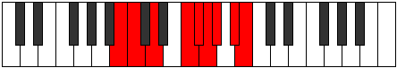

# Mode Mydyllic

## Links

- [Documentation](README.md)
- [Scales Index](Scales.md)
- [Modes Index](Modes.md)
- [Chords Index](Chords.md)

## Parent Scale

[Zagyllic](ScaleZagyllic.md)

## Number

[3019](https://ianring.com/musictheory/scales/3019)

## Transposition

1, 2, 3, 1, 1, 1, 2, 1

## Chord Pattern

i, IIIb5, vii⁰

## Perfection

- 5 Perfect notes
- 3 Perfect notes

## Perfection Profile

[true true false true false true false true]

## Permutations

| Tonic | Notes | Signature | Illustration | Audio |
|-------|-------|-----------|--------------|-------|
| [C](ModeCNaturalMydyllic.md) | C, C#, **D#**, F#, **G**, G#, **A**, B, C | C |  | [midi](https://github.com/edipermadi/music/blob/main/docs/ModeCNaturalMydyllic.mid?raw=true) |
| [C#](ModeCSharpMydyllic.md) | C#, D, **E**, G, **G#**, A, **A#**, C, C# | C |  | [midi](https://github.com/edipermadi/music/blob/main/docs/ModeCSharpMydyllic.mid?raw=true) |
| [Db](ModeDFlatMydyllic.md) | Db, D, **E**, G, **Ab**, A, **Bb**, C, Db | C |  | [midi](https://github.com/edipermadi/music/blob/main/docs/ModeDFlatMydyllic.mid?raw=true) |
| [D](ModeDNaturalMydyllic.md) | D, D#, **F**, G#, **A**, A#, **B**, C#, D | C |  | [midi](https://github.com/edipermadi/music/blob/main/docs/ModeDNaturalMydyllic.mid?raw=true) |
| [D#](ModeDSharpMydyllic.md) | D#, E, **F#**, A, **A#**, B, **C**, D, D# | C |  | [midi](https://github.com/edipermadi/music/blob/main/docs/ModeDSharpMydyllic.mid?raw=true) |
| [Eb](ModeEFlatMydyllic.md) | Eb, E, **Gb**, A, **Bb**, B, **C**, D, Eb | C |  | [midi](https://github.com/edipermadi/music/blob/main/docs/ModeEFlatMydyllic.mid?raw=true) |
| [E](ModeENaturalMydyllic.md) | E, F, **G**, A#, **B**, C, **C#**, D#, E | C |  | [midi](https://github.com/edipermadi/music/blob/main/docs/ModeENaturalMydyllic.mid?raw=true) |
| [F](ModeFNaturalMydyllic.md) | F, F#, **G#**, B, **C**, C#, **D**, E, F | C |  | [midi](https://github.com/edipermadi/music/blob/main/docs/ModeFNaturalMydyllic.mid?raw=true) |
| [F#](ModeFSharpMydyllic.md) | F#, G, **A**, C, **C#**, D, **D#**, F, F# | C |  | [midi](https://github.com/edipermadi/music/blob/main/docs/ModeFSharpMydyllic.mid?raw=true) |
| [Gb](ModeGFlatMydyllic.md) | Gb, G, **A**, C, **Db**, D, **Eb**, F, Gb | C |  | [midi](https://github.com/edipermadi/music/blob/main/docs/ModeGFlatMydyllic.mid?raw=true) |
| [G](ModeGNaturalMydyllic.md) | G, G#, **A#**, C#, **D**, D#, **E**, F#, G | C |  | [midi](https://github.com/edipermadi/music/blob/main/docs/ModeGNaturalMydyllic.mid?raw=true) |
| [G#](ModeGSharpMydyllic.md) | G#, A, **B**, D, **D#**, E, **F**, G, G# | C |  | [midi](https://github.com/edipermadi/music/blob/main/docs/ModeGSharpMydyllic.mid?raw=true) |
| [Ab](ModeAFlatMydyllic.md) | Ab, A, **B**, D, **Eb**, E, **F**, G, Ab | C |  | [midi](https://github.com/edipermadi/music/blob/main/docs/ModeAFlatMydyllic.mid?raw=true) |
| [A](ModeANaturalMydyllic.md) | A, A#, **C**, D#, **E**, F, **F#**, G#, A | C |  | [midi](https://github.com/edipermadi/music/blob/main/docs/ModeANaturalMydyllic.mid?raw=true) |
| [A#](ModeASharpMydyllic.md) | A#, B, **C#**, E, **F**, F#, **G**, A, A# | C |  | [midi](https://github.com/edipermadi/music/blob/main/docs/ModeASharpMydyllic.mid?raw=true) |
| [Bb](ModeBFlatMydyllic.md) | Bb, B, **Db**, E, **F**, Gb, **G**, A, Bb | C |  | [midi](https://github.com/edipermadi/music/blob/main/docs/ModeBFlatMydyllic.mid?raw=true) |
| [B](ModeBNaturalMydyllic.md) | B, C, **D**, F, **F#**, G, **G#**, A#, B | C |  | [midi](https://github.com/edipermadi/music/blob/main/docs/ModeBNaturalMydyllic.mid?raw=true) |
