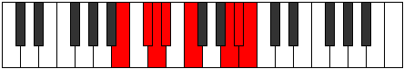

# Mode Mylian

## Links

- [Documentation](README.md)
- [Scales Index](Scales.md)
- [Modes Index](Modes.md)
- [Chords Index](Chords.md)

## Parent Scale

[Katacrian](ScaleKatacrian.md)

## Number

[3165](https://ianring.com/musictheory/scales/3165)

## Luminosity

-1

## Transposition

2, 1, 1, 2, 4, 1, 1

## Chord Pattern

i⁰

## Perfection

- 3 Perfect notes
- 4 Perfect notes

## Perfection Profile

false, false, true, true, false, false, true

## Permutations

| Tonic | Notes | Signature | Illustration | Audio |
|-------|-------|-----------|--------------|-------|
| [C](ModeCNaturalMylian.md) | **C**, **D**, Eb, Fb, **Gb**, **A#**, B, **C** | C |  | [midi](https://github.com/edipermadi/music/blob/main/docs/ModeCNaturalMylian.mid?raw=true) |
| [C#](ModeCSharpMylian.md) | **C#**, **D#**, E, F, **G**, **A##**, B#, **C#** | C |  | [midi](https://github.com/edipermadi/music/blob/main/docs/ModeCSharpMylian.mid?raw=true) |
| [Db](ModeDFlatMylian.md) | **Db**, **Eb**, Fb, Gbb, **Abb**, **B**, C, **Db** | C |  | [midi](https://github.com/edipermadi/music/blob/main/docs/ModeDFlatMylian.mid?raw=true) |
| [D](ModeDNaturalMylian.md) | **D**, **E**, F, Gb, **Ab**, **B#**, C#, **D** | C |  | [midi](https://github.com/edipermadi/music/blob/main/docs/ModeDNaturalMylian.mid?raw=true) |
| [D#](ModeDSharpMylian.md) | **D#**, **E#**, F#, G, **A**, **B##**, C##, **D#** | C |  | [midi](https://github.com/edipermadi/music/blob/main/docs/ModeDSharpMylian.mid?raw=true) |
| [Eb](ModeEFlatMylian.md) | **Eb**, **F**, Gb, Abb, **Bbb**, **C#**, D, **Eb** | C |  | [midi](https://github.com/edipermadi/music/blob/main/docs/ModeEFlatMylian.mid?raw=true) |
| [E](ModeENaturalMylian.md) | **E**, **F#**, G, Ab, **Bb**, **C##**, D#, **E** | C |  | [midi](https://github.com/edipermadi/music/blob/main/docs/ModeENaturalMylian.mid?raw=true) |
| [F](ModeFNaturalMylian.md) | **F**, **G**, Ab, Bbb, **Cb**, **D#**, E, **F** | C |  | [midi](https://github.com/edipermadi/music/blob/main/docs/ModeFNaturalMylian.mid?raw=true) |
| [F#](ModeFSharpMylian.md) | **F#**, **G#**, A, Bb, **C**, **D##**, E#, **F#** | C |  | [midi](https://github.com/edipermadi/music/blob/main/docs/ModeFSharpMylian.mid?raw=true) |
| [Gb](ModeGFlatMylian.md) | **Gb**, **Ab**, Bbb, Cbb, **Dbb**, **E**, F, **Gb** | C |  | [midi](https://github.com/edipermadi/music/blob/main/docs/ModeGFlatMylian.mid?raw=true) |
| [G](ModeGNaturalMylian.md) | **G**, **A**, Bb, Cb, **Db**, **E#**, F#, **G** | C |  | [midi](https://github.com/edipermadi/music/blob/main/docs/ModeGNaturalMylian.mid?raw=true) |
| [G#](ModeGSharpMylian.md) | **G#**, **A#**, B, C, **D**, **E##**, F##, **G#** | C |  | [midi](https://github.com/edipermadi/music/blob/main/docs/ModeGSharpMylian.mid?raw=true) |
| [Ab](ModeAFlatMylian.md) | **Ab**, **Bb**, Cb, Dbb, **Ebb**, **F#**, G, **Ab** | C |  | [midi](https://github.com/edipermadi/music/blob/main/docs/ModeAFlatMylian.mid?raw=true) |
| [A](ModeANaturalMylian.md) | **A**, **B**, C, Db, **Eb**, **F##**, G#, **A** | C |  | [midi](https://github.com/edipermadi/music/blob/main/docs/ModeANaturalMylian.mid?raw=true) |
| [A#](ModeASharpMylian.md) | **A#**, **B#**, C#, D, **E**, **F###**, G##, **A#** | C |  | [midi](https://github.com/edipermadi/music/blob/main/docs/ModeASharpMylian.mid?raw=true) |
| [Bb](ModeBFlatMylian.md) | **Bb**, **C**, Db, Ebb, **Fb**, **G#**, A, **Bb** | C |  | [midi](https://github.com/edipermadi/music/blob/main/docs/ModeBFlatMylian.mid?raw=true) |
| [B](ModeBNaturalMylian.md) | **B**, **C#**, D, Eb, **F**, **G##**, A#, **B** | C |  | [midi](https://github.com/edipermadi/music/blob/main/docs/ModeBNaturalMylian.mid?raw=true) |
