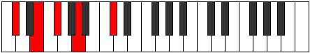
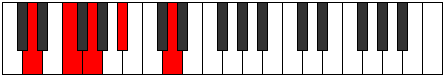
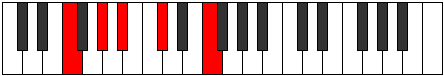
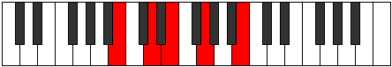

# Mode Mynic

## Links

- [Documentation](README.md)
- [Scales Index](Scales.md)
- [Modes Index](Modes.md)
- [Chords Index](Chords.md)

## Parent Scale

[Epathic](ScaleEpathic.md)

## Number

[297](https://ianring.com/musictheory/scales/297)

## Luminosity

3

## Transposition

3, 2, 3, 4

## Chord Pattern

## Perfection

- 2 Perfect notes
- 2 Perfect notes

## Perfection Profile

false, false, true, true

## Permutations

| Tonic | Notes | Signature | Illustration | Audio |
|-------|-------|-----------|--------------|-------|
| [C](ModeCNaturalMynic.md) | **C**, **D#**, F, G#, **C** | C |  | [midi](https://github.com/edipermadi/music/blob/main/docs/ModeCNaturalMynic.mid?raw=true) |
| [C#](ModeCSharpMynic.md) | **C#**, **E**, F#, A, **C#** | C |  | [midi](https://github.com/edipermadi/music/blob/main/docs/ModeCSharpMynic.mid?raw=true) |
| [Db](ModeDFlatMynic.md) | **Db**, **E**, Gb, A, **Db** | C |  | [midi](https://github.com/edipermadi/music/blob/main/docs/ModeDFlatMynic.mid?raw=true) |
| [D](ModeDNaturalMynic.md) | **D**, **F**, G, A#, **D** | C |  | [midi](https://github.com/edipermadi/music/blob/main/docs/ModeDNaturalMynic.mid?raw=true) |
| [D#](ModeDSharpMynic.md) | **D#**, **F#**, G#, B, **D#** | C |  | [midi](https://github.com/edipermadi/music/blob/main/docs/ModeDSharpMynic.mid?raw=true) |
| [Eb](ModeEFlatMynic.md) | **Eb**, **Gb**, Ab, B, **Eb** | C |  | [midi](https://github.com/edipermadi/music/blob/main/docs/ModeEFlatMynic.mid?raw=true) |
| [E](ModeENaturalMynic.md) | **E**, **G**, A, C, **E** | C |  | [midi](https://github.com/edipermadi/music/blob/main/docs/ModeENaturalMynic.mid?raw=true) |
| [F](ModeFNaturalMynic.md) | **F**, **G#**, A#, C#, **F** | C |  | [midi](https://github.com/edipermadi/music/blob/main/docs/ModeFNaturalMynic.mid?raw=true) |
| [F#](ModeFSharpMynic.md) | **F#**, **A**, B, D, **F#** | C |  | [midi](https://github.com/edipermadi/music/blob/main/docs/ModeFSharpMynic.mid?raw=true) |
| [Gb](ModeGFlatMynic.md) | **Gb**, **A**, B, D, **Gb** | C |  | [midi](https://github.com/edipermadi/music/blob/main/docs/ModeGFlatMynic.mid?raw=true) |
| [G](ModeGNaturalMynic.md) | **G**, **A#**, C, D#, **G** | C |  | [midi](https://github.com/edipermadi/music/blob/main/docs/ModeGNaturalMynic.mid?raw=true) |
| [G#](ModeGSharpMynic.md) | **G#**, **B**, C#, E, **G#** | C |  | [midi](https://github.com/edipermadi/music/blob/main/docs/ModeGSharpMynic.mid?raw=true) |
| [Ab](ModeAFlatMynic.md) | **Ab**, **B**, Db, E, **Ab** | C |  | [midi](https://github.com/edipermadi/music/blob/main/docs/ModeAFlatMynic.mid?raw=true) |
| [A](ModeANaturalMynic.md) | **A**, **C**, D, F, **A** | C |  | [midi](https://github.com/edipermadi/music/blob/main/docs/ModeANaturalMynic.mid?raw=true) |
| [A#](ModeASharpMynic.md) | **A#**, **C#**, D#, F#, **A#** | C |  | [midi](https://github.com/edipermadi/music/blob/main/docs/ModeASharpMynic.mid?raw=true) |
| [Bb](ModeBFlatMynic.md) | **Bb**, **Db**, Eb, Gb, **Bb** | C |  | [midi](https://github.com/edipermadi/music/blob/main/docs/ModeBFlatMynic.mid?raw=true) |
| [B](ModeBNaturalMynic.md) | **B**, **D**, E, G, **B** | C |  | [midi](https://github.com/edipermadi/music/blob/main/docs/ModeBNaturalMynic.mid?raw=true) |
