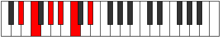
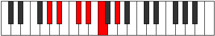

# Mode Mynitonic

## Links

- [Documentation](index.md)
- [Scales Index](Scales.md)
- [Modes Index](Modes.md)
- [Chords Index](Chords.md)

## Parent Scale

[Epathitonic](ScaleEpathitonic.md)

## Number

[677](https://ianring.com/musictheory/scales/677)

## Perfection

- 4 Perfect notes
- 1 Perfect notes

## Perfection Profile

[true true true true false]

## Permutations

| Tonic | Notes | Signature | Illustration | Audio |
|-------|-------|-----------|--------------|-------|
| [C](ModeCNaturalMynitonic.md) | C, D, F, G, **A**, C | C |  | [midi](ModeCNaturalMynitonic.mid) [ogg](ModeCNaturalMynitonic.ogg) |
| [C#](ModeCSharpMynitonic.md) | C#, D#, F#, G#, **A#**, C# | C |  | [midi](ModeCSharpMynitonic.mid) [ogg](ModeCSharpMynitonic.ogg) |
| [Db](ModeDFlatMynitonic.md) | Db, Eb, Gb, Ab, **Bb**, Db | C |  | [midi](ModeDFlatMynitonic.mid) [ogg](ModeDFlatMynitonic.ogg) |
| [D](ModeDNaturalMynitonic.md) | D, E, G, A, **B**, D | C |  | [midi](ModeDNaturalMynitonic.mid) [ogg](ModeDNaturalMynitonic.ogg) |
| [D#](ModeDSharpMynitonic.md) | D#, F, G#, A#, **C**, D# | C |  | [midi](ModeDSharpMynitonic.mid) [ogg](ModeDSharpMynitonic.ogg) |
| [Eb](ModeEFlatMynitonic.md) | Eb, F, Ab, Bb, **C**, Eb | C |  | [midi](ModeEFlatMynitonic.mid) [ogg](ModeEFlatMynitonic.ogg) |
| [E](ModeENaturalMynitonic.md) | E, F#, A, B, **C#**, E | C |  | [midi](ModeENaturalMynitonic.mid) [ogg](ModeENaturalMynitonic.ogg) |
| [F](ModeFNaturalMynitonic.md) | F, G, A#, C, **D**, F | C |  | [midi](ModeFNaturalMynitonic.mid) [ogg](ModeFNaturalMynitonic.ogg) |
| [F#](ModeFSharpMynitonic.md) | F#, G#, B, C#, **D#**, F# | C |  | [midi](ModeFSharpMynitonic.mid) [ogg](ModeFSharpMynitonic.ogg) |
| [Gb](ModeGFlatMynitonic.md) | Gb, Ab, B, Db, **Eb**, Gb | C |  | [midi](ModeGFlatMynitonic.mid) [ogg](ModeGFlatMynitonic.ogg) |
| [G](ModeGNaturalMynitonic.md) | G, A, C, D, **E**, G | C |  | [midi](ModeGNaturalMynitonic.mid) [ogg](ModeGNaturalMynitonic.ogg) |
| [G#](ModeGSharpMynitonic.md) | G#, A#, C#, D#, **F**, G# | C |  | [midi](ModeGSharpMynitonic.mid) [ogg](ModeGSharpMynitonic.ogg) |
| [Ab](ModeAFlatMynitonic.md) | Ab, Bb, Db, Eb, **F**, Ab | C |  | [midi](ModeAFlatMynitonic.mid) [ogg](ModeAFlatMynitonic.ogg) |
| [A](ModeANaturalMynitonic.md) | A, B, D, E, **F#**, A | C |  | [midi](ModeANaturalMynitonic.mid) [ogg](ModeANaturalMynitonic.ogg) |
| [A#](ModeASharpMynitonic.md) | A#, C, D#, F, **G**, A# | C |  | [midi](ModeASharpMynitonic.mid) [ogg](ModeASharpMynitonic.ogg) |
| [Bb](ModeBFlatMynitonic.md) | Bb, C, Eb, F, **G**, Bb | C |  | [midi](ModeBFlatMynitonic.mid) [ogg](ModeBFlatMynitonic.ogg) |
| [B](ModeBNaturalMynitonic.md) | B, C#, E, F#, **G#**, B | C |  | [midi](ModeBNaturalMynitonic.mid) [ogg](ModeBNaturalMynitonic.ogg) |
