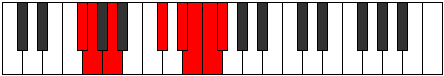

# Mode Myptian

## Links

- [Documentation](index.md)
- [Scales Index](Scales.md)
- [Modes Index](Modes.md)
- [Chords Index](Chords.md)

## Parent Scale

[Gydian](ScaleGydian.md)

## Number

[3723](https://ianring.com/musictheory/scales/3723)

## Perfection

- 2 Perfect notes
- 5 Perfect notes

## Perfection Profile

[true false true false false false false]

## Permutations

| Tonic | Notes | Signature | Illustration | Audio |
|-------|-------|-----------|--------------|-------|
| [C](ModeCNaturalMyptian.md) | C, **Db**, Eb, **F##**, **G##**, **A#**, **B**, C | C |  | [midi](ModeCNaturalMyptian.mid) [ogg](ModeCNaturalMyptian.ogg) |
| [C#](ModeCSharpMyptian.md) | C#, **D**, E, **F###**, **G###**, **A##**, **B#**, C# | C |  | [midi](ModeCSharpMyptian.mid) [ogg](ModeCSharpMyptian.ogg) |
| [Db](ModeDFlatMyptian.md) | Db, **Ebb**, Fb, **G#**, **A#**, **B**, **C**, Db | C |  | [midi](ModeDFlatMyptian.mid) [ogg](ModeDFlatMyptian.ogg) |
| [D](ModeDNaturalMyptian.md) | D, **Eb**, F, **G##**, **A##**, **B#**, **C#**, D | C |  | [midi](ModeDNaturalMyptian.mid) [ogg](ModeDNaturalMyptian.ogg) |
| [D#](ModeDSharpMyptian.md) | D#, **E**, F#, **G###**, **A###**, **B##**, **C##**, D# | C |  | [midi](ModeDSharpMyptian.mid) [ogg](ModeDSharpMyptian.ogg) |
| [Eb](ModeEFlatMyptian.md) | Eb, **Fb**, Gb, **A#**, **B#**, **C#**, **D**, Eb | C |  | [midi](ModeEFlatMyptian.mid) [ogg](ModeEFlatMyptian.ogg) |
| [E](ModeENaturalMyptian.md) | E, **F**, G, **A##**, **B##**, **C##**, **D#**, E | C |  | [midi](ModeENaturalMyptian.mid) [ogg](ModeENaturalMyptian.ogg) |
| [F](ModeFNaturalMyptian.md) | F, **Gb**, Ab, **B#**, **C##**, **D#**, **E**, F | C |  | [midi](ModeFNaturalMyptian.mid) [ogg](ModeFNaturalMyptian.ogg) |
| [F#](ModeFSharpMyptian.md) | F#, **G**, A, **B##**, **C###**, **D##**, **E#**, F# | C |  | [midi](ModeFSharpMyptian.mid) [ogg](ModeFSharpMyptian.ogg) |
| [Gb](ModeGFlatMyptian.md) | Gb, **Abb**, Bbb, **C#**, **D#**, **E**, **F**, Gb | C |  | [midi](ModeGFlatMyptian.mid) [ogg](ModeGFlatMyptian.ogg) |
| [G](ModeGNaturalMyptian.md) | G, **Ab**, Bb, **C##**, **D##**, **E#**, **F#**, G | C |  | [midi](ModeGNaturalMyptian.mid) [ogg](ModeGNaturalMyptian.ogg) |
| [G#](ModeGSharpMyptian.md) | G#, **A**, B, **C###**, **D###**, **E##**, **F##**, G# | C |  | [midi](ModeGSharpMyptian.mid) [ogg](ModeGSharpMyptian.ogg) |
| [Ab](ModeAFlatMyptian.md) | Ab, **Bbb**, Cb, **D#**, **E#**, **F#**, **G**, Ab | C |  | [midi](ModeAFlatMyptian.mid) [ogg](ModeAFlatMyptian.ogg) |
| [A](ModeANaturalMyptian.md) | A, **Bb**, C, **D##**, **E##**, **F##**, **G#**, A | C |  | [midi](ModeANaturalMyptian.mid) [ogg](ModeANaturalMyptian.ogg) |
| [A#](ModeASharpMyptian.md) | A#, **B**, C#, **D###**, **E###**, **F###**, **G##**, A# | C |  | [midi](ModeASharpMyptian.mid) [ogg](ModeASharpMyptian.ogg) |
| [Bb](ModeBFlatMyptian.md) | Bb, **Cb**, Db, **E#**, **F##**, **G#**, **A**, Bb | C |  | [midi](ModeBFlatMyptian.mid) [ogg](ModeBFlatMyptian.ogg) |
| [B](ModeBNaturalMyptian.md) | B, **C**, D, **E##**, **F###**, **G##**, **A#**, B | C |  | [midi](ModeBNaturalMyptian.mid) [ogg](ModeBNaturalMyptian.ogg) |
