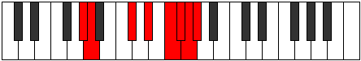

# Mode Myrian

## Links

- [Documentation](index.md)
- [Scales Index](Scales.md)
- [Modes Index](Modes.md)
- [Chords Index](Chords.md)

## Parent Scale

[Pythian](ScalePythian.md)

## Number

[3747](https://ianring.com/musictheory/scales/3747)

## Interval Pattern

1, 4, 2, 2, 1, 1, 1

## Chord Pattern

## Perfection

- 3 Perfect notes
- 4 Perfect notes

## Perfection Profile

[true false true false false true false]

## Permutations

| Tonic | Notes | Signature | Illustration | Audio |
|-------|-------|-----------|--------------|-------|
| [C](ModeCNaturalMyrian.md) | C, **Db**, E#, **F##**, **G##**, A#, **B**, C | C |  | [midi](https://github.com/edipermadi/music/blob/main/docs/ModeCNaturalMyrian.mid?raw=true) |
| [C#](ModeCSharpMyrian.md) | C#, **D**, E##, **F###**, **G###**, A##, **B#**, C# | C |  | [midi](https://github.com/edipermadi/music/blob/main/docs/ModeCSharpMyrian.mid?raw=true) |
| [Db](ModeDFlatMyrian.md) | Db, **Ebb**, F#, **G#**, **A#**, B, **C**, Db | C |  | [midi](https://github.com/edipermadi/music/blob/main/docs/ModeDFlatMyrian.mid?raw=true) |
| [D](ModeDNaturalMyrian.md) | D, **Eb**, F##, **G##**, **A##**, B#, **C#**, D | C |  | [midi](https://github.com/edipermadi/music/blob/main/docs/ModeDNaturalMyrian.mid?raw=true) |
| [D#](ModeDSharpMyrian.md) | D#, **E**, F###, **G###**, **A###**, B##, **C##**, D# | C |  | [midi](https://github.com/edipermadi/music/blob/main/docs/ModeDSharpMyrian.mid?raw=true) |
| [Eb](ModeEFlatMyrian.md) | Eb, **Fb**, G#, **A#**, **B#**, C#, **D**, Eb | C |  | [midi](https://github.com/edipermadi/music/blob/main/docs/ModeEFlatMyrian.mid?raw=true) |
| [E](ModeENaturalMyrian.md) | E, **F**, G##, **A##**, **B##**, C##, **D#**, E | C |  | [midi](https://github.com/edipermadi/music/blob/main/docs/ModeENaturalMyrian.mid?raw=true) |
| [F](ModeFNaturalMyrian.md) | F, **Gb**, A#, **B#**, **C##**, D#, **E**, F | C |  | [midi](https://github.com/edipermadi/music/blob/main/docs/ModeFNaturalMyrian.mid?raw=true) |
| [F#](ModeFSharpMyrian.md) | F#, **G**, A##, **B##**, **C###**, D##, **E#**, F# | C |  | [midi](https://github.com/edipermadi/music/blob/main/docs/ModeFSharpMyrian.mid?raw=true) |
| [Gb](ModeGFlatMyrian.md) | Gb, **Abb**, B, **C#**, **D#**, E, **F**, Gb | C |  | [midi](https://github.com/edipermadi/music/blob/main/docs/ModeGFlatMyrian.mid?raw=true) |
| [G](ModeGNaturalMyrian.md) | G, **Ab**, B#, **C##**, **D##**, E#, **F#**, G | C |  | [midi](https://github.com/edipermadi/music/blob/main/docs/ModeGNaturalMyrian.mid?raw=true) |
| [G#](ModeGSharpMyrian.md) | G#, **A**, B##, **C###**, **D###**, E##, **F##**, G# | C |  | [midi](https://github.com/edipermadi/music/blob/main/docs/ModeGSharpMyrian.mid?raw=true) |
| [Ab](ModeAFlatMyrian.md) | Ab, **Bbb**, C#, **D#**, **E#**, F#, **G**, Ab | C |  | [midi](https://github.com/edipermadi/music/blob/main/docs/ModeAFlatMyrian.mid?raw=true) |
| [A](ModeANaturalMyrian.md) | A, **Bb**, C##, **D##**, **E##**, F##, **G#**, A | C |  | [midi](https://github.com/edipermadi/music/blob/main/docs/ModeANaturalMyrian.mid?raw=true) |
| [A#](ModeASharpMyrian.md) | A#, **B**, C###, **D###**, **E###**, F###, **G##**, A# | C |  | [midi](https://github.com/edipermadi/music/blob/main/docs/ModeASharpMyrian.mid?raw=true) |
| [Bb](ModeBFlatMyrian.md) | Bb, **Cb**, D#, **E#**, **F##**, G#, **A**, Bb | C |  | [midi](https://github.com/edipermadi/music/blob/main/docs/ModeBFlatMyrian.mid?raw=true) |
| [B](ModeBNaturalMyrian.md) | B, **C**, D##, **E##**, **F###**, G##, **A#**, B | C |  | [midi](https://github.com/edipermadi/music/blob/main/docs/ModeBNaturalMyrian.mid?raw=true) |
