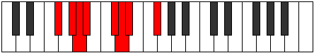
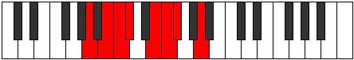

# Mode Mythian

## Links

- [Documentation](README.md)
- [Scales Index](Scales.md)
- [Modes Index](Modes.md)
- [Chords Index](Chords.md)

## Parent Scale

[Epathian](ScaleEpathian.md)

## Number

[925](https://ianring.com/musictheory/scales/925)

## Interval Pattern

2, 1, 1, 3, 1, 1, 3

## Chord Pattern

i, ii⁰b3, IIIb5, IV⁺, VI

## Perfection

- 5 Perfect notes
- 2 Perfect notes

## Perfection Profile

[true true false false true true true]

## Permutations

| Tonic | Notes | Signature | Illustration | Audio |
|-------|-------|-----------|--------------|-------|
| [C](ModeCNaturalMythian.md) | C, D, **Eb**, **Fb**, G, Ab, Bbb, C | C |  | [midi](https://github.com/edipermadi/music/blob/main/docs/ModeCNaturalMythian.mid?raw=true) |
| [C#](ModeCSharpMythian.md) | C#, D#, **E**, **F**, G#, A, Bb, C# | C |  | [midi](https://github.com/edipermadi/music/blob/main/docs/ModeCSharpMythian.mid?raw=true) |
| [Db](ModeDFlatMythian.md) | Db, Eb, **Fb**, **Gbb**, Ab, Bbb, Cbb, Db | C |  | [midi](https://github.com/edipermadi/music/blob/main/docs/ModeDFlatMythian.mid?raw=true) |
| [D](ModeDNaturalMythian.md) | D, E, **F**, **Gb**, A, Bb, Cb, D | C |  | [midi](https://github.com/edipermadi/music/blob/main/docs/ModeDNaturalMythian.mid?raw=true) |
| [D#](ModeDSharpMythian.md) | D#, E#, **F#**, **G**, A#, B, C, D# | C |  | [midi](https://github.com/edipermadi/music/blob/main/docs/ModeDSharpMythian.mid?raw=true) |
| [Eb](ModeEFlatMythian.md) | Eb, F, **Gb**, **Abb**, Bb, Cb, Dbb, Eb | C |  | [midi](https://github.com/edipermadi/music/blob/main/docs/ModeEFlatMythian.mid?raw=true) |
| [E](ModeENaturalMythian.md) | E, F#, **G**, **Ab**, B, C, Db, E | C |  | [midi](https://github.com/edipermadi/music/blob/main/docs/ModeENaturalMythian.mid?raw=true) |
| [F](ModeFNaturalMythian.md) | F, G, **Ab**, **Bbb**, C, Db, Ebb, F | C |  | [midi](https://github.com/edipermadi/music/blob/main/docs/ModeFNaturalMythian.mid?raw=true) |
| [F#](ModeFSharpMythian.md) | F#, G#, **A**, **Bb**, C#, D, Eb, F# | C |  | [midi](https://github.com/edipermadi/music/blob/main/docs/ModeFSharpMythian.mid?raw=true) |
| [Gb](ModeGFlatMythian.md) | Gb, Ab, **Bbb**, **Cbb**, Db, Ebb, Fbb, Gb | C |  | [midi](https://github.com/edipermadi/music/blob/main/docs/ModeGFlatMythian.mid?raw=true) |
| [G](ModeGNaturalMythian.md) | G, A, **Bb**, **Cb**, D, Eb, Fb, G | C |  | [midi](https://github.com/edipermadi/music/blob/main/docs/ModeGNaturalMythian.mid?raw=true) |
| [G#](ModeGSharpMythian.md) | G#, A#, **B**, **C**, D#, E, F, G# | C |  | [midi](https://github.com/edipermadi/music/blob/main/docs/ModeGSharpMythian.mid?raw=true) |
| [Ab](ModeAFlatMythian.md) | Ab, Bb, **Cb**, **Dbb**, Eb, Fb, Gbb, Ab | C |  | [midi](https://github.com/edipermadi/music/blob/main/docs/ModeAFlatMythian.mid?raw=true) |
| [A](ModeANaturalMythian.md) | A, B, **C**, **Db**, E, F, Gb, A | C |  | [midi](https://github.com/edipermadi/music/blob/main/docs/ModeANaturalMythian.mid?raw=true) |
| [A#](ModeASharpMythian.md) | A#, B#, **C#**, **D**, E#, F#, G, A# | C |  | [midi](https://github.com/edipermadi/music/blob/main/docs/ModeASharpMythian.mid?raw=true) |
| [Bb](ModeBFlatMythian.md) | Bb, C, **Db**, **Ebb**, F, Gb, Abb, Bb | C |  | [midi](https://github.com/edipermadi/music/blob/main/docs/ModeBFlatMythian.mid?raw=true) |
| [B](ModeBNaturalMythian.md) | B, C#, **D**, **Eb**, F#, G, Ab, B | C |  | [midi](https://github.com/edipermadi/music/blob/main/docs/ModeBNaturalMythian.mid?raw=true) |
