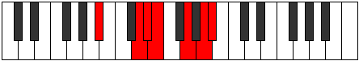
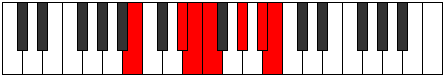

# Mode Mythimic

## Links

- [Documentation](index.md)
- [Scales Index](Scales.md)
- [Modes Index](Modes.md)
- [Chords Index](Chords.md)

## Parent Scale

[Mythimic](ScaleMythimic.md)

## Number

[2673](https://ianring.com/musictheory/scales/2673)

## Interval Pattern

4, 1, 1, 3, 2, 1

## Chord Pattern

III, iv⁰, v

## Perfection

- 4 Perfect notes
- 2 Perfect notes

## Perfection Profile

[false true true false true true]

## Permutations

| Tonic | Notes | Signature | Illustration | Audio |
|-------|-------|-----------|--------------|-------|
| [C](ModeCNaturalMythimic.md) | **C**, D##, E#, **F#**, G##, A##, **C** | C |  | [midi](https://github.com/edipermadi/music/blob/main/docs/ModeCNaturalMythimic.mid?raw=true) |
| [C#](ModeCSharpMythimic.md) | **C#**, D###, E##, **F##**, G###, A###, **C#** | C |  | [midi](https://github.com/edipermadi/music/blob/main/docs/ModeCSharpMythimic.mid?raw=true) |
| [Db](ModeDFlatMythimic.md) | **Db**, E#, F#, **G**, A#, B#, **Db** | C |  | [midi](https://github.com/edipermadi/music/blob/main/docs/ModeDFlatMythimic.mid?raw=true) |
| [D](ModeDNaturalMythimic.md) | **D**, E##, F##, **G#**, A##, B##, **D** | C |  | [midi](https://github.com/edipermadi/music/blob/main/docs/ModeDNaturalMythimic.mid?raw=true) |
| [D#](ModeDSharpMythimic.md) | **D#**, E###, F###, **G##**, A###, B###, **D#** | C |  | [midi](https://github.com/edipermadi/music/blob/main/docs/ModeDSharpMythimic.mid?raw=true) |
| [Eb](ModeEFlatMythimic.md) | **Eb**, F##, G#, **A**, B#, C##, **Eb** | C |  | [midi](https://github.com/edipermadi/music/blob/main/docs/ModeEFlatMythimic.mid?raw=true) |
| [E](ModeENaturalMythimic.md) | **E**, F###, G##, **A#**, B##, C###, **E** | C |  | [midi](https://github.com/edipermadi/music/blob/main/docs/ModeENaturalMythimic.mid?raw=true) |
| [F](ModeFNaturalMythimic.md) | **F**, G##, A#, **B**, C##, D##, **F** | C |  | [midi](https://github.com/edipermadi/music/blob/main/docs/ModeFNaturalMythimic.mid?raw=true) |
| [F#](ModeFSharpMythimic.md) | **F#**, G###, A##, **B#**, C###, D###, **F#** | C |  | [midi](https://github.com/edipermadi/music/blob/main/docs/ModeFSharpMythimic.mid?raw=true) |
| [Gb](ModeGFlatMythimic.md) | **Gb**, A#, B, **C**, D#, E#, **Gb** | C |  | [midi](https://github.com/edipermadi/music/blob/main/docs/ModeGFlatMythimic.mid?raw=true) |
| [G](ModeGNaturalMythimic.md) | **G**, A##, B#, **C#**, D##, E##, **G** | C |  | [midi](https://github.com/edipermadi/music/blob/main/docs/ModeGNaturalMythimic.mid?raw=true) |
| [G#](ModeGSharpMythimic.md) | **G#**, A###, B##, **C##**, D###, E###, **G#** | C |  | [midi](https://github.com/edipermadi/music/blob/main/docs/ModeGSharpMythimic.mid?raw=true) |
| [Ab](ModeAFlatMythimic.md) | **Ab**, B#, C#, **D**, E#, F##, **Ab** | C |  | [midi](https://github.com/edipermadi/music/blob/main/docs/ModeAFlatMythimic.mid?raw=true) |
| [A](ModeANaturalMythimic.md) | **A**, B##, C##, **D#**, E##, F###, **A** | C |  | [midi](https://github.com/edipermadi/music/blob/main/docs/ModeANaturalMythimic.mid?raw=true) |
| [A#](ModeASharpMythimic.md) | **A#**, B###, C###, **D##**, E###, Cbbb, **A#** | C |  | [midi](https://github.com/edipermadi/music/blob/main/docs/ModeASharpMythimic.mid?raw=true) |
| [Bb](ModeBFlatMythimic.md) | **Bb**, C##, D#, **E**, F##, G##, **Bb** | C |  | [midi](https://github.com/edipermadi/music/blob/main/docs/ModeBFlatMythimic.mid?raw=true) |
| [B](ModeBNaturalMythimic.md) | **B**, C###, D##, **E#**, F###, G###, **B** | C |  | [midi](https://github.com/edipermadi/music/blob/main/docs/ModeBNaturalMythimic.mid?raw=true) |
