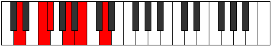

# Mode Mythitonic

## Links

- [Documentation](index.md)
- [Scales Index](Scales.md)
- [Modes Index](Modes.md)
- [Chords Index](Chords.md)

## Parent Scale

[Lyditonic](ScaleLyditonic.md)

## Number

[665](https://ianring.com/musictheory/scales/665)

## Perfection

- 2 Perfect notes
- 3 Perfect notes

## Perfection Profile

[true false false false true]

## Permutations

| Tonic | Notes | Signature | Illustration | Audio |
|-------|-------|-----------|--------------|-------|
| [C](ModeCNaturalMythitonic.md) | C, **D#**, **E**, **G**, A, C | C |  | [midi](ModeCNaturalMythitonic.mid) [ogg](ModeCNaturalMythitonic.ogg) |
| [C#](ModeCSharpMythitonic.md) | C#, **E**, **F**, **G#**, A#, C# | C |  | [midi](ModeCSharpMythitonic.mid) [ogg](ModeCSharpMythitonic.ogg) |
| [Db](ModeDFlatMythitonic.md) | Db, **E**, **F**, **Ab**, Bb, Db | C |  | [midi](ModeDFlatMythitonic.mid) [ogg](ModeDFlatMythitonic.ogg) |
| [D](ModeDNaturalMythitonic.md) | D, **F**, **F#**, **A**, B, D | C |  | [midi](ModeDNaturalMythitonic.mid) [ogg](ModeDNaturalMythitonic.ogg) |
| [D#](ModeDSharpMythitonic.md) | D#, **F#**, **G**, **A#**, C, D# | C |  | [midi](ModeDSharpMythitonic.mid) [ogg](ModeDSharpMythitonic.ogg) |
| [Eb](ModeEFlatMythitonic.md) | Eb, **Gb**, **G**, **Bb**, C, Eb | C |  | [midi](ModeEFlatMythitonic.mid) [ogg](ModeEFlatMythitonic.ogg) |
| [E](ModeENaturalMythitonic.md) | E, **G**, **G#**, **B**, C#, E | C |  | [midi](ModeENaturalMythitonic.mid) [ogg](ModeENaturalMythitonic.ogg) |
| [F](ModeFNaturalMythitonic.md) | F, **G#**, **A**, **C**, D, F | C |  | [midi](ModeFNaturalMythitonic.mid) [ogg](ModeFNaturalMythitonic.ogg) |
| [F#](ModeFSharpMythitonic.md) | F#, **A**, **A#**, **C#**, D#, F# | C |  | [midi](ModeFSharpMythitonic.mid) [ogg](ModeFSharpMythitonic.ogg) |
| [Gb](ModeGFlatMythitonic.md) | Gb, **A**, **Bb**, **Db**, Eb, Gb | C |  | [midi](ModeGFlatMythitonic.mid) [ogg](ModeGFlatMythitonic.ogg) |
| [G](ModeGNaturalMythitonic.md) | G, **A#**, **B**, **D**, E, G | C |  | [midi](ModeGNaturalMythitonic.mid) [ogg](ModeGNaturalMythitonic.ogg) |
| [G#](ModeGSharpMythitonic.md) | G#, **B**, **C**, **D#**, F, G# | C |  | [midi](ModeGSharpMythitonic.mid) [ogg](ModeGSharpMythitonic.ogg) |
| [Ab](ModeAFlatMythitonic.md) | Ab, **B**, **C**, **Eb**, F, Ab | C |  | [midi](ModeAFlatMythitonic.mid) [ogg](ModeAFlatMythitonic.ogg) |
| [A](ModeANaturalMythitonic.md) | A, **C**, **C#**, **E**, F#, A | C |  | [midi](ModeANaturalMythitonic.mid) [ogg](ModeANaturalMythitonic.ogg) |
| [A#](ModeASharpMythitonic.md) | A#, **C#**, **D**, **F**, G, A# | C |  | [midi](ModeASharpMythitonic.mid) [ogg](ModeASharpMythitonic.ogg) |
| [Bb](ModeBFlatMythitonic.md) | Bb, **Db**, **D**, **F**, G, Bb | C |  | [midi](ModeBFlatMythitonic.mid) [ogg](ModeBFlatMythitonic.ogg) |
| [B](ModeBNaturalMythitonic.md) | B, **D**, **D#**, **F#**, G#, B | C |  | [midi](ModeBNaturalMythitonic.mid) [ogg](ModeBNaturalMythitonic.ogg) |
