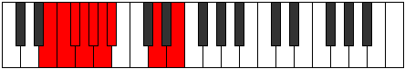

# Mode Mythyllic

## Links

- [Documentation](index.md)
- [Scales Index](Scales.md)
- [Modes Index](Modes.md)
- [Chords Index](Chords.md)

## Parent Scale

[Stycryllic](ScaleStycryllic.md)

## Number

[1151](https://ianring.com/musictheory/scales/1151)

## Interval Pattern

1, 1, 1, 1, 1, 1, 4, 2

## Chord Pattern

## Perfection

- 4 Perfect notes
- 4 Perfect notes

## Perfection Profile

[false false false true false true true true]

## Permutations

| Tonic | Notes | Signature | Illustration | Audio |
|-------|-------|-----------|--------------|-------|
| [C](ModeCNaturalMythyllic.md) | **C**, **C#**, **D**, D#, **E**, F, F#, A#, **C** | C |  | [midi](https://github.com/edipermadi/music/blob/main/docs/ModeCNaturalMythyllic.mid?raw=true) |
| [C#](ModeCSharpMythyllic.md) | **C#**, **D**, **D#**, E, **F**, F#, G, B, **C#** | C |  | [midi](https://github.com/edipermadi/music/blob/main/docs/ModeCSharpMythyllic.mid?raw=true) |
| [Db](ModeDFlatMythyllic.md) | **Db**, **D**, **Eb**, E, **F**, Gb, G, B, **Db** | C |  | [midi](https://github.com/edipermadi/music/blob/main/docs/ModeDFlatMythyllic.mid?raw=true) |
| [D](ModeDNaturalMythyllic.md) | **D**, **D#**, **E**, F, **F#**, G, G#, C, **D** | C |  | [midi](https://github.com/edipermadi/music/blob/main/docs/ModeDNaturalMythyllic.mid?raw=true) |
| [D#](ModeDSharpMythyllic.md) | **D#**, **E**, **F**, F#, **G**, G#, A, C#, **D#** | C |  | [midi](https://github.com/edipermadi/music/blob/main/docs/ModeDSharpMythyllic.mid?raw=true) |
| [Eb](ModeEFlatMythyllic.md) | **Eb**, **E**, **F**, Gb, **G**, Ab, A, Db, **Eb** | C |  | [midi](https://github.com/edipermadi/music/blob/main/docs/ModeEFlatMythyllic.mid?raw=true) |
| [E](ModeENaturalMythyllic.md) | **E**, **F**, **F#**, G, **G#**, A, A#, D, **E** | C |  | [midi](https://github.com/edipermadi/music/blob/main/docs/ModeENaturalMythyllic.mid?raw=true) |
| [F](ModeFNaturalMythyllic.md) | **F**, **F#**, **G**, G#, **A**, A#, B, D#, **F** | C |  | [midi](https://github.com/edipermadi/music/blob/main/docs/ModeFNaturalMythyllic.mid?raw=true) |
| [F#](ModeFSharpMythyllic.md) | **F#**, **G**, **G#**, A, **A#**, B, C, E, **F#** | C |  | [midi](https://github.com/edipermadi/music/blob/main/docs/ModeFSharpMythyllic.mid?raw=true) |
| [Gb](ModeGFlatMythyllic.md) | **Gb**, **G**, **Ab**, A, **Bb**, B, C, E, **Gb** | C |  | [midi](https://github.com/edipermadi/music/blob/main/docs/ModeGFlatMythyllic.mid?raw=true) |
| [G](ModeGNaturalMythyllic.md) | **G**, **G#**, **A**, A#, **B**, C, C#, F, **G** | C |  | [midi](https://github.com/edipermadi/music/blob/main/docs/ModeGNaturalMythyllic.mid?raw=true) |
| [G#](ModeGSharpMythyllic.md) | **G#**, **A**, **A#**, B, **C**, C#, D, F#, **G#** | C |  | [midi](https://github.com/edipermadi/music/blob/main/docs/ModeGSharpMythyllic.mid?raw=true) |
| [Ab](ModeAFlatMythyllic.md) | **Ab**, **A**, **Bb**, B, **C**, Db, D, Gb, **Ab** | C |  | [midi](https://github.com/edipermadi/music/blob/main/docs/ModeAFlatMythyllic.mid?raw=true) |
| [A](ModeANaturalMythyllic.md) | **A**, **A#**, **B**, C, **C#**, D, D#, G, **A** | C |  | [midi](https://github.com/edipermadi/music/blob/main/docs/ModeANaturalMythyllic.mid?raw=true) |
| [A#](ModeASharpMythyllic.md) | **A#**, **B**, **C**, C#, **D**, D#, E, G#, **A#** | C |  | [midi](https://github.com/edipermadi/music/blob/main/docs/ModeASharpMythyllic.mid?raw=true) |
| [Bb](ModeBFlatMythyllic.md) | **Bb**, **B**, **C**, Db, **D**, Eb, E, Ab, **Bb** | C |  | [midi](https://github.com/edipermadi/music/blob/main/docs/ModeBFlatMythyllic.mid?raw=true) |
| [B](ModeBNaturalMythyllic.md) | **B**, **C**, **C#**, D, **D#**, E, F, A, **B** | C |  | [midi](https://github.com/edipermadi/music/blob/main/docs/ModeBNaturalMythyllic.mid?raw=true) |
