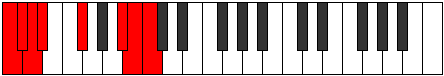
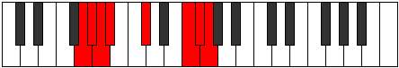

# Mode Pacrian

## Links

- [Documentation](README.md)
- [Scales Index](Scales.md)
- [Modes Index](Modes.md)
- [Chords Index](Chords.md)

## Parent Scale

[Katyptian](ScaleKatyptian.md)

## Number

[3151](https://ianring.com/musictheory/scales/3151)

## Luminosity

-1

## Transposition

1, 1, 1, 3, 4, 1, 1

## Chord Pattern

i⁰b3

## Perfection

- 3 Perfect notes
- 4 Perfect notes

## Perfection Profile

false, false, false, true, true, false, true

## Permutations

| Tonic | Notes | Signature | Illustration | Audio |
|-------|-------|-----------|--------------|-------|
| [C](ModeCNaturalPacrian.md) | **C**, **Db**, **Ebb**, Fbb, Gb, **A#**, B, **C** | C |  | [midi](https://github.com/edipermadi/music/blob/main/docs/ModeCNaturalPacrian.mid?raw=true) |
| [C#](ModeCSharpPacrian.md) | **C#**, **D**, **Eb**, Fb, G, **A##**, B#, **C#** | C |  | [midi](https://github.com/edipermadi/music/blob/main/docs/ModeCSharpPacrian.mid?raw=true) |
| [Db](ModeDFlatPacrian.md) | **Db**, **Ebb**, **Fbb**, Gbbb, Abb, **B**, C, **Db** | C |  | [midi](https://github.com/edipermadi/music/blob/main/docs/ModeDFlatPacrian.mid?raw=true) |
| [D](ModeDNaturalPacrian.md) | **D**, **Eb**, **Fb**, Gbb, Ab, **B#**, C#, **D** | C |  | [midi](https://github.com/edipermadi/music/blob/main/docs/ModeDNaturalPacrian.mid?raw=true) |
| [D#](ModeDSharpPacrian.md) | **D#**, **E**, **F**, Gb, A, **B##**, C##, **D#** | C |  | [midi](https://github.com/edipermadi/music/blob/main/docs/ModeDSharpPacrian.mid?raw=true) |
| [Eb](ModeEFlatPacrian.md) | **Eb**, **Fb**, **Gbb**, Abbb, Bbb, **C#**, D, **Eb** | C |  | [midi](https://github.com/edipermadi/music/blob/main/docs/ModeEFlatPacrian.mid?raw=true) |
| [E](ModeENaturalPacrian.md) | **E**, **F**, **Gb**, Abb, Bb, **C##**, D#, **E** | C |  | [midi](https://github.com/edipermadi/music/blob/main/docs/ModeENaturalPacrian.mid?raw=true) |
| [F](ModeFNaturalPacrian.md) | **F**, **Gb**, **Abb**, Bbbb, Cb, **D#**, E, **F** | C |  | [midi](https://github.com/edipermadi/music/blob/main/docs/ModeFNaturalPacrian.mid?raw=true) |
| [F#](ModeFSharpPacrian.md) | **F#**, **G**, **Ab**, Bbb, C, **D##**, E#, **F#** | C |  | [midi](https://github.com/edipermadi/music/blob/main/docs/ModeFSharpPacrian.mid?raw=true) |
| [Gb](ModeGFlatPacrian.md) | **Gb**, **Abb**, **Bbbb**, Cbbb, Dbb, **E**, F, **Gb** | C |  | [midi](https://github.com/edipermadi/music/blob/main/docs/ModeGFlatPacrian.mid?raw=true) |
| [G](ModeGNaturalPacrian.md) | **G**, **Ab**, **Bbb**, Cbb, Db, **E#**, F#, **G** | C |  | [midi](https://github.com/edipermadi/music/blob/main/docs/ModeGNaturalPacrian.mid?raw=true) |
| [G#](ModeGSharpPacrian.md) | **G#**, **A**, **Bb**, Cb, D, **E##**, F##, **G#** | C |  | [midi](https://github.com/edipermadi/music/blob/main/docs/ModeGSharpPacrian.mid?raw=true) |
| [Ab](ModeAFlatPacrian.md) | **Ab**, **Bbb**, **Cbb**, Dbbb, Ebb, **F#**, G, **Ab** | C |  | [midi](https://github.com/edipermadi/music/blob/main/docs/ModeAFlatPacrian.mid?raw=true) |
| [A](ModeANaturalPacrian.md) | **A**, **Bb**, **Cb**, Dbb, Eb, **F##**, G#, **A** | C |  | [midi](https://github.com/edipermadi/music/blob/main/docs/ModeANaturalPacrian.mid?raw=true) |
| [A#](ModeASharpPacrian.md) | **A#**, **B**, **C**, Db, E, **F###**, G##, **A#** | C |  | [midi](https://github.com/edipermadi/music/blob/main/docs/ModeASharpPacrian.mid?raw=true) |
| [Bb](ModeBFlatPacrian.md) | **Bb**, **Cb**, **Dbb**, Ebbb, Fb, **G#**, A, **Bb** | C |  | [midi](https://github.com/edipermadi/music/blob/main/docs/ModeBFlatPacrian.mid?raw=true) |
| [B](ModeBNaturalPacrian.md) | **B**, **C**, **Db**, Ebb, F, **G##**, A#, **B** | C |  | [midi](https://github.com/edipermadi/music/blob/main/docs/ModeBNaturalPacrian.mid?raw=true) |
