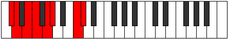

# Mode Padian

## Links

- [Documentation](index.md)
- [Scales Index](Scales.md)
- [Modes Index](Modes.md)
- [Chords Index](Chords.md)

## Parent Scale

[Aeolathian](ScaleAeolathian.md)

## Number

[2267](https://ianring.com/musictheory/scales/2267)

## Interval Pattern

1, 2, 1, 2, 1, 4, 1

## Chord Pattern

i⁰, i, I, ii⁰, III⁺, iv, VI⁺, VII, VII⁺

## Perfection

- 4 Perfect notes
- 3 Perfect notes

## Perfection Profile

[true false false true true false true]

## Permutations

| Tonic | Notes | Signature | Illustration | Audio |
|-------|-------|-----------|--------------|-------|
| [C](ModeCNaturalPadian.md) | C, **Db**, **Eb**, Fb, Gb, **Abb**, B, C | C |  | [midi](https://github.com/edipermadi/music/blob/main/docs/ModeCNaturalPadian.mid?raw=true) |
| [C#](ModeCSharpPadian.md) | C#, **D**, **E**, F, G, **Ab**, B#, C# | C |  | [midi](https://github.com/edipermadi/music/blob/main/docs/ModeCSharpPadian.mid?raw=true) |
| [Db](ModeDFlatPadian.md) | Db, **Ebb**, **Fb**, Gbb, Abb, **Bbbb**, C, Db | C |  | [midi](https://github.com/edipermadi/music/blob/main/docs/ModeDFlatPadian.mid?raw=true) |
| [D](ModeDNaturalPadian.md) | D, **Eb**, **F**, Gb, Ab, **Bbb**, C#, D | C |  | [midi](https://github.com/edipermadi/music/blob/main/docs/ModeDNaturalPadian.mid?raw=true) |
| [D#](ModeDSharpPadian.md) | D#, **E**, **F#**, G, A, **Bb**, C##, D# | C |  | [midi](https://github.com/edipermadi/music/blob/main/docs/ModeDSharpPadian.mid?raw=true) |
| [Eb](ModeEFlatPadian.md) | Eb, **Fb**, **Gb**, Abb, Bbb, **Cbb**, D, Eb | C |  | [midi](https://github.com/edipermadi/music/blob/main/docs/ModeEFlatPadian.mid?raw=true) |
| [E](ModeENaturalPadian.md) | E, **F**, **G**, Ab, Bb, **Cb**, D#, E | C |  | [midi](https://github.com/edipermadi/music/blob/main/docs/ModeENaturalPadian.mid?raw=true) |
| [F](ModeFNaturalPadian.md) | F, **Gb**, **Ab**, Bbb, Cb, **Dbb**, E, F | C |  | [midi](https://github.com/edipermadi/music/blob/main/docs/ModeFNaturalPadian.mid?raw=true) |
| [F#](ModeFSharpPadian.md) | F#, **G**, **A**, Bb, C, **Db**, E#, F# | C |  | [midi](https://github.com/edipermadi/music/blob/main/docs/ModeFSharpPadian.mid?raw=true) |
| [Gb](ModeGFlatPadian.md) | Gb, **Abb**, **Bbb**, Cbb, Dbb, **Ebbb**, F, Gb | C |  | [midi](https://github.com/edipermadi/music/blob/main/docs/ModeGFlatPadian.mid?raw=true) |
| [G](ModeGNaturalPadian.md) | G, **Ab**, **Bb**, Cb, Db, **Ebb**, F#, G | C |  | [midi](https://github.com/edipermadi/music/blob/main/docs/ModeGNaturalPadian.mid?raw=true) |
| [G#](ModeGSharpPadian.md) | G#, **A**, **B**, C, D, **Eb**, F##, G# | C |  | [midi](https://github.com/edipermadi/music/blob/main/docs/ModeGSharpPadian.mid?raw=true) |
| [Ab](ModeAFlatPadian.md) | Ab, **Bbb**, **Cb**, Dbb, Ebb, **Fbb**, G, Ab | C |  | [midi](https://github.com/edipermadi/music/blob/main/docs/ModeAFlatPadian.mid?raw=true) |
| [A](ModeANaturalPadian.md) | A, **Bb**, **C**, Db, Eb, **Fb**, G#, A | C |  | [midi](https://github.com/edipermadi/music/blob/main/docs/ModeANaturalPadian.mid?raw=true) |
| [A#](ModeASharpPadian.md) | A#, **B**, **C#**, D, E, **F**, G##, A# | C |  | [midi](https://github.com/edipermadi/music/blob/main/docs/ModeASharpPadian.mid?raw=true) |
| [Bb](ModeBFlatPadian.md) | Bb, **Cb**, **Db**, Ebb, Fb, **Gbb**, A, Bb | C |  | [midi](https://github.com/edipermadi/music/blob/main/docs/ModeBFlatPadian.mid?raw=true) |
| [B](ModeBNaturalPadian.md) | B, **C**, **D**, Eb, F, **Gb**, A#, B | C |  | [midi](https://github.com/edipermadi/music/blob/main/docs/ModeBNaturalPadian.mid?raw=true) |
