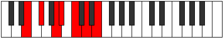

# Mode Padimic

## Links

- [Documentation](index.md)
- [Scales Index](Scales.md)
- [Modes Index](Modes.md)
- [Chords Index](Chords.md)

## Parent Scale

[Boptimic](ScaleBoptimic.md)

## Number

[1381](https://ianring.com/musictheory/scales/1381)

## Interval Pattern

2, 3, 1, 2, 2, 2

## Chord Pattern

II⁺, iii, IV⁺, VI⁺

## Perfection

- 2 Perfect notes
- 4 Perfect notes

## Perfection Profile

[false false true false false true]

## Permutations

| Tonic | Notes | Signature | Illustration | Audio |
|-------|-------|-----------|--------------|-------|
| [C](ModeCNaturalPadimic.md) | **C**, **D**, E#, **F#**, **G#**, A#, **C** | C |  | [midi](https://github.com/edipermadi/music/blob/main/docs/ModeCNaturalPadimic.mid?raw=true) |
| [C#](ModeCSharpPadimic.md) | **C#**, **D#**, E##, **F##**, **G##**, A##, **C#** | C |  | [midi](https://github.com/edipermadi/music/blob/main/docs/ModeCSharpPadimic.mid?raw=true) |
| [Db](ModeDFlatPadimic.md) | **Db**, **Eb**, F#, **G**, **A**, B, **Db** | C |  | [midi](https://github.com/edipermadi/music/blob/main/docs/ModeDFlatPadimic.mid?raw=true) |
| [D](ModeDNaturalPadimic.md) | **D**, **E**, F##, **G#**, **A#**, B#, **D** | C |  | [midi](https://github.com/edipermadi/music/blob/main/docs/ModeDNaturalPadimic.mid?raw=true) |
| [D#](ModeDSharpPadimic.md) | **D#**, **E#**, F###, **G##**, **A##**, B##, **D#** | C |  | [midi](https://github.com/edipermadi/music/blob/main/docs/ModeDSharpPadimic.mid?raw=true) |
| [Eb](ModeEFlatPadimic.md) | **Eb**, **F**, G#, **A**, **B**, C#, **Eb** | C |  | [midi](https://github.com/edipermadi/music/blob/main/docs/ModeEFlatPadimic.mid?raw=true) |
| [E](ModeENaturalPadimic.md) | **E**, **F#**, G##, **A#**, **B#**, C##, **E** | C |  | [midi](https://github.com/edipermadi/music/blob/main/docs/ModeENaturalPadimic.mid?raw=true) |
| [F](ModeFNaturalPadimic.md) | **F**, **G**, A#, **B**, **C#**, D#, **F** | C |  | [midi](https://github.com/edipermadi/music/blob/main/docs/ModeFNaturalPadimic.mid?raw=true) |
| [F#](ModeFSharpPadimic.md) | **F#**, **G#**, A##, **B#**, **C##**, D##, **F#** | C |  | [midi](https://github.com/edipermadi/music/blob/main/docs/ModeFSharpPadimic.mid?raw=true) |
| [Gb](ModeGFlatPadimic.md) | **Gb**, **Ab**, B, **C**, **D**, E, **Gb** | C |  | [midi](https://github.com/edipermadi/music/blob/main/docs/ModeGFlatPadimic.mid?raw=true) |
| [G](ModeGNaturalPadimic.md) | **G**, **A**, B#, **C#**, **D#**, E#, **G** | C |  | [midi](https://github.com/edipermadi/music/blob/main/docs/ModeGNaturalPadimic.mid?raw=true) |
| [G#](ModeGSharpPadimic.md) | **G#**, **A#**, B##, **C##**, **D##**, E##, **G#** | C |  | [midi](https://github.com/edipermadi/music/blob/main/docs/ModeGSharpPadimic.mid?raw=true) |
| [Ab](ModeAFlatPadimic.md) | **Ab**, **Bb**, C#, **D**, **E**, F#, **Ab** | C |  | [midi](https://github.com/edipermadi/music/blob/main/docs/ModeAFlatPadimic.mid?raw=true) |
| [A](ModeANaturalPadimic.md) | **A**, **B**, C##, **D#**, **E#**, F##, **A** | C |  | [midi](https://github.com/edipermadi/music/blob/main/docs/ModeANaturalPadimic.mid?raw=true) |
| [A#](ModeASharpPadimic.md) | **A#**, **B#**, C###, **D##**, **E##**, F###, **A#** | C |  | [midi](https://github.com/edipermadi/music/blob/main/docs/ModeASharpPadimic.mid?raw=true) |
| [Bb](ModeBFlatPadimic.md) | **Bb**, **C**, D#, **E**, **F#**, G#, **Bb** | C |  | [midi](https://github.com/edipermadi/music/blob/main/docs/ModeBFlatPadimic.mid?raw=true) |
| [B](ModeBNaturalPadimic.md) | **B**, **C#**, D##, **E#**, **F##**, G##, **B** | C |  | [midi](https://github.com/edipermadi/music/blob/main/docs/ModeBNaturalPadimic.mid?raw=true) |
