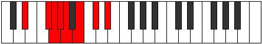

# Mode Pagian

## Links

- [Documentation](index.md)
- [Scales Index](Scales.md)
- [Modes Index](Modes.md)
- [Chords Index](Chords.md)

## Parent Scale

[Pagian](ScalePagian.md)

## Number

[1401](https://ianring.com/musictheory/scales/1401)

## Perfection

- 4 Perfect notes
- 3 Perfect notes

## Perfection Profile

[false true false true false true true]

## Permutations

| Tonic | Notes | Signature | Illustration | Audio |
|-------|-------|-----------|--------------|-------|
| [C](ModeCNaturalPagian.md) | **C**, D#, **E**, F, **Gb**, Ab, Bb, **C** | C |  | [midi](ModeCNaturalPagian.mid) [ogg](ModeCNaturalPagian.ogg) |
| [C#](ModeCSharpPagian.md) | **C#**, D##, **E#**, F#, **G**, A, B, **C#** | C |  | [midi](ModeCSharpPagian.mid) [ogg](ModeCSharpPagian.ogg) |
| [Db](ModeDFlatPagian.md) | **Db**, E, **F**, Gb, **Abb**, Bbb, Cb, **Db** | C |  | [midi](ModeDFlatPagian.mid) [ogg](ModeDFlatPagian.ogg) |
| [D](ModeDNaturalPagian.md) | **D**, E#, **F#**, G, **Ab**, Bb, C, **D** | C |  | [midi](ModeDNaturalPagian.mid) [ogg](ModeDNaturalPagian.ogg) |
| [D#](ModeDSharpPagian.md) | **D#**, E##, **F##**, G#, **A**, B, C#, **D#** | C |  | [midi](ModeDSharpPagian.mid) [ogg](ModeDSharpPagian.ogg) |
| [Eb](ModeEFlatPagian.md) | **Eb**, F#, **G**, Ab, **Bbb**, Cb, Db, **Eb** | C |  | [midi](ModeEFlatPagian.mid) [ogg](ModeEFlatPagian.ogg) |
| [E](ModeENaturalPagian.md) | **E**, F##, **G#**, A, **Bb**, C, D, **E** | C |  | [midi](ModeENaturalPagian.mid) [ogg](ModeENaturalPagian.ogg) |
| [F](ModeFNaturalPagian.md) | **F**, G#, **A**, Bb, **Cb**, Db, Eb, **F** | C |  | [midi](ModeFNaturalPagian.mid) [ogg](ModeFNaturalPagian.ogg) |
| [F#](ModeFSharpPagian.md) | **F#**, G##, **A#**, B, **C**, D, E, **F#** | C |  | [midi](ModeFSharpPagian.mid) [ogg](ModeFSharpPagian.ogg) |
| [Gb](ModeGFlatPagian.md) | **Gb**, A, **Bb**, Cb, **Dbb**, Ebb, Fb, **Gb** | C |  | [midi](ModeGFlatPagian.mid) [ogg](ModeGFlatPagian.ogg) |
| [G](ModeGNaturalPagian.md) | **G**, A#, **B**, C, **Db**, Eb, F, **G** | C |  | [midi](ModeGNaturalPagian.mid) [ogg](ModeGNaturalPagian.ogg) |
| [G#](ModeGSharpPagian.md) | **G#**, A##, **B#**, C#, **D**, E, F#, **G#** | C |  | [midi](ModeGSharpPagian.mid) [ogg](ModeGSharpPagian.ogg) |
| [Ab](ModeAFlatPagian.md) | **Ab**, B, **C**, Db, **Ebb**, Fb, Gb, **Ab** | C |  | [midi](ModeAFlatPagian.mid) [ogg](ModeAFlatPagian.ogg) |
| [A](ModeANaturalPagian.md) | **A**, B#, **C#**, D, **Eb**, F, G, **A** | C |  | [midi](ModeANaturalPagian.mid) [ogg](ModeANaturalPagian.ogg) |
| [A#](ModeASharpPagian.md) | **A#**, B##, **C##**, D#, **E**, F#, G#, **A#** | C |  | [midi](ModeASharpPagian.mid) [ogg](ModeASharpPagian.ogg) |
| [Bb](ModeBFlatPagian.md) | **Bb**, C#, **D**, Eb, **Fb**, Gb, Ab, **Bb** | C |  | [midi](ModeBFlatPagian.mid) [ogg](ModeBFlatPagian.ogg) |
| [B](ModeBNaturalPagian.md) | **B**, C##, **D#**, E, **F**, G, A, **B** | C |  | [midi](ModeBNaturalPagian.mid) [ogg](ModeBNaturalPagian.ogg) |
