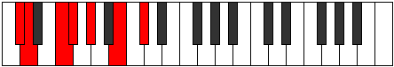
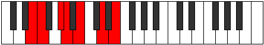
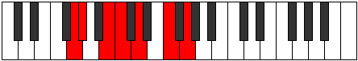
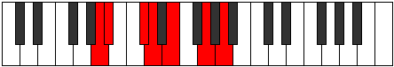

# Mode Pagimic

## Links

- [Documentation](README.md)
- [Scales Index](Scales.md)
- [Modes Index](Modes.md)
- [Chords Index](Chords.md)

## Parent Scale

[Bocrimic](ScaleBocrimic.md)

## Number

[1203](https://ianring.com/musictheory/scales/1203)

## Transposition

1, 3, 1, 2, 3, 2

## Chord Pattern

I, vi

## Perfection

- 3 Perfect notes
- 3 Perfect notes

## Perfection Profile

[true false false true false true]

## Permutations

| Tonic | Notes | Signature | Illustration | Audio |
|-------|-------|-----------|--------------|-------|
| [C](ModeCNaturalPagimic.md) | C, **Db**, **E**, F, **G**, A#, C | C |  | [midi](https://github.com/edipermadi/music/blob/main/docs/ModeCNaturalPagimic.mid?raw=true) |
| [C#](ModeCSharpPagimic.md) | C#, **D**, **E#**, F#, **G#**, A##, C# | C |  | [midi](https://github.com/edipermadi/music/blob/main/docs/ModeCSharpPagimic.mid?raw=true) |
| [Db](ModeDFlatPagimic.md) | Db, **Ebb**, **F**, Gb, **Ab**, B, Db | C |  | [midi](https://github.com/edipermadi/music/blob/main/docs/ModeDFlatPagimic.mid?raw=true) |
| [D](ModeDNaturalPagimic.md) | D, **Eb**, **F#**, G, **A**, B#, D | C |  | [midi](https://github.com/edipermadi/music/blob/main/docs/ModeDNaturalPagimic.mid?raw=true) |
| [D#](ModeDSharpPagimic.md) | D#, **E**, **F##**, G#, **A#**, B##, D# | C |  | [midi](https://github.com/edipermadi/music/blob/main/docs/ModeDSharpPagimic.mid?raw=true) |
| [Eb](ModeEFlatPagimic.md) | Eb, **Fb**, **G**, Ab, **Bb**, C#, Eb | C |  | [midi](https://github.com/edipermadi/music/blob/main/docs/ModeEFlatPagimic.mid?raw=true) |
| [E](ModeENaturalPagimic.md) | E, **F**, **G#**, A, **B**, C##, E | C |  | [midi](https://github.com/edipermadi/music/blob/main/docs/ModeENaturalPagimic.mid?raw=true) |
| [F](ModeFNaturalPagimic.md) | F, **Gb**, **A**, Bb, **C**, D#, F | C |  | [midi](https://github.com/edipermadi/music/blob/main/docs/ModeFNaturalPagimic.mid?raw=true) |
| [F#](ModeFSharpPagimic.md) | F#, **G**, **A#**, B, **C#**, D##, F# | C |  | [midi](https://github.com/edipermadi/music/blob/main/docs/ModeFSharpPagimic.mid?raw=true) |
| [Gb](ModeGFlatPagimic.md) | Gb, **Abb**, **Bb**, Cb, **Db**, E, Gb | C |  | [midi](https://github.com/edipermadi/music/blob/main/docs/ModeGFlatPagimic.mid?raw=true) |
| [G](ModeGNaturalPagimic.md) | G, **Ab**, **B**, C, **D**, E#, G | C |  | [midi](https://github.com/edipermadi/music/blob/main/docs/ModeGNaturalPagimic.mid?raw=true) |
| [G#](ModeGSharpPagimic.md) | G#, **A**, **B#**, C#, **D#**, E##, G# | C |  | [midi](https://github.com/edipermadi/music/blob/main/docs/ModeGSharpPagimic.mid?raw=true) |
| [Ab](ModeAFlatPagimic.md) | Ab, **Bbb**, **C**, Db, **Eb**, F#, Ab | C |  | [midi](https://github.com/edipermadi/music/blob/main/docs/ModeAFlatPagimic.mid?raw=true) |
| [A](ModeANaturalPagimic.md) | A, **Bb**, **C#**, D, **E**, F##, A | C |  | [midi](https://github.com/edipermadi/music/blob/main/docs/ModeANaturalPagimic.mid?raw=true) |
| [A#](ModeASharpPagimic.md) | A#, **B**, **C##**, D#, **E#**, F###, A# | C |  | [midi](https://github.com/edipermadi/music/blob/main/docs/ModeASharpPagimic.mid?raw=true) |
| [Bb](ModeBFlatPagimic.md) | Bb, **Cb**, **D**, Eb, **F**, G#, Bb | C |  | [midi](https://github.com/edipermadi/music/blob/main/docs/ModeBFlatPagimic.mid?raw=true) |
| [B](ModeBNaturalPagimic.md) | B, **C**, **D#**, E, **F#**, G##, B | C |  | [midi](https://github.com/edipermadi/music/blob/main/docs/ModeBNaturalPagimic.mid?raw=true) |
