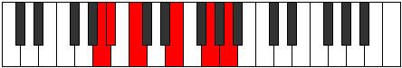

# Mode Pagitonic

## Links

- [Documentation](index.md)
- [Scales Index](Scales.md)
- [Modes Index](Modes.md)
- [Chords Index](Chords.md)

## Parent Scale

[Ionaditonic](ScaleIonaditonic.md)

## Number

[1163](https://ianring.com/musictheory/scales/1163)

## Perfection

- 2 Perfect notes
- 3 Perfect notes

## Perfection Profile

[true false true false false]

## Permutations

| Tonic | Notes | Signature | Illustration | Audio |
|-------|-------|-----------|--------------|-------|
| [C](ModeCNaturalPagitonic.md) | C, **C#**, D#, **G**, **A#**, C | C |  | [midi](ModeCNaturalPagitonic.mid) [ogg](ModeCNaturalPagitonic.ogg) |
| [C#](ModeCSharpPagitonic.md) | C#, **D**, E, **G#**, **B**, C# | C |  | [midi](ModeCSharpPagitonic.mid) [ogg](ModeCSharpPagitonic.ogg) |
| [Db](ModeDFlatPagitonic.md) | Db, **D**, E, **Ab**, **B**, Db | C |  | [midi](ModeDFlatPagitonic.mid) [ogg](ModeDFlatPagitonic.ogg) |
| [D](ModeDNaturalPagitonic.md) | D, **D#**, F, **A**, **C**, D | C |  | [midi](ModeDNaturalPagitonic.mid) [ogg](ModeDNaturalPagitonic.ogg) |
| [D#](ModeDSharpPagitonic.md) | D#, **E**, F#, **A#**, **C#**, D# | C |  | [midi](ModeDSharpPagitonic.mid) [ogg](ModeDSharpPagitonic.ogg) |
| [Eb](ModeEFlatPagitonic.md) | Eb, **E**, Gb, **Bb**, **Db**, Eb | C |  | [midi](ModeEFlatPagitonic.mid) [ogg](ModeEFlatPagitonic.ogg) |
| [E](ModeENaturalPagitonic.md) | E, **F**, G, **B**, **D**, E | C |  | [midi](ModeENaturalPagitonic.mid) [ogg](ModeENaturalPagitonic.ogg) |
| [F](ModeFNaturalPagitonic.md) | F, **F#**, G#, **C**, **D#**, F | C |  | [midi](ModeFNaturalPagitonic.mid) [ogg](ModeFNaturalPagitonic.ogg) |
| [F#](ModeFSharpPagitonic.md) | F#, **G**, A, **C#**, **E**, F# | C |  | [midi](ModeFSharpPagitonic.mid) [ogg](ModeFSharpPagitonic.ogg) |
| [Gb](ModeGFlatPagitonic.md) | Gb, **G**, A, **Db**, **E**, Gb | C |  | [midi](ModeGFlatPagitonic.mid) [ogg](ModeGFlatPagitonic.ogg) |
| [G](ModeGNaturalPagitonic.md) | G, **G#**, A#, **D**, **F**, G | C |  | [midi](ModeGNaturalPagitonic.mid) [ogg](ModeGNaturalPagitonic.ogg) |
| [G#](ModeGSharpPagitonic.md) | G#, **A**, B, **D#**, **F#**, G# | C |  | [midi](ModeGSharpPagitonic.mid) [ogg](ModeGSharpPagitonic.ogg) |
| [Ab](ModeAFlatPagitonic.md) | Ab, **A**, B, **Eb**, **Gb**, Ab | C |  | [midi](ModeAFlatPagitonic.mid) [ogg](ModeAFlatPagitonic.ogg) |
| [A](ModeANaturalPagitonic.md) | A, **A#**, C, **E**, **G**, A | C |  | [midi](ModeANaturalPagitonic.mid) [ogg](ModeANaturalPagitonic.ogg) |
| [A#](ModeASharpPagitonic.md) | A#, **B**, C#, **F**, **G#**, A# | C |  | [midi](ModeASharpPagitonic.mid) [ogg](ModeASharpPagitonic.ogg) |
| [Bb](ModeBFlatPagitonic.md) | Bb, **B**, Db, **F**, **Ab**, Bb | C |  | [midi](ModeBFlatPagitonic.mid) [ogg](ModeBFlatPagitonic.ogg) |
| [B](ModeBNaturalPagitonic.md) | B, **C**, D, **F#**, **A**, B | C |  | [midi](ModeBNaturalPagitonic.mid) [ogg](ModeBNaturalPagitonic.ogg) |
