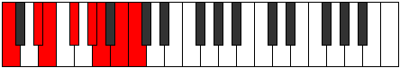
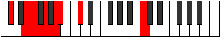
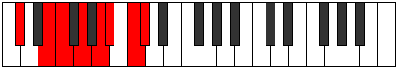
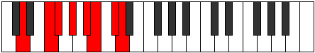
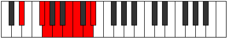
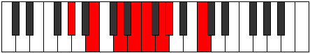
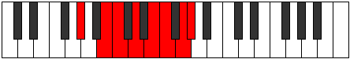
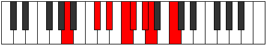
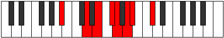
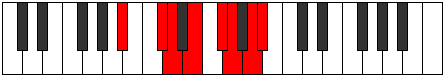

# Mode Palian

## Links

- [Documentation](index.md)
- [Scales Index](Scales.md)
- [Modes Index](Modes.md)
- [Chords Index](Chords.md)

## Parent Scale

[Palian](ScalePalian.md)

## Number

[2905](https://ianring.com/musictheory/scales/2905)

## Perfection

- 4 Perfect notes
- 3 Perfect notes

## Perfection Profile

[false false true false true true true]

## Permutations

| Tonic | Notes | Signature | Illustration | Audio |
|-------|-------|-----------|--------------|-------|
| [C](ModeCNaturalPalian.md) | **C**, **D#**, E, **F#**, G#, A, B, **C** | C |  | [midi](ModeCNaturalPalian.mid) [ogg](ModeCNaturalPalian.ogg) |
| [C#](ModeCSharpPalian.md) | **C#**, **D##**, E#, **F##**, G##, A#, B#, **C#** | C |  | [midi](ModeCSharpPalian.mid) [ogg](ModeCSharpPalian.ogg) |
| [Db](ModeDFlatPalian.md) | **Db**, **E**, F, **G**, A, Bb, C, **Db** | C |  | [midi](ModeDFlatPalian.mid) [ogg](ModeDFlatPalian.ogg) |
| [D](ModeDNaturalPalian.md) | **D**, **E#**, F#, **G#**, A#, B, C#, **D** | C |  | [midi](ModeDNaturalPalian.mid) [ogg](ModeDNaturalPalian.ogg) |
| [D#](ModeDSharpPalian.md) | **D#**, **E##**, F##, **G##**, A##, B#, C##, **D#** | C |  | [midi](ModeDSharpPalian.mid) [ogg](ModeDSharpPalian.ogg) |
| [Eb](ModeEFlatPalian.md) | **Eb**, **F#**, G, **A**, B, C, D, **Eb** | C |  | [midi](ModeEFlatPalian.mid) [ogg](ModeEFlatPalian.ogg) |
| [E](ModeENaturalPalian.md) | **E**, **F##**, G#, **A#**, B#, C#, D#, **E** | C |  | [midi](ModeENaturalPalian.mid) [ogg](ModeENaturalPalian.ogg) |
| [F](ModeFNaturalPalian.md) | **F**, **G#**, A, **B**, C#, D, E, **F** | C |  | [midi](ModeFNaturalPalian.mid) [ogg](ModeFNaturalPalian.ogg) |
| [F#](ModeFSharpPalian.md) | **F#**, **G##**, A#, **B#**, C##, D#, E#, **F#** | C |  | [midi](ModeFSharpPalian.mid) [ogg](ModeFSharpPalian.ogg) |
| [Gb](ModeGFlatPalian.md) | **Gb**, **A**, Bb, **C**, D, Eb, F, **Gb** | C |  | [midi](ModeGFlatPalian.mid) [ogg](ModeGFlatPalian.ogg) |
| [G](ModeGNaturalPalian.md) | **G**, **A#**, B, **C#**, D#, E, F#, **G** | C |  | [midi](ModeGNaturalPalian.mid) [ogg](ModeGNaturalPalian.ogg) |
| [G#](ModeGSharpPalian.md) | **G#**, **A##**, B#, **C##**, D##, E#, F##, **G#** | C |  | [midi](ModeGSharpPalian.mid) [ogg](ModeGSharpPalian.ogg) |
| [Ab](ModeAFlatPalian.md) | **Ab**, **B**, C, **D**, E, F, G, **Ab** | C |  | [midi](ModeAFlatPalian.mid) [ogg](ModeAFlatPalian.ogg) |
| [A](ModeANaturalPalian.md) | **A**, **B#**, C#, **D#**, E#, F#, G#, **A** | C |  | [midi](ModeANaturalPalian.mid) [ogg](ModeANaturalPalian.ogg) |
| [A#](ModeASharpPalian.md) | **A#**, **B##**, C##, **D##**, E##, F##, G##, **A#** | C |  | [midi](ModeASharpPalian.mid) [ogg](ModeASharpPalian.ogg) |
| [Bb](ModeBFlatPalian.md) | **Bb**, **C#**, D, **E**, F#, G, A, **Bb** | C |  | [midi](ModeBFlatPalian.mid) [ogg](ModeBFlatPalian.ogg) |
| [B](ModeBNaturalPalian.md) | **B**, **C##**, D#, **E#**, F##, G#, A#, **B** | C |  | [midi](ModeBNaturalPalian.mid) [ogg](ModeBNaturalPalian.ogg) |
