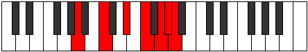

# Mode Palimic

## Links

- [Documentation](index.md)
- [Scales Index](Scales.md)
- [Modes Index](Modes.md)
- [Chords Index](Chords.md)

## Parent Scale

[Palimic](ScalePalimic.md)

## Number

[3401](https://ianring.com/musictheory/scales/3401)

## Perfection

- 3 Perfect notes
- 3 Perfect notes

## Perfection Profile

[false true false true false true]

## Permutations

| Tonic | Notes | Signature | Illustration | Audio |
|-------|-------|-----------|--------------|-------|
| [C](ModeCNaturalPalimic.md) | **C**, D#, **E##**, F###, **G###**, A##, **C** | C |  | [midi](ModeCNaturalPalimic.mid) [ogg](ModeCNaturalPalimic.ogg) |
| [C#](ModeCSharpPalimic.md) | **C#**, D##, **E###**, Cbbb, **Dbbb**, Dbb, **C#** | C |  | [midi](ModeCSharpPalimic.mid) [ogg](ModeCSharpPalimic.ogg) |
| [Db](ModeDFlatPalimic.md) | **Db**, E, **F##**, G##, **A##**, B#, **Db** | C |  | [midi](ModeDFlatPalimic.mid) [ogg](ModeDFlatPalimic.ogg) |
| [D](ModeDNaturalPalimic.md) | **D**, E#, **F###**, G###, **A###**, B##, **D** | C |  | [midi](ModeDNaturalPalimic.mid) [ogg](ModeDNaturalPalimic.ogg) |
| [D#](ModeDSharpPalimic.md) | **D#**, E##, **Cbbb**, Dbbb, **Ebbb**, Fbbb, **D#** | C |  | [midi](ModeDSharpPalimic.mid) [ogg](ModeDSharpPalimic.ogg) |
| [Eb](ModeEFlatPalimic.md) | **Eb**, F#, **G##**, A##, **B##**, C##, **Eb** | C |  | [midi](ModeEFlatPalimic.mid) [ogg](ModeEFlatPalimic.ogg) |
| [E](ModeENaturalPalimic.md) | **E**, F##, **G###**, A###, **B###**, C###, **E** | C |  | [midi](ModeENaturalPalimic.mid) [ogg](ModeENaturalPalimic.ogg) |
| [F](ModeFNaturalPalimic.md) | **F**, G#, **A##**, B##, **C###**, D##, **F** | C |  | [midi](ModeFNaturalPalimic.mid) [ogg](ModeFNaturalPalimic.ogg) |
| [F#](ModeFSharpPalimic.md) | **F#**, G##, **A###**, B###, **D##**, E#, **F#** | C |  | [midi](ModeFSharpPalimic.mid) [ogg](ModeFSharpPalimic.ogg) |
| [Gb](ModeGFlatPalimic.md) | **Gb**, A, **B#**, C##, **D##**, E#, **Gb** | C |  | [midi](ModeGFlatPalimic.mid) [ogg](ModeGFlatPalimic.ogg) |
| [G](ModeGNaturalPalimic.md) | **G**, A#, **B##**, C###, **D###**, E##, **G** | C |  | [midi](ModeGNaturalPalimic.mid) [ogg](ModeGNaturalPalimic.ogg) |
| [G#](ModeGSharpPalimic.md) | **G#**, A##, **B###**, D##, **E##**, F##, **G#** | C |  | [midi](ModeGSharpPalimic.mid) [ogg](ModeGSharpPalimic.ogg) |
| [Ab](ModeAFlatPalimic.md) | **Ab**, B, **C##**, D##, **E##**, F##, **Ab** | C |  | [midi](ModeAFlatPalimic.mid) [ogg](ModeAFlatPalimic.ogg) |
| [A](ModeANaturalPalimic.md) | **A**, B#, **C###**, D###, **E###**, F###, **A** | C |  | [midi](ModeANaturalPalimic.mid) [ogg](ModeANaturalPalimic.ogg) |
| [A#](ModeASharpPalimic.md) | **A#**, B##, **D##**, E##, **F###**, G##, **A#** | C |  | [midi](ModeASharpPalimic.mid) [ogg](ModeASharpPalimic.ogg) |
| [Bb](ModeBFlatPalimic.md) | **Bb**, C#, **D##**, E##, **F###**, G##, **Bb** | C |  | [midi](ModeBFlatPalimic.mid) [ogg](ModeBFlatPalimic.ogg) |
| [B](ModeBNaturalPalimic.md) | **B**, C##, **D###**, E###, **Cbbb**, Cbb, **B** | C |  | [midi](ModeBNaturalPalimic.mid) [ogg](ModeBNaturalPalimic.ogg) |
