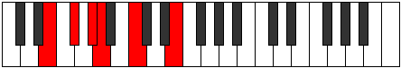
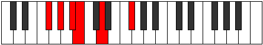
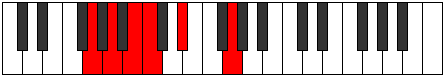

# Mode Palitonic

## Links

- [Documentation](README.md)
- [Scales Index](Scales.md)
- [Modes Index](Modes.md)
- [Chords Index](Chords.md)

## Parent Scale

[Aerynitonic](ScaleAerynitonic.md)

## Number

[309](https://ianring.com/musictheory/scales/309)

## Transposition

2, 2, 1, 3, 4

## Chord Pattern

I⁺

## Perfection

- 1 Perfect notes
- 4 Perfect notes

## Perfection Profile

[false false false true false]

## Permutations

| Tonic | Notes | Signature | Illustration | Audio |
|-------|-------|-----------|--------------|-------|
| [C](ModeCNaturalPalitonic.md) | **C**, **D**, **E**, F, **G#**, **C** | C |  | [midi](https://github.com/edipermadi/music/blob/main/docs/ModeCNaturalPalitonic.mid?raw=true) |
| [C#](ModeCSharpPalitonic.md) | **C#**, **D#**, **F**, F#, **A**, **C#** | C |  | [midi](https://github.com/edipermadi/music/blob/main/docs/ModeCSharpPalitonic.mid?raw=true) |
| [Db](ModeDFlatPalitonic.md) | **Db**, **Eb**, **F**, Gb, **A**, **Db** | C |  | [midi](https://github.com/edipermadi/music/blob/main/docs/ModeDFlatPalitonic.mid?raw=true) |
| [D](ModeDNaturalPalitonic.md) | **D**, **E**, **F#**, G, **A#**, **D** | C |  | [midi](https://github.com/edipermadi/music/blob/main/docs/ModeDNaturalPalitonic.mid?raw=true) |
| [D#](ModeDSharpPalitonic.md) | **D#**, **F**, **G**, G#, **B**, **D#** | C |  | [midi](https://github.com/edipermadi/music/blob/main/docs/ModeDSharpPalitonic.mid?raw=true) |
| [Eb](ModeEFlatPalitonic.md) | **Eb**, **F**, **G**, Ab, **B**, **Eb** | C |  | [midi](https://github.com/edipermadi/music/blob/main/docs/ModeEFlatPalitonic.mid?raw=true) |
| [E](ModeENaturalPalitonic.md) | **E**, **F#**, **G#**, A, **C**, **E** | C |  | [midi](https://github.com/edipermadi/music/blob/main/docs/ModeENaturalPalitonic.mid?raw=true) |
| [F](ModeFNaturalPalitonic.md) | **F**, **G**, **A**, A#, **C#**, **F** | C |  | [midi](https://github.com/edipermadi/music/blob/main/docs/ModeFNaturalPalitonic.mid?raw=true) |
| [F#](ModeFSharpPalitonic.md) | **F#**, **G#**, **A#**, B, **D**, **F#** | C |  | [midi](https://github.com/edipermadi/music/blob/main/docs/ModeFSharpPalitonic.mid?raw=true) |
| [Gb](ModeGFlatPalitonic.md) | **Gb**, **Ab**, **Bb**, B, **D**, **Gb** | C |  | [midi](https://github.com/edipermadi/music/blob/main/docs/ModeGFlatPalitonic.mid?raw=true) |
| [G](ModeGNaturalPalitonic.md) | **G**, **A**, **B**, C, **D#**, **G** | C |  | [midi](https://github.com/edipermadi/music/blob/main/docs/ModeGNaturalPalitonic.mid?raw=true) |
| [G#](ModeGSharpPalitonic.md) | **G#**, **A#**, **C**, C#, **E**, **G#** | C |  | [midi](https://github.com/edipermadi/music/blob/main/docs/ModeGSharpPalitonic.mid?raw=true) |
| [Ab](ModeAFlatPalitonic.md) | **Ab**, **Bb**, **C**, Db, **E**, **Ab** | C |  | [midi](https://github.com/edipermadi/music/blob/main/docs/ModeAFlatPalitonic.mid?raw=true) |
| [A](ModeANaturalPalitonic.md) | **A**, **B**, **C#**, D, **F**, **A** | C |  | [midi](https://github.com/edipermadi/music/blob/main/docs/ModeANaturalPalitonic.mid?raw=true) |
| [A#](ModeASharpPalitonic.md) | **A#**, **C**, **D**, D#, **F#**, **A#** | C |  | [midi](https://github.com/edipermadi/music/blob/main/docs/ModeASharpPalitonic.mid?raw=true) |
| [Bb](ModeBFlatPalitonic.md) | **Bb**, **C**, **D**, Eb, **Gb**, **Bb** | C |  | [midi](https://github.com/edipermadi/music/blob/main/docs/ModeBFlatPalitonic.mid?raw=true) |
| [B](ModeBNaturalPalitonic.md) | **B**, **C#**, **D#**, E, **G**, **B** | C |  | [midi](https://github.com/edipermadi/music/blob/main/docs/ModeBNaturalPalitonic.mid?raw=true) |
