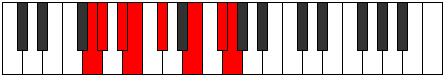

# Mode Panian

## Links

- [Documentation](README.md)
- [Scales Index](Scales.md)
- [Modes Index](Modes.md)
- [Chords Index](Chords.md)

## Parent Scale

[Rythian](ScaleRythian.md)

## Number

[2651](https://ianring.com/musictheory/scales/2651)

## Interval Pattern

1, 2, 1, 2, 3, 2, 1

## Chord Pattern

i⁰, vi⁰

## Perfection

- 4 Perfect notes
- 3 Perfect notes

## Perfection Profile

[false false false true true true true]

## Permutations

| Tonic | Notes | Signature | Illustration | Audio |
|-------|-------|-----------|--------------|-------|
| [C](ModeCNaturalPanian.md) | **C**, **Db**, **Eb**, Fb, Gb, A, B, **C** | C |  | [midi](https://github.com/edipermadi/music/blob/main/docs/ModeCNaturalPanian.mid?raw=true) |
| [C#](ModeCSharpPanian.md) | **C#**, **D**, **E**, F, G, A#, B#, **C#** | C |  | [midi](https://github.com/edipermadi/music/blob/main/docs/ModeCSharpPanian.mid?raw=true) |
| [Db](ModeDFlatPanian.md) | **Db**, **Ebb**, **Fb**, Gbb, Abb, Bb, C, **Db** | C |  | [midi](https://github.com/edipermadi/music/blob/main/docs/ModeDFlatPanian.mid?raw=true) |
| [D](ModeDNaturalPanian.md) | **D**, **Eb**, **F**, Gb, Ab, B, C#, **D** | C |  | [midi](https://github.com/edipermadi/music/blob/main/docs/ModeDNaturalPanian.mid?raw=true) |
| [D#](ModeDSharpPanian.md) | **D#**, **E**, **F#**, G, A, B#, C##, **D#** | C |  | [midi](https://github.com/edipermadi/music/blob/main/docs/ModeDSharpPanian.mid?raw=true) |
| [Eb](ModeEFlatPanian.md) | **Eb**, **Fb**, **Gb**, Abb, Bbb, C, D, **Eb** | C |  | [midi](https://github.com/edipermadi/music/blob/main/docs/ModeEFlatPanian.mid?raw=true) |
| [E](ModeENaturalPanian.md) | **E**, **F**, **G**, Ab, Bb, C#, D#, **E** | C |  | [midi](https://github.com/edipermadi/music/blob/main/docs/ModeENaturalPanian.mid?raw=true) |
| [F](ModeFNaturalPanian.md) | **F**, **Gb**, **Ab**, Bbb, Cb, D, E, **F** | C |  | [midi](https://github.com/edipermadi/music/blob/main/docs/ModeFNaturalPanian.mid?raw=true) |
| [F#](ModeFSharpPanian.md) | **F#**, **G**, **A**, Bb, C, D#, E#, **F#** | C |  | [midi](https://github.com/edipermadi/music/blob/main/docs/ModeFSharpPanian.mid?raw=true) |
| [Gb](ModeGFlatPanian.md) | **Gb**, **Abb**, **Bbb**, Cbb, Dbb, Eb, F, **Gb** | C |  | [midi](https://github.com/edipermadi/music/blob/main/docs/ModeGFlatPanian.mid?raw=true) |
| [G](ModeGNaturalPanian.md) | **G**, **Ab**, **Bb**, Cb, Db, E, F#, **G** | C |  | [midi](https://github.com/edipermadi/music/blob/main/docs/ModeGNaturalPanian.mid?raw=true) |
| [G#](ModeGSharpPanian.md) | **G#**, **A**, **B**, C, D, E#, F##, **G#** | C |  | [midi](https://github.com/edipermadi/music/blob/main/docs/ModeGSharpPanian.mid?raw=true) |
| [Ab](ModeAFlatPanian.md) | **Ab**, **Bbb**, **Cb**, Dbb, Ebb, F, G, **Ab** | C |  | [midi](https://github.com/edipermadi/music/blob/main/docs/ModeAFlatPanian.mid?raw=true) |
| [A](ModeANaturalPanian.md) | **A**, **Bb**, **C**, Db, Eb, F#, G#, **A** | C |  | [midi](https://github.com/edipermadi/music/blob/main/docs/ModeANaturalPanian.mid?raw=true) |
| [A#](ModeASharpPanian.md) | **A#**, **B**, **C#**, D, E, F##, G##, **A#** | C |  | [midi](https://github.com/edipermadi/music/blob/main/docs/ModeASharpPanian.mid?raw=true) |
| [Bb](ModeBFlatPanian.md) | **Bb**, **Cb**, **Db**, Ebb, Fb, G, A, **Bb** | C |  | [midi](https://github.com/edipermadi/music/blob/main/docs/ModeBFlatPanian.mid?raw=true) |
| [B](ModeBNaturalPanian.md) | **B**, **C**, **D**, Eb, F, G#, A#, **B** | C |  | [midi](https://github.com/edipermadi/music/blob/main/docs/ModeBNaturalPanian.mid?raw=true) |
