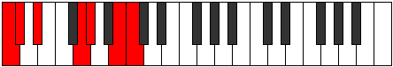

# Mode Panimic

## Links

- [Documentation](README.md)
- [Scales Index](Scales.md)
- [Modes Index](Modes.md)
- [Chords Index](Chords.md)

## Parent Scale

[Thogimic](ScaleThogimic.md)

## Number

[2443](https://ianring.com/musictheory/scales/2443)

## Transposition

1, 2, 4, 1, 3, 1

## Chord Pattern

IVb5, V

## Perfection

- 3 Perfect notes
- 3 Perfect notes

## Perfection Profile

true, true, false, false, true, false

## Permutations

| Tonic | Notes | Signature | Illustration | Audio |
|-------|-------|-----------|--------------|-------|
| [C](ModeCNaturalPanimic.md) | C, Db, **Eb**, **F##**, G#, **A##**, C | C |  | [midi](https://github.com/edipermadi/music/blob/main/docs/ModeCNaturalPanimic.mid?raw=true) |
| [C#](ModeCSharpPanimic.md) | C#, D, **E**, **F###**, G##, **A###**, C# | C |  | [midi](https://github.com/edipermadi/music/blob/main/docs/ModeCSharpPanimic.mid?raw=true) |
| [Db](ModeDFlatPanimic.md) | Db, Ebb, **Fb**, **G#**, A, **B#**, Db | C |  | [midi](https://github.com/edipermadi/music/blob/main/docs/ModeDFlatPanimic.mid?raw=true) |
| [D](ModeDNaturalPanimic.md) | D, Eb, **F**, **G##**, A#, **B##**, D | C |  | [midi](https://github.com/edipermadi/music/blob/main/docs/ModeDNaturalPanimic.mid?raw=true) |
| [D#](ModeDSharpPanimic.md) | D#, E, **F#**, **G###**, A##, **B###**, D# | C |  | [midi](https://github.com/edipermadi/music/blob/main/docs/ModeDSharpPanimic.mid?raw=true) |
| [Eb](ModeEFlatPanimic.md) | Eb, Fb, **Gb**, **A#**, B, **C##**, Eb | C |  | [midi](https://github.com/edipermadi/music/blob/main/docs/ModeEFlatPanimic.mid?raw=true) |
| [E](ModeENaturalPanimic.md) | E, F, **G**, **A##**, B#, **C###**, E | C |  | [midi](https://github.com/edipermadi/music/blob/main/docs/ModeENaturalPanimic.mid?raw=true) |
| [F](ModeFNaturalPanimic.md) | F, Gb, **Ab**, **B#**, C#, **D##**, F | C |  | [midi](https://github.com/edipermadi/music/blob/main/docs/ModeFNaturalPanimic.mid?raw=true) |
| [F#](ModeFSharpPanimic.md) | F#, G, **A**, **B##**, C##, **D###**, F# | C |  | [midi](https://github.com/edipermadi/music/blob/main/docs/ModeFSharpPanimic.mid?raw=true) |
| [Gb](ModeGFlatPanimic.md) | Gb, Abb, **Bbb**, **C#**, D, **E#**, Gb | C |  | [midi](https://github.com/edipermadi/music/blob/main/docs/ModeGFlatPanimic.mid?raw=true) |
| [G](ModeGNaturalPanimic.md) | G, Ab, **Bb**, **C##**, D#, **E##**, G | C |  | [midi](https://github.com/edipermadi/music/blob/main/docs/ModeGNaturalPanimic.mid?raw=true) |
| [G#](ModeGSharpPanimic.md) | G#, A, **B**, **C###**, D##, **E###**, G# | C |  | [midi](https://github.com/edipermadi/music/blob/main/docs/ModeGSharpPanimic.mid?raw=true) |
| [Ab](ModeAFlatPanimic.md) | Ab, Bbb, **Cb**, **D#**, E, **F##**, Ab | C |  | [midi](https://github.com/edipermadi/music/blob/main/docs/ModeAFlatPanimic.mid?raw=true) |
| [A](ModeANaturalPanimic.md) | A, Bb, **C**, **D##**, E#, **F###**, A | C |  | [midi](https://github.com/edipermadi/music/blob/main/docs/ModeANaturalPanimic.mid?raw=true) |
| [A#](ModeASharpPanimic.md) | A#, B, **C#**, **D###**, E##, **Cbbb**, A# | C |  | [midi](https://github.com/edipermadi/music/blob/main/docs/ModeASharpPanimic.mid?raw=true) |
| [Bb](ModeBFlatPanimic.md) | Bb, Cb, **Db**, **E#**, F#, **G##**, Bb | C |  | [midi](https://github.com/edipermadi/music/blob/main/docs/ModeBFlatPanimic.mid?raw=true) |
| [B](ModeBNaturalPanimic.md) | B, C, **D**, **E##**, F##, **G###**, B | C |  | [midi](https://github.com/edipermadi/music/blob/main/docs/ModeBNaturalPanimic.mid?raw=true) |
