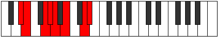

# Mode Paptian

## Links

- [Documentation](index.md)
- [Scales Index](Scales.md)
- [Modes Index](Modes.md)
- [Chords Index](Chords.md)

## Parent Scale

[Epogian](ScaleEpogian.md)

## Number

[2419](https://ianring.com/musictheory/scales/2419)

## Perfection

- 5 Perfect notes
- 2 Perfect notes

## Perfection Profile

[false true true true true false true]

## Permutations

| Tonic | Notes | Signature | Illustration | Audio |
|-------|-------|-----------|--------------|-------|
| [C](ModeCNaturalPaptian.md) | **C**, Db, E, F, Gb, **Ab**, B, **C** | C |  | [midi](https://github.com/edipermadi/music/blob/main/docs/ModeCNaturalPaptian.mid?raw=true) |
| [C#](ModeCSharpPaptian.md) | **C#**, D, E#, F#, G, **A**, B#, **C#** | C |  | [midi](https://github.com/edipermadi/music/blob/main/docs/ModeCSharpPaptian.mid?raw=true) |
| [Db](ModeDFlatPaptian.md) | **Db**, Ebb, F, Gb, Abb, **Bbb**, C, **Db** | C |  | [midi](https://github.com/edipermadi/music/blob/main/docs/ModeDFlatPaptian.mid?raw=true) |
| [D](ModeDNaturalPaptian.md) | **D**, Eb, F#, G, Ab, **Bb**, C#, **D** | C |  | [midi](https://github.com/edipermadi/music/blob/main/docs/ModeDNaturalPaptian.mid?raw=true) |
| [D#](ModeDSharpPaptian.md) | **D#**, E, F##, G#, A, **B**, C##, **D#** | C |  | [midi](https://github.com/edipermadi/music/blob/main/docs/ModeDSharpPaptian.mid?raw=true) |
| [Eb](ModeEFlatPaptian.md) | **Eb**, Fb, G, Ab, Bbb, **Cb**, D, **Eb** | C |  | [midi](https://github.com/edipermadi/music/blob/main/docs/ModeEFlatPaptian.mid?raw=true) |
| [E](ModeENaturalPaptian.md) | **E**, F, G#, A, Bb, **C**, D#, **E** | C |  | [midi](https://github.com/edipermadi/music/blob/main/docs/ModeENaturalPaptian.mid?raw=true) |
| [F](ModeFNaturalPaptian.md) | **F**, Gb, A, Bb, Cb, **Db**, E, **F** | C |  | [midi](https://github.com/edipermadi/music/blob/main/docs/ModeFNaturalPaptian.mid?raw=true) |
| [F#](ModeFSharpPaptian.md) | **F#**, G, A#, B, C, **D**, E#, **F#** | C |  | [midi](https://github.com/edipermadi/music/blob/main/docs/ModeFSharpPaptian.mid?raw=true) |
| [Gb](ModeGFlatPaptian.md) | **Gb**, Abb, Bb, Cb, Dbb, **Ebb**, F, **Gb** | C |  | [midi](https://github.com/edipermadi/music/blob/main/docs/ModeGFlatPaptian.mid?raw=true) |
| [G](ModeGNaturalPaptian.md) | **G**, Ab, B, C, Db, **Eb**, F#, **G** | C |  | [midi](https://github.com/edipermadi/music/blob/main/docs/ModeGNaturalPaptian.mid?raw=true) |
| [G#](ModeGSharpPaptian.md) | **G#**, A, B#, C#, D, **E**, F##, **G#** | C |  | [midi](https://github.com/edipermadi/music/blob/main/docs/ModeGSharpPaptian.mid?raw=true) |
| [Ab](ModeAFlatPaptian.md) | **Ab**, Bbb, C, Db, Ebb, **Fb**, G, **Ab** | C |  | [midi](https://github.com/edipermadi/music/blob/main/docs/ModeAFlatPaptian.mid?raw=true) |
| [A](ModeANaturalPaptian.md) | **A**, Bb, C#, D, Eb, **F**, G#, **A** | C |  | [midi](https://github.com/edipermadi/music/blob/main/docs/ModeANaturalPaptian.mid?raw=true) |
| [A#](ModeASharpPaptian.md) | **A#**, B, C##, D#, E, **F#**, G##, **A#** | C |  | [midi](https://github.com/edipermadi/music/blob/main/docs/ModeASharpPaptian.mid?raw=true) |
| [Bb](ModeBFlatPaptian.md) | **Bb**, Cb, D, Eb, Fb, **Gb**, A, **Bb** | C |  | [midi](https://github.com/edipermadi/music/blob/main/docs/ModeBFlatPaptian.mid?raw=true) |
| [B](ModeBNaturalPaptian.md) | **B**, C, D#, E, F, **G**, A#, **B** | C |  | [midi](https://github.com/edipermadi/music/blob/main/docs/ModeBNaturalPaptian.mid?raw=true) |
