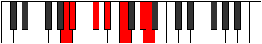

# Mode Paptimic

## Links

- [Documentation](index.md)
- [Scales Index](Scales.md)
- [Modes Index](Modes.md)
- [Chords Index](Chords.md)

## Parent Scale

[Dalimic](ScaleDalimic.md)

## Number

[2387](https://ianring.com/musictheory/scales/2387)

## Perfection

- 4 Perfect notes
- 2 Perfect notes

## Perfection Profile

[false true true true false true]

## Permutations

| Tonic | Notes | Signature | Illustration | Audio |
|-------|-------|-----------|--------------|-------|
| [C](ModeCNaturalPaptimic.md) | **C**, Db, E, F#, **G#**, A##, **C** | C |  | [midi](ModeCNaturalPaptimic.mid) [ogg](ModeCNaturalPaptimic.ogg) |
| [C#](ModeCSharpPaptimic.md) | **C#**, D, E#, F##, **G##**, A###, **C#** | C |  | [midi](ModeCSharpPaptimic.mid) [ogg](ModeCSharpPaptimic.ogg) |
| [Db](ModeDFlatPaptimic.md) | **Db**, Ebb, F, G, **A**, B#, **Db** | C |  | [midi](ModeDFlatPaptimic.mid) [ogg](ModeDFlatPaptimic.ogg) |
| [D](ModeDNaturalPaptimic.md) | **D**, Eb, F#, G#, **A#**, B##, **D** | C |  | [midi](ModeDNaturalPaptimic.mid) [ogg](ModeDNaturalPaptimic.ogg) |
| [D#](ModeDSharpPaptimic.md) | **D#**, E, F##, G##, **A##**, B###, **D#** | C |  | [midi](ModeDSharpPaptimic.mid) [ogg](ModeDSharpPaptimic.ogg) |
| [Eb](ModeEFlatPaptimic.md) | **Eb**, Fb, G, A, **B**, C##, **Eb** | C |  | [midi](ModeEFlatPaptimic.mid) [ogg](ModeEFlatPaptimic.ogg) |
| [E](ModeENaturalPaptimic.md) | **E**, F, G#, A#, **B#**, C###, **E** | C |  | [midi](ModeENaturalPaptimic.mid) [ogg](ModeENaturalPaptimic.ogg) |
| [F](ModeFNaturalPaptimic.md) | **F**, Gb, A, B, **C#**, D##, **F** | C |  | [midi](ModeFNaturalPaptimic.mid) [ogg](ModeFNaturalPaptimic.ogg) |
| [F#](ModeFSharpPaptimic.md) | **F#**, G, A#, B#, **C##**, D###, **F#** | C |  | [midi](ModeFSharpPaptimic.mid) [ogg](ModeFSharpPaptimic.ogg) |
| [Gb](ModeGFlatPaptimic.md) | **Gb**, Abb, Bb, C, **D**, E#, **Gb** | C |  | [midi](ModeGFlatPaptimic.mid) [ogg](ModeGFlatPaptimic.ogg) |
| [G](ModeGNaturalPaptimic.md) | **G**, Ab, B, C#, **D#**, E##, **G** | C |  | [midi](ModeGNaturalPaptimic.mid) [ogg](ModeGNaturalPaptimic.ogg) |
| [G#](ModeGSharpPaptimic.md) | **G#**, A, B#, C##, **D##**, E###, **G#** | C |  | [midi](ModeGSharpPaptimic.mid) [ogg](ModeGSharpPaptimic.ogg) |
| [Ab](ModeAFlatPaptimic.md) | **Ab**, Bbb, C, D, **E**, F##, **Ab** | C |  | [midi](ModeAFlatPaptimic.mid) [ogg](ModeAFlatPaptimic.ogg) |
| [A](ModeANaturalPaptimic.md) | **A**, Bb, C#, D#, **E#**, F###, **A** | C |  | [midi](ModeANaturalPaptimic.mid) [ogg](ModeANaturalPaptimic.ogg) |
| [A#](ModeASharpPaptimic.md) | **A#**, B, C##, D##, **E##**, Cbbb, **A#** | C |  | [midi](ModeASharpPaptimic.mid) [ogg](ModeASharpPaptimic.ogg) |
| [Bb](ModeBFlatPaptimic.md) | **Bb**, Cb, D, E, **F#**, G##, **Bb** | C |  | [midi](ModeBFlatPaptimic.mid) [ogg](ModeBFlatPaptimic.ogg) |
| [B](ModeBNaturalPaptimic.md) | **B**, C, D#, E#, **F##**, G###, **B** | C |  | [midi](ModeBNaturalPaptimic.mid) [ogg](ModeBNaturalPaptimic.ogg) |
