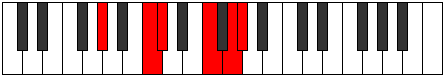

# Mode Paptitonic

## Links

- [Documentation](index.md)
- [Scales Index](Scales.md)
- [Modes Index](Modes.md)
- [Chords Index](Chords.md)

## Parent Scale

[Zolitonic](ScaleZolitonic.md)

## Number

[2609](https://ianring.com/musictheory/scales/2609)

## Perfection

- 3 Perfect notes
- 2 Perfect notes

## Perfection Profile

[false true true true false]

## Permutations

| Tonic | Notes | Signature | Illustration | Audio |
|-------|-------|-----------|--------------|-------|
| [C](ModeCNaturalPaptitonic.md) | **C**, E, F, A, **B**, **C** | C |  | [midi](ModeCNaturalPaptitonic.mid) [ogg](ModeCNaturalPaptitonic.ogg) |
| [C#](ModeCSharpPaptitonic.md) | **C#**, F, F#, A#, **C**, **C#** | C |  | [midi](ModeCSharpPaptitonic.mid) [ogg](ModeCSharpPaptitonic.ogg) |
| [Db](ModeDFlatPaptitonic.md) | **Db**, F, Gb, Bb, **C**, **Db** | C |  | [midi](ModeDFlatPaptitonic.mid) [ogg](ModeDFlatPaptitonic.ogg) |
| [D](ModeDNaturalPaptitonic.md) | **D**, F#, G, B, **C#**, **D** | C |  | [midi](ModeDNaturalPaptitonic.mid) [ogg](ModeDNaturalPaptitonic.ogg) |
| [D#](ModeDSharpPaptitonic.md) | **D#**, G, G#, C, **D**, **D#** | C |  | [midi](ModeDSharpPaptitonic.mid) [ogg](ModeDSharpPaptitonic.ogg) |
| [Eb](ModeEFlatPaptitonic.md) | **Eb**, G, Ab, C, **D**, **Eb** | C |  | [midi](ModeEFlatPaptitonic.mid) [ogg](ModeEFlatPaptitonic.ogg) |
| [E](ModeENaturalPaptitonic.md) | **E**, G#, A, C#, **D#**, **E** | C |  | [midi](ModeENaturalPaptitonic.mid) [ogg](ModeENaturalPaptitonic.ogg) |
| [F](ModeFNaturalPaptitonic.md) | **F**, A, A#, D, **E**, **F** | C |  | [midi](ModeFNaturalPaptitonic.mid) [ogg](ModeFNaturalPaptitonic.ogg) |
| [F#](ModeFSharpPaptitonic.md) | **F#**, A#, B, D#, **F**, **F#** | C |  | [midi](ModeFSharpPaptitonic.mid) [ogg](ModeFSharpPaptitonic.ogg) |
| [Gb](ModeGFlatPaptitonic.md) | **Gb**, Bb, B, Eb, **F**, **Gb** | C |  | [midi](ModeGFlatPaptitonic.mid) [ogg](ModeGFlatPaptitonic.ogg) |
| [G](ModeGNaturalPaptitonic.md) | **G**, B, C, E, **F#**, **G** | C |  | [midi](ModeGNaturalPaptitonic.mid) [ogg](ModeGNaturalPaptitonic.ogg) |
| [G#](ModeGSharpPaptitonic.md) | **G#**, C, C#, F, **G**, **G#** | C |  | [midi](ModeGSharpPaptitonic.mid) [ogg](ModeGSharpPaptitonic.ogg) |
| [Ab](ModeAFlatPaptitonic.md) | **Ab**, C, Db, F, **G**, **Ab** | C |  | [midi](ModeAFlatPaptitonic.mid) [ogg](ModeAFlatPaptitonic.ogg) |
| [A](ModeANaturalPaptitonic.md) | **A**, C#, D, F#, **G#**, **A** | C |  | [midi](ModeANaturalPaptitonic.mid) [ogg](ModeANaturalPaptitonic.ogg) |
| [A#](ModeASharpPaptitonic.md) | **A#**, D, D#, G, **A**, **A#** | C |  | [midi](ModeASharpPaptitonic.mid) [ogg](ModeASharpPaptitonic.ogg) |
| [Bb](ModeBFlatPaptitonic.md) | **Bb**, D, Eb, G, **A**, **Bb** | C |  | [midi](ModeBFlatPaptitonic.mid) [ogg](ModeBFlatPaptitonic.ogg) |
| [B](ModeBNaturalPaptitonic.md) | **B**, D#, E, G#, **A#**, **B** | C |  | [midi](ModeBNaturalPaptitonic.mid) [ogg](ModeBNaturalPaptitonic.ogg) |
