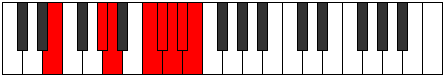

# Mode Parian

## Links

- [Documentation](index.md)
- [Scales Index](Scales.md)
- [Modes Index](Modes.md)
- [Chords Index](Chords.md)

## Parent Scale

[Parian](ScaleParian.md)

## Number

[3889](https://ianring.com/musictheory/scales/3889)

## Perfection

- 4 Perfect notes
- 3 Perfect notes

## Perfection Profile

[false true true false true true false]

## Permutations

| Tonic | Notes | Signature | Illustration | Audio |
|-------|-------|-----------|--------------|-------|
| [C](ModeCNaturalParian.md) | **C**, D##, E#, **F###**, G##, A#, **B**, **C** | C |  | [midi](ModeCNaturalParian.mid) [ogg](ModeCNaturalParian.ogg) |
| [C#](ModeCSharpParian.md) | **C#**, D###, E##, **Cbbb**, Cbb, Dbbb, **Dbb**, **C#** | C |  | [midi](ModeCSharpParian.mid) [ogg](ModeCSharpParian.ogg) |
| [Db](ModeDFlatParian.md) | **Db**, E#, F#, **G##**, A#, B, **C**, **Db** | C |  | [midi](ModeDFlatParian.mid) [ogg](ModeDFlatParian.ogg) |
| [D](ModeDNaturalParian.md) | **D**, E##, F##, **G###**, A##, B#, **C#**, **D** | C |  | [midi](ModeDNaturalParian.mid) [ogg](ModeDNaturalParian.ogg) |
| [D#](ModeDSharpParian.md) | **D#**, E###, F###, **Cb**, Dbb, Ebbb, **Fbbb**, **D#** | C |  | [midi](ModeDSharpParian.mid) [ogg](ModeDSharpParian.ogg) |
| [Eb](ModeEFlatParian.md) | **Eb**, F##, G#, **A##**, B#, C#, **D**, **Eb** | C |  | [midi](ModeEFlatParian.mid) [ogg](ModeEFlatParian.ogg) |
| [E](ModeENaturalParian.md) | **E**, F###, G##, **A###**, B##, C##, **D#**, **E** | C |  | [midi](ModeENaturalParian.mid) [ogg](ModeENaturalParian.ogg) |
| [F](ModeFNaturalParian.md) | **F**, G##, A#, **B##**, C##, D#, **E**, **F** | C |  | [midi](ModeFNaturalParian.mid) [ogg](ModeFNaturalParian.ogg) |
| [F#](ModeFSharpParian.md) | **F#**, G###, A##, **B###**, C###, D##, **E#**, **F#** | C |  | [midi](ModeFSharpParian.mid) [ogg](ModeFSharpParian.ogg) |
| [Gb](ModeGFlatParian.md) | **Gb**, A#, B, **C##**, D#, E, **F**, **Gb** | C |  | [midi](ModeGFlatParian.mid) [ogg](ModeGFlatParian.ogg) |
| [G](ModeGNaturalParian.md) | **G**, A##, B#, **C###**, D##, E#, **F#**, **G** | C |  | [midi](ModeGNaturalParian.mid) [ogg](ModeGNaturalParian.ogg) |
| [G#](ModeGSharpParian.md) | **G#**, A###, B##, **D##**, E#, F#, **G**, **G#** | C |  | [midi](ModeGSharpParian.mid) [ogg](ModeGSharpParian.ogg) |
| [Ab](ModeAFlatParian.md) | **Ab**, B#, C#, **D##**, E#, F#, **G**, **Ab** | C |  | [midi](ModeAFlatParian.mid) [ogg](ModeAFlatParian.ogg) |
| [A](ModeANaturalParian.md) | **A**, B##, C##, **D###**, E##, F##, **G#**, **A** | C |  | [midi](ModeANaturalParian.mid) [ogg](ModeANaturalParian.ogg) |
| [A#](ModeASharpParian.md) | **A#**, B###, C###, **E##**, F##, G#, **A**, **A#** | C |  | [midi](ModeASharpParian.mid) [ogg](ModeASharpParian.ogg) |
| [Bb](ModeBFlatParian.md) | **Bb**, C##, D#, **E##**, F##, G#, **A**, **Bb** | C |  | [midi](ModeBFlatParian.mid) [ogg](ModeBFlatParian.ogg) |
| [B](ModeBNaturalParian.md) | **B**, C###, D##, **E###**, F###, G##, **A#**, **B** | C |  | [midi](ModeBNaturalParian.mid) [ogg](ModeBNaturalParian.ogg) |
