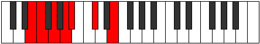
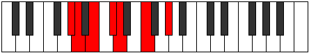

# Mode Parimic

## Links

- [Documentation](README.md)
- [Scales Index](Scales.md)
- [Modes Index](Modes.md)
- [Chords Index](Chords.md)

## Parent Scale

[Dagimic](ScaleDagimic.md)

## Number

[619](https://ianring.com/musictheory/scales/619)

## Transposition

1, 2, 2, 1, 3, 3

## Chord Pattern

i⁰, II⁺, II⁺, IV⁺, VI⁺

## Perfection

- 2 Perfect notes
- 4 Perfect notes

## Perfection Profile

[false false false true true false]

## Permutations

| Tonic | Notes | Signature | Illustration | Audio |
|-------|-------|-----------|--------------|-------|
| [C](ModeCNaturalParimic.md) | **C**, **Db**, **Eb**, F, Gb, **A**, **C** | C |  | [midi](https://github.com/edipermadi/music/blob/main/docs/ModeCNaturalParimic.mid?raw=true) |
| [C#](ModeCSharpParimic.md) | **C#**, **D**, **E**, F#, G, **A#**, **C#** | C |  | [midi](https://github.com/edipermadi/music/blob/main/docs/ModeCSharpParimic.mid?raw=true) |
| [Db](ModeDFlatParimic.md) | **Db**, **Ebb**, **Fb**, Gb, Abb, **Bb**, **Db** | C |  | [midi](https://github.com/edipermadi/music/blob/main/docs/ModeDFlatParimic.mid?raw=true) |
| [D](ModeDNaturalParimic.md) | **D**, **Eb**, **F**, G, Ab, **B**, **D** | C |  | [midi](https://github.com/edipermadi/music/blob/main/docs/ModeDNaturalParimic.mid?raw=true) |
| [D#](ModeDSharpParimic.md) | **D#**, **E**, **F#**, G#, A, **B#**, **D#** | C |  | [midi](https://github.com/edipermadi/music/blob/main/docs/ModeDSharpParimic.mid?raw=true) |
| [Eb](ModeEFlatParimic.md) | **Eb**, **Fb**, **Gb**, Ab, Bbb, **C**, **Eb** | C |  | [midi](https://github.com/edipermadi/music/blob/main/docs/ModeEFlatParimic.mid?raw=true) |
| [E](ModeENaturalParimic.md) | **E**, **F**, **G**, A, Bb, **C#**, **E** | C |  | [midi](https://github.com/edipermadi/music/blob/main/docs/ModeENaturalParimic.mid?raw=true) |
| [F](ModeFNaturalParimic.md) | **F**, **Gb**, **Ab**, Bb, Cb, **D**, **F** | C |  | [midi](https://github.com/edipermadi/music/blob/main/docs/ModeFNaturalParimic.mid?raw=true) |
| [F#](ModeFSharpParimic.md) | **F#**, **G**, **A**, B, C, **D#**, **F#** | C |  | [midi](https://github.com/edipermadi/music/blob/main/docs/ModeFSharpParimic.mid?raw=true) |
| [Gb](ModeGFlatParimic.md) | **Gb**, **Abb**, **Bbb**, Cb, Dbb, **Eb**, **Gb** | C |  | [midi](https://github.com/edipermadi/music/blob/main/docs/ModeGFlatParimic.mid?raw=true) |
| [G](ModeGNaturalParimic.md) | **G**, **Ab**, **Bb**, C, Db, **E**, **G** | C |  | [midi](https://github.com/edipermadi/music/blob/main/docs/ModeGNaturalParimic.mid?raw=true) |
| [G#](ModeGSharpParimic.md) | **G#**, **A**, **B**, C#, D, **E#**, **G#** | C |  | [midi](https://github.com/edipermadi/music/blob/main/docs/ModeGSharpParimic.mid?raw=true) |
| [Ab](ModeAFlatParimic.md) | **Ab**, **Bbb**, **Cb**, Db, Ebb, **F**, **Ab** | C |  | [midi](https://github.com/edipermadi/music/blob/main/docs/ModeAFlatParimic.mid?raw=true) |
| [A](ModeANaturalParimic.md) | **A**, **Bb**, **C**, D, Eb, **F#**, **A** | C |  | [midi](https://github.com/edipermadi/music/blob/main/docs/ModeANaturalParimic.mid?raw=true) |
| [A#](ModeASharpParimic.md) | **A#**, **B**, **C#**, D#, E, **F##**, **A#** | C |  | [midi](https://github.com/edipermadi/music/blob/main/docs/ModeASharpParimic.mid?raw=true) |
| [Bb](ModeBFlatParimic.md) | **Bb**, **Cb**, **Db**, Eb, Fb, **G**, **Bb** | C |  | [midi](https://github.com/edipermadi/music/blob/main/docs/ModeBFlatParimic.mid?raw=true) |
| [B](ModeBNaturalParimic.md) | **B**, **C**, **D**, E, F, **G#**, **B** | C |  | [midi](https://github.com/edipermadi/music/blob/main/docs/ModeBNaturalParimic.mid?raw=true) |
