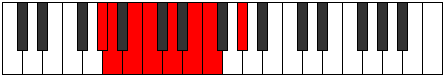

# Mode Pathian

## Links

- [Documentation](index.md)
- [Scales Index](Scales.md)
- [Modes Index](Modes.md)
- [Chords Index](Chords.md)

## Parent Scale

[Bycrian](ScaleBycrian.md)

## Number

[859](https://ianring.com/musictheory/scales/859)

## Perfection

- 4 Perfect notes
- 3 Perfect notes

## Perfection Profile

[false true false false true true true]

## Permutations

| Tonic | Notes | Signature | Illustration | Audio |
|-------|-------|-----------|--------------|-------|
| [C](ModeCNaturalPathian.md) | **C**, Db, **Eb**, **Fb**, Gb, Ab, Bbb, **C** | C |  | [midi](ModeCNaturalPathian.mid) [ogg](ModeCNaturalPathian.ogg) |
| [C#](ModeCSharpPathian.md) | **C#**, D, **E**, **F**, G, A, Bb, **C#** | C |  | [midi](ModeCSharpPathian.mid) [ogg](ModeCSharpPathian.ogg) |
| [Db](ModeDFlatPathian.md) | **Db**, Ebb, **Fb**, **Gbb**, Abb, Bbb, Cbb, **Db** | C |  | [midi](ModeDFlatPathian.mid) [ogg](ModeDFlatPathian.ogg) |
| [D](ModeDNaturalPathian.md) | **D**, Eb, **F**, **Gb**, Ab, Bb, Cb, **D** | C |  | [midi](ModeDNaturalPathian.mid) [ogg](ModeDNaturalPathian.ogg) |
| [D#](ModeDSharpPathian.md) | **D#**, E, **F#**, **G**, A, B, C, **D#** | C |  | [midi](ModeDSharpPathian.mid) [ogg](ModeDSharpPathian.ogg) |
| [Eb](ModeEFlatPathian.md) | **Eb**, Fb, **Gb**, **Abb**, Bbb, Cb, Dbb, **Eb** | C |  | [midi](ModeEFlatPathian.mid) [ogg](ModeEFlatPathian.ogg) |
| [E](ModeENaturalPathian.md) | **E**, F, **G**, **Ab**, Bb, C, Db, **E** | C |  | [midi](ModeENaturalPathian.mid) [ogg](ModeENaturalPathian.ogg) |
| [F](ModeFNaturalPathian.md) | **F**, Gb, **Ab**, **Bbb**, Cb, Db, Ebb, **F** | C |  | [midi](ModeFNaturalPathian.mid) [ogg](ModeFNaturalPathian.ogg) |
| [F#](ModeFSharpPathian.md) | **F#**, G, **A**, **Bb**, C, D, Eb, **F#** | C |  | [midi](ModeFSharpPathian.mid) [ogg](ModeFSharpPathian.ogg) |
| [Gb](ModeGFlatPathian.md) | **Gb**, Abb, **Bbb**, **Cbb**, Dbb, Ebb, Fbb, **Gb** | C |  | [midi](ModeGFlatPathian.mid) [ogg](ModeGFlatPathian.ogg) |
| [G](ModeGNaturalPathian.md) | **G**, Ab, **Bb**, **Cb**, Db, Eb, Fb, **G** | C |  | [midi](ModeGNaturalPathian.mid) [ogg](ModeGNaturalPathian.ogg) |
| [G#](ModeGSharpPathian.md) | **G#**, A, **B**, **C**, D, E, F, **G#** | C |  | [midi](ModeGSharpPathian.mid) [ogg](ModeGSharpPathian.ogg) |
| [Ab](ModeAFlatPathian.md) | **Ab**, Bbb, **Cb**, **Dbb**, Ebb, Fb, Gbb, **Ab** | C |  | [midi](ModeAFlatPathian.mid) [ogg](ModeAFlatPathian.ogg) |
| [A](ModeANaturalPathian.md) | **A**, Bb, **C**, **Db**, Eb, F, Gb, **A** | C |  | [midi](ModeANaturalPathian.mid) [ogg](ModeANaturalPathian.ogg) |
| [A#](ModeASharpPathian.md) | **A#**, B, **C#**, **D**, E, F#, G, **A#** | C |  | [midi](ModeASharpPathian.mid) [ogg](ModeASharpPathian.ogg) |
| [Bb](ModeBFlatPathian.md) | **Bb**, Cb, **Db**, **Ebb**, Fb, Gb, Abb, **Bb** | C |  | [midi](ModeBFlatPathian.mid) [ogg](ModeBFlatPathian.ogg) |
| [B](ModeBNaturalPathian.md) | **B**, C, **D**, **Eb**, F, G, Ab, **B** | C |  | [midi](ModeBNaturalPathian.mid) [ogg](ModeBNaturalPathian.ogg) |
