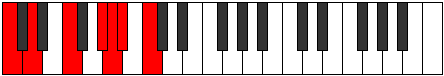
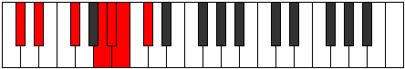
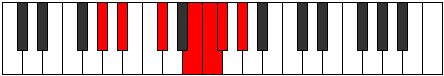

# Mode Pathimic

## Links

- [Documentation](index.md)
- [Scales Index](Scales.md)
- [Modes Index](Modes.md)
- [Chords Index](Chords.md)

## Parent Scale

[Zagimic](ScaleZagimic.md)

## Number

[1829](https://ianring.com/musictheory/scales/1829)

## Perfection

- 3 Perfect notes
- 3 Perfect notes

## Perfection Profile

[false true true false false true]

## Permutations

| Tonic | Notes | Signature | Illustration | Audio |
|-------|-------|-----------|--------------|-------|
| [C](ModeCNaturalPathimic.md) | **C**, D, E#, **F###**, **G##**, A#, **C** | C |  | [midi](ModeCNaturalPathimic.mid) [ogg](ModeCNaturalPathimic.ogg) |
| [C#](ModeCSharpPathimic.md) | **C#**, D#, E##, **Cbbb**, **Cbb**, Dbbb, **C#** | C |  | [midi](ModeCSharpPathimic.mid) [ogg](ModeCSharpPathimic.ogg) |
| [Db](ModeDFlatPathimic.md) | **Db**, Eb, F#, **G##**, **A#**, B, **Db** | C |  | [midi](ModeDFlatPathimic.mid) [ogg](ModeDFlatPathimic.ogg) |
| [D](ModeDNaturalPathimic.md) | **D**, E, F##, **G###**, **A##**, B#, **D** | C |  | [midi](ModeDNaturalPathimic.mid) [ogg](ModeDNaturalPathimic.ogg) |
| [D#](ModeDSharpPathimic.md) | **D#**, E#, F###, **Cb**, **Dbb**, Ebbb, **D#** | C |  | [midi](ModeDSharpPathimic.mid) [ogg](ModeDSharpPathimic.ogg) |
| [Eb](ModeEFlatPathimic.md) | **Eb**, F, G#, **A##**, **B#**, C#, **Eb** | C |  | [midi](ModeEFlatPathimic.mid) [ogg](ModeEFlatPathimic.ogg) |
| [E](ModeENaturalPathimic.md) | **E**, F#, G##, **A###**, **B##**, C##, **E** | C |  | [midi](ModeENaturalPathimic.mid) [ogg](ModeENaturalPathimic.ogg) |
| [F](ModeFNaturalPathimic.md) | **F**, G, A#, **B##**, **C##**, D#, **F** | C |  | [midi](ModeFNaturalPathimic.mid) [ogg](ModeFNaturalPathimic.ogg) |
| [F#](ModeFSharpPathimic.md) | **F#**, G#, A##, **B###**, **C###**, D##, **F#** | C |  | [midi](ModeFSharpPathimic.mid) [ogg](ModeFSharpPathimic.ogg) |
| [Gb](ModeGFlatPathimic.md) | **Gb**, Ab, B, **C##**, **D#**, E, **Gb** | C |  | [midi](ModeGFlatPathimic.mid) [ogg](ModeGFlatPathimic.ogg) |
| [G](ModeGNaturalPathimic.md) | **G**, A, B#, **C###**, **D##**, E#, **G** | C |  | [midi](ModeGNaturalPathimic.mid) [ogg](ModeGNaturalPathimic.ogg) |
| [G#](ModeGSharpPathimic.md) | **G#**, A#, B##, **D##**, **E#**, F#, **G#** | C |  | [midi](ModeGSharpPathimic.mid) [ogg](ModeGSharpPathimic.ogg) |
| [Ab](ModeAFlatPathimic.md) | **Ab**, Bb, C#, **D##**, **E#**, F#, **Ab** | C |  | [midi](ModeAFlatPathimic.mid) [ogg](ModeAFlatPathimic.ogg) |
| [A](ModeANaturalPathimic.md) | **A**, B, C##, **D###**, **E##**, F##, **A** | C |  | [midi](ModeANaturalPathimic.mid) [ogg](ModeANaturalPathimic.ogg) |
| [A#](ModeASharpPathimic.md) | **A#**, B#, C###, **E##**, **F##**, G#, **A#** | C |  | [midi](ModeASharpPathimic.mid) [ogg](ModeASharpPathimic.ogg) |
| [Bb](ModeBFlatPathimic.md) | **Bb**, C, D#, **E##**, **F##**, G#, **Bb** | C |  | [midi](ModeBFlatPathimic.mid) [ogg](ModeBFlatPathimic.ogg) |
| [B](ModeBNaturalPathimic.md) | **B**, C#, D##, **E###**, **F###**, G##, **B** | C |  | [midi](ModeBNaturalPathimic.mid) [ogg](ModeBNaturalPathimic.ogg) |
