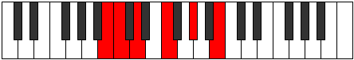

# Mode Pathitonic

## Links

- [Documentation](README.md)
- [Scales Index](Scales.md)
- [Modes Index](Modes.md)
- [Chords Index](Chords.md)

## Parent Scale

[Thyritonic](ScaleThyritonic.md)

## Number

[587](https://ianring.com/musictheory/scales/587)

## Transposition

1, 2, 3, 3, 3

## Chord Pattern

## Perfection

- 1 Perfect notes
- 4 Perfect notes

## Perfection Profile

false, false, false, true, false

## Permutations

| Tonic | Notes | Signature | Illustration | Audio |
|-------|-------|-----------|--------------|-------|
| [C](ModeCNaturalPathitonic.md) | **C**, **C#**, **D#**, F#, **A**, **C** | C |  | [midi](https://github.com/edipermadi/music/blob/main/docs/ModeCNaturalPathitonic.mid?raw=true) |
| [C#](ModeCSharpPathitonic.md) | **C#**, **D**, **E**, G, **A#**, **C#** | C |  | [midi](https://github.com/edipermadi/music/blob/main/docs/ModeCSharpPathitonic.mid?raw=true) |
| [Db](ModeDFlatPathitonic.md) | **Db**, **D**, **E**, G, **Bb**, **Db** | C |  | [midi](https://github.com/edipermadi/music/blob/main/docs/ModeDFlatPathitonic.mid?raw=true) |
| [D](ModeDNaturalPathitonic.md) | **D**, **D#**, **F**, G#, **B**, **D** | C |  | [midi](https://github.com/edipermadi/music/blob/main/docs/ModeDNaturalPathitonic.mid?raw=true) |
| [D#](ModeDSharpPathitonic.md) | **D#**, **E**, **F#**, A, **C**, **D#** | C |  | [midi](https://github.com/edipermadi/music/blob/main/docs/ModeDSharpPathitonic.mid?raw=true) |
| [Eb](ModeEFlatPathitonic.md) | **Eb**, **E**, **Gb**, A, **C**, **Eb** | C |  | [midi](https://github.com/edipermadi/music/blob/main/docs/ModeEFlatPathitonic.mid?raw=true) |
| [E](ModeENaturalPathitonic.md) | **E**, **F**, **G**, A#, **C#**, **E** | C |  | [midi](https://github.com/edipermadi/music/blob/main/docs/ModeENaturalPathitonic.mid?raw=true) |
| [F](ModeFNaturalPathitonic.md) | **F**, **F#**, **G#**, B, **D**, **F** | C |  | [midi](https://github.com/edipermadi/music/blob/main/docs/ModeFNaturalPathitonic.mid?raw=true) |
| [F#](ModeFSharpPathitonic.md) | **F#**, **G**, **A**, C, **D#**, **F#** | C |  | [midi](https://github.com/edipermadi/music/blob/main/docs/ModeFSharpPathitonic.mid?raw=true) |
| [Gb](ModeGFlatPathitonic.md) | **Gb**, **G**, **A**, C, **Eb**, **Gb** | C |  | [midi](https://github.com/edipermadi/music/blob/main/docs/ModeGFlatPathitonic.mid?raw=true) |
| [G](ModeGNaturalPathitonic.md) | **G**, **G#**, **A#**, C#, **E**, **G** | C |  | [midi](https://github.com/edipermadi/music/blob/main/docs/ModeGNaturalPathitonic.mid?raw=true) |
| [G#](ModeGSharpPathitonic.md) | **G#**, **A**, **B**, D, **F**, **G#** | C |  | [midi](https://github.com/edipermadi/music/blob/main/docs/ModeGSharpPathitonic.mid?raw=true) |
| [Ab](ModeAFlatPathitonic.md) | **Ab**, **A**, **B**, D, **F**, **Ab** | C |  | [midi](https://github.com/edipermadi/music/blob/main/docs/ModeAFlatPathitonic.mid?raw=true) |
| [A](ModeANaturalPathitonic.md) | **A**, **A#**, **C**, D#, **F#**, **A** | C |  | [midi](https://github.com/edipermadi/music/blob/main/docs/ModeANaturalPathitonic.mid?raw=true) |
| [A#](ModeASharpPathitonic.md) | **A#**, **B**, **C#**, E, **G**, **A#** | C |  | [midi](https://github.com/edipermadi/music/blob/main/docs/ModeASharpPathitonic.mid?raw=true) |
| [Bb](ModeBFlatPathitonic.md) | **Bb**, **B**, **Db**, E, **G**, **Bb** | C |  | [midi](https://github.com/edipermadi/music/blob/main/docs/ModeBFlatPathitonic.mid?raw=true) |
| [B](ModeBNaturalPathitonic.md) | **B**, **C**, **D**, F, **G#**, **B** | C |  | [midi](https://github.com/edipermadi/music/blob/main/docs/ModeBNaturalPathitonic.mid?raw=true) |
